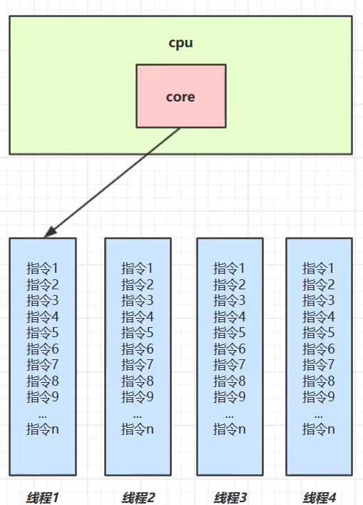
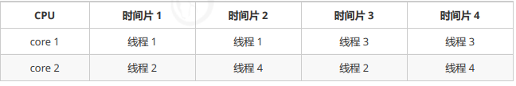
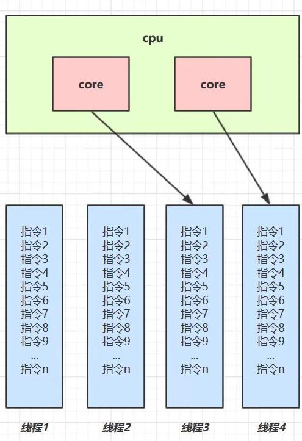
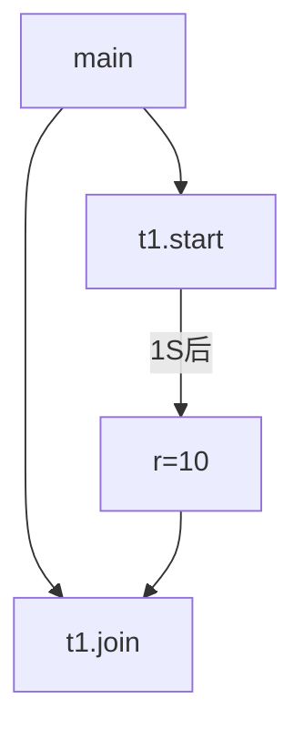
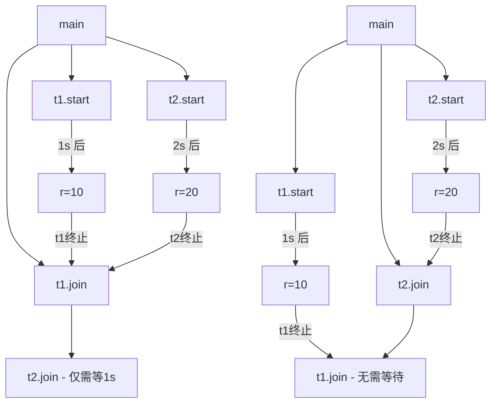
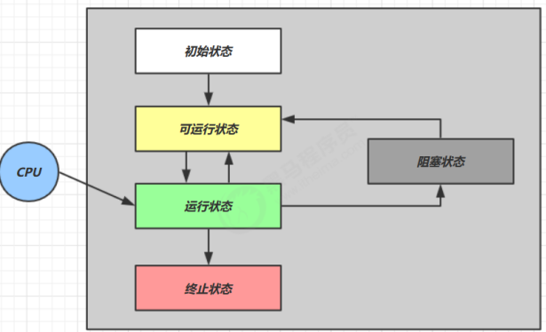
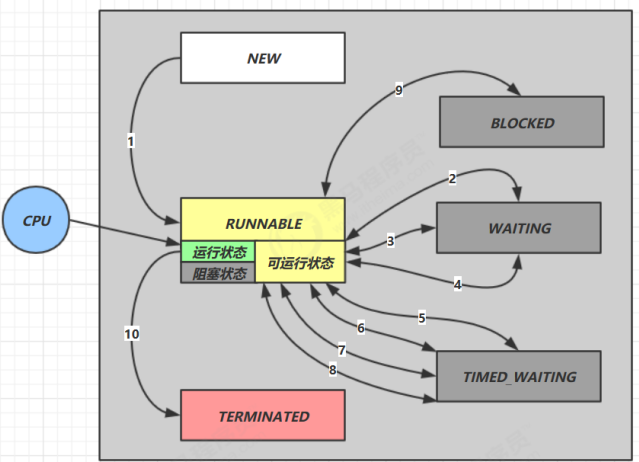

## 一、进程与线程

### 1. 进程与线程

#### 进程

- 程序由指令和数据组成，但这些指令要运行，数据要读写，就必须将指令加载至 CPU，数据加载至内存。在 指令运行过程中还需要用到磁盘、网络等设备。进程就是用来加载指令、管理内存、管理 IO 的 
- 当一个程序被运行，从磁盘加载这个程序的代码至内存，这时就开启了一个进程。 
- 进程就可以视为程序的一个实例。大部分程序可以同时运行多个实例进程（例如记事本、画图、浏览器 等），也有的程序只能启动一个实例进程（例如网易云音乐、360 安全卫士等）

#### 线程

- 一个进程之内可以分为一到多个线程。 
- 一个线程就是一个指令流，将指令流中的一条条指令以一定的顺序交给 CPU 执行 
- Java 中，线程作为最小调度单位，进程作为资源分配的最小单位。 在 windows 中进程是不活动的，只是作 为线程的容器

#### 对比

- 进程基本上相互独立的，而线程存在于进程内，是进程的一个子集 
- 进程拥有共享的资源，如内存空间等，供其内部的线程共享 
- 进程间通信较为复杂 
  - 同一台计算机的进程通信称为 IPC（Inter-process communication） 
  - 不同计算机之间的进程通信，需要通过网络，并遵守共同的协议，例如 HTTP 
- 线程通信相对简单，因为它们共享进程内的内存，一个例子是多个线程可以访问同一个共享变量 
- 线程更轻量，线程上下文切换成本一般上要比进程上下文切换低

### 2. 并行与并发

​		单核 cpu 下，线程实际还是 串行执行 的。操作系统中有一个组件叫做任务调度器，将 cpu 的时间片（windows 下时间片最小约为 15 毫秒）分给不同的程序使用，只是由于 cpu 在线程间（时间片很短）的切换非常快，人类感 觉是**同时运行**的 。总结为一句话就是：**微观串行，宏观并行**， 一般会将这种**线程轮流使用 CPU**的做法称为并发， concurrent




多核 cpu下，每个**核（core）**都可以调度运行线程，这时候线程可以是并行的。





- 并发（concurrent）是同一时间应对（dealing with）多件事情的能力 
- 并行（parallel）是同一时间动手做（doing）多件事情的能力

如：

- 家庭主妇做饭、打扫卫生、给孩子喂奶，她一个人轮流交替做这多件事，这时就是并发 
- 家庭主妇雇了个保姆，她们一起这些事，这时既有并发，也有并行（这时会产生竞争，例如锅只有一口，一 个人用锅时，另一个人就得等待） 
- 雇了3个保姆，一个专做饭、一个专打扫卫生、一个专喂奶，互不干扰，这时是并行

### 3. 应用

#### 异步调用

以调用方角度来讲，如果 

- 需要等待结果返回，才能继续运行就是同步 
- 不需要等待结果返回，就能继续运行就是异步

实例：

1. 设计

   多线程可以让方法执行变为异步的（即不要巴巴干等着）比如说读取磁盘文件时，假设读取操作花费了 5 秒钟，如 果没有线程调度机制，这 5 秒 cpu 什么都做不了，其它代码都得暂停...

2. 结论

   - 比如在项目中，视频文件需要转换格式等操作比较费时，这时开一个新线程处理视频转换，避免阻塞主线程 
   - tomcat 的异步 servlet 也是类似的目的，让用户线程处理耗时较长的操作，避免阻塞 tomcat 的工作线程 
   - ui 程序中，开线程进行其他操作，避免阻塞 ui 线程

#### 提高效率

充分利用多核 cpu 的优势，提高运行效率。想象下面的场景，执行 3 个计算，最后将计算结果汇总。

>计算 1 花费 10 ms 
>
>计算 2 花费 11 ms 
>
>计算 3 花费 9 ms 
>
>汇总需要 1 ms

- 如果是串行执行，那么总共花费的时间是**10 + 11 + 9 + 1 = 31ms**
- 但如果是四核 cpu，各个核心分别使用线程 1 执行计算 1，线程 2 执行计算 2，线程 3 执行计算 3，那么 3 个 线程是并行的，花费时间只取决于最长的那个线程运行的时间，即**11ms**最后加上汇总时间只会花费**12ms**
- **需要在多核 cpu 才能提高效率，单核仍然时是轮流执行**

实例：

1. 设计

   - 基准测试工具选择，使用了比较靠谱的 JMH，它会执行程序预热，执行多次测试并平均 

   - cpu 核数限制，有两种思路 

     - 使用虚拟机，分配合适的核 
     - 使用 msconfig，分配合适的核，需要重启比较麻烦 

   - 并行计算方式的选择 

     - 直接使用 parallel stream，后来发现它有自己的问题 
     - 自己手动控制 thread，实现简单的并行计算

     ```java
     @Fork(1)
     @BenchmarkMode(Mode.AverageTime)
     @Warmup(iterations = 3)
     @Measurement(iterations = 5)
     public class MyBenchmark {
     
         static int[] ARRAY = new int[1000_000_00];
     
         static {
             Arrays.fill(ARRAY, 1);
         }
     
         @Benchmark
         public int c() throws Exception {
             int[] array = ARRAY;
     
             FutureTask<Integer> t1 = new FutureTask<>(() -> {
                 int sum = 0;
                 for (int i = 0; i < 250_000_00; i++) {
                     sum += array[0 + i];
                 }
     
                 return sum;
             });
     
             FutureTask<Integer> t2 = new FutureTask<>(() -> {
                 int sum = 0;
                 for (int i = 0; i < 250_000_00; i++) {
                     sum += array[250_000_00 + i];
                 }
     
                 return sum;
             });
     
             FutureTask<Integer> t3 = new FutureTask<>(() -> {
                 int sum = 0;
                 for (int i = 0; i < 250_000_00; i++) {
                     sum += array[500_000_00 + i];
                 }
     
                 return sum;
             });
     
             FutureTask<Integer> t4 = new FutureTask<>(() -> {
                 int sum = 0;
                 for (int i = 0; i < 250_000_00; i++) {
                     sum += array[750_000_00 + i];
                 }
     
                 return sum;
             });
     
             new Thread(t1).start();
             new Thread(t2).start();
             new Thread(t3).start();
             new Thread(t4).start();
             return t1.get() + t2.get() + t3.get() + t4.get();
         }
     
         @Benchmark
         public int d() throws Exception {
             int[] array = ARRAY;
             FutureTask<Integer> t1 = new FutureTask<>(() -> {
                 int sum = 0;
                 for (int i = 0; i < 1000_000_00; i++) {
                     sum += array[0 + i];
                 }
                 return sum;
             });
     
             new Thread(t1).start();
             return t1.get();
         }
     }
     
     public class MyBenchmarkTest {
     
         @Test
         public void test() throws RunnerException {
             Options options = new OptionsBuilder()
                     .include(MyBenchmark.class.getSimpleName())
     //                .output("/temp/mybenchmark.log")
                     .build();
             new Runner(options).run();
         }
     }
     ```

2. 结论
   - 单核 cpu 下，多线程不能实际提高程序运行效率，只是为了能够在不同的任务之间切换，不同线程轮流使用 cpu ，不至于一个线程总占用 cpu，别的线程没法干活 
   - 多核 cpu 可以并行跑多个线程，但能否提高程序运行效率还是要分情况的 
     - 有些任务，经过精心设计，将任务拆分，并行执行，当然可以提高程序的运行效率。但不是所有计算任 务都能拆分
     - 也不是所有任务都需要拆分，任务的目的如果不同，谈拆分和效率没啥意义 
   - IO 操作不占用 cpu，只是我们一般拷贝文件使用的是【阻塞 IO】，这时相当于线程虽然不用 cpu，但需要一 直等待 IO 结束，没能充分利用线程。所以才有后面的【非阻塞 IO】和【异步 IO】优化

## 二、Java线程

### 1. 创建和运行线程

#### 直接使用Thread

```java
// 创建线程对象
Thread t = new Thread() {
    public void run() {
        // 要执行的任务
    }
};
// 启动线程
t.start();

// 构造方法的参数是给线程指定名字，推荐
Thread t1 = new Thread("t1") {
    @Override
    // run 方法内实现了要执行的任务
    public void run() {
        log.debug("hello");
    }
};
t1.start();
```

#### 使用Runnable配合Thread

把【线程】和【任务】（要执行的代码）分开 

- Thread 代表线程 
- Runnable 可运行的任务（线程要执行的代码）

```java
Runnable runnable = new Runnable() {
    public void run(){
        // 要执行的任务
    }
};
// 创建线程对象
Thread t = new Thread( runnable );
// 启动线程
t.start(); 

// 创建任务对象
Runnable task2 = new Runnable() {
    @Override
    public void run() {
        log.debug("hello");
    }
};
// 参数1 是任务对象; 参数2 是线程名字，推荐
Thread t2 = new Thread(task2, "t2");
t2.start();

// java8之后使用lambda精简代码
// 创建任务对象
Runnable task2 = () -> log.debug("hello");
// 参数1 是任务对象; 参数2 是线程名字，推荐
Thread t2 = new Thread(task2, "t2");
t2.start();
```

#### FutureTask配合Thread

FutureTask 能够接收 Callable 类型的参数，用来处理有返回结果的情况

```java
// 创建任务对象
FutureTask<Integer> task3 = new FutureTask<>(() -> {
    log.debug("hello");
    return 100;
});
// 参数1 是任务对象; 参数2 是线程名字，推荐
new Thread(task3, "t3").start();
// 主线程阻塞，同步等待 task 执行完毕的结果
Integer result = task3.get();
log.debug("结果是:{}", result);
```

### 2. 多个线程同时运行

- 交替执行 
- 谁先谁后，不由我们控制

### 3. 查看进程线程的方法

#### windows

- 任务管理器可以查看进程和线程数，也可以用来杀死进程 
- **tasklist** 查看进程 
- **taskkill** 杀死进程

#### linux

- **ps -fe** 查看所有进程 
- **ps -fT -p <PID>**  查看某个进程（PID）的所有线程 
- **kill** 杀死进程 
- **top** 按大写 H 切换是否显示线程 
- **top -H -p <PID>**  查看某个进程（PID）的所有线程

#### java

- **jps** 命令查看所有 Java 进程 

- **jstack**  查看某个 Java 进程（PID）的所有线程状态 

- **jconsole** 来查看某个 Java 进程中线程的运行情况（图形界面）

  - 远程监控配置

    - 需要以如下方式运行你的 java 类

      ```
      java -Djava.rmi.server.hostname=`ip地址` -Dcom.sun.management.jmxremote -
      Dcom.sun.management.jmxremote.port=`连接端口` -Dcom.sun.management.jmxremote.ssl=是否安全连接 -
      Dcom.sun.management.jmxremote.authenticate=是否认证 java类
      ```

    - 修改 /etc/hosts 文件将 127.0.0.1 映射至主机名

  - 如果要认证访问，还需要做如下步骤

    - 复制 jmxremote.password 文件 
    - 修改 jmxremote.password 和 jmxremote.access 文件的权限为 600 即文件所有者可读写 
    - 连接时填入 controlRole（用户名），R&D（密码）

### 4. 线程运行

#### 栈与栈帧

Java Virtual Machine Stacks （Java 虚拟机栈） 

我们都知道 JVM 中由堆、栈、方法区所组成，其中栈内存是给谁用的呢？其实就是线程，每个线程启动后，虚拟 机就会为其分配一块栈内存。 

- 每个栈由多个栈帧（Frame）组成，对应着每次方法调用时所占用的内存 
- 每个线程只能有一个活动栈帧，对应着当前正在执行的那个方法

#### 线程上下文切换（Thread Context Switch）

因为以下一些原因导致 cpu 不再执行当前的线程，转而执行另一个线程的代码 

- 线程的 cpu 时间片用完 
- 垃圾回收 
- 有更高优先级的线程需要运行 
- 线程自己调用了 sleep、yield、wait、join、park、synchronized、lock 等方法 

当 Context Switch 发生时，需要由操作系统保存当前线程的状态，并恢复另一个线程的状态，Java 中对应的概念 就是程序计数器（Program Counter Register），它的作用是记住下一条 jvm 指令的执行地址，是线程私有的 

- 状态包括程序计数器、虚拟机栈中每个栈帧的信息，如局部变量、操作数栈、返回地址等 
- Context Switch 频繁发生会影响性能

### 5. 常见方法

| 方法名           | static | 功能说明                                                     | 注意                                                         |
| ---------------- | ------ | ------------------------------------------------------------ | ------------------------------------------------------------ |
| start()          |        | 启动一个新线 程，在新的线程 运行 run 方法 中的代码           | start 方法只是让线程进入就绪，里面代码不一定立刻 运行（CPU 的时间片还没分给它）。每个线程对象的 start方法只能调用一次，如果调用了多次会出现 IllegalThreadStateException |
| run()            |        | 新线程启动后会 调用的方法                                    | 如果在构造 Thread 对象时传递了 Runnable 参数，则 线程启动后会调用 Runnable 中的 run 方法，否则默 认不执行任何操作。但可以创建 Thread 的子类对象， 来覆盖默认行为 |
| join()           |        | 等待线程运行结 束                                            |                                                              |
| join(long n)     |        | 等待线程运行结 束,最多等待 n  毫秒                           |                                                              |
| getId()          |        | 获取线程长整型 的 id                                         | id 唯一                                                      |
| getName()        |        | 获取线程名                                                   |                                                              |
| setName(String)  |        | 修改线程名                                                   |                                                              |
| getPriority()    |        | 获取线程优先级                                               |                                                              |
| setPriority(int) |        | 修改线程优先级                                               | java中规定线程优先级是1~10 的整数，较大的优先级 能提高该线程被 CPU 调度的机率 |
| getState()       |        | 获取线程状态                                                 | Java 中线程状态是用 6 个 enum 表示，分别为： NEW, RUNNABLE, BLOCKED, WAITING,  TIMED_WAITING, TERMINATED |
| isInterrupted()  |        | 判断是否被打 断                                              | 不会清除 打断标记                                            |
| isAlive()        |        | 线程是否存活 （还没有运行完 毕）                             |                                                              |
| interrupt()      |        | 打断线程                                                     | 如果被打断线程正在 sleep，wait，join 会导致被打断 的线程抛出 InterruptedException，并清除 打断标 记 ；如果打断的正在运行的线程，则会设置 打断标 记 ；park 的线程被打断，也会设置 打断标记 |
| interrupted()    | static | 判断当前线程是 否被打断                                      | 会清除 打断标记                                              |
| currentThread()  | static | 获取当前正在执 行的线程                                      |                                                              |
| sleep(long n)    | static | 让当前执行的线 程休眠n毫秒， 休眠时让出 cpu  的时间片给其它 线程 |                                                              |
| yield()          | static | 提示线程调度器 让出当前线程对 CPU的使用                      | 主要是为了测试和调试                                         |

### 6. start与run

#### 调用run

```java
public static void main(String[] args) {
    Thread t1 = new Thread("t1") {
        @Override
        public void run() {
            log.debug(Thread.currentThread().getName());
            FileReader.read(Constants.MP4_FULL_PATH);
        }
    };
    t1.run();
    log.debug("do other things ...");
}
```

输出：

```
19:39:14 [main] c.TestStart - main
19:39:14 [main] c.FileReader - read [1.mp4] start ...
19:39:18 [main] c.FileReader - read [1.mp4] end ... cost: 4227 ms
19:39:18 [main] c.TestStart - do other things ...
```

程序仍在 main 线程运行， **FileReader.read()** 方法调用还是同步的

#### 调用start

```java
public static void main(String[] args) {
    Thread t1 = new Thread("t1") {
        @Override
        public void run() {
            log.debug(Thread.currentThread().getName());
            FileReader.read(Constants.MP4_FULL_PATH);
        }
    };
    t1.run();
    log.debug("do other things ...");
}
```

输出：

```
19:41:30 [main] c.TestStart - do other things ...
19:41:30 [t1] c.TestStart - t1
19:41:30 [t1] c.FileReader - read [1.mp4] start ...
19:41:35 [t1] c.FileReader - read [1.mp4] end ... cost: 4542 ms
```

程序在 t1 线程运行， **FileReader.read()**方法调用是异步的

### 7. sleep与yield

#### sleep

1. 调用 sleep 会让当前线程从 Running 进入 Timed Waiting 状态（阻塞） 
2. 其它线程可以使用 interrupt 方法打断正在睡眠的线程，这时 sleep 方法会抛出 InterruptedException 
3. 睡眠结束后的线程未必会立刻得到执行 
4. 建议用 TimeUnit 的 sleep 代替 Thread 的 sleep 来获得更好的可读性

#### yield

1. 调用 yield 会让当前线程从 Running 进入 Runnable 就绪状态，然后调度执行其它线程 
2. 具体的实现依赖于操作系统的任务调度器

#### 线程优先级

- 线程优先级会提示（hint）调度器优先调度该线程，但它仅仅是一个提示，调度器可以忽略它 
- 如果 cpu 比较忙，那么优先级高的线程会获得更多的时间片，但 cpu 闲时，优先级几乎没作用

```java
Runnable task1 = () -> {
    int count = 0;
    for (;;) {
        System.out.println("---->1 " + count++);
    }
};
Runnable task2 = () -> {
    int count = 0;
    for (;;) {
        // Thread.yield();
        System.out.println(" ---->2 " + count++);
    }
};
Thread t1 = new Thread(task1, "t1");

Thread t2 = new Thread(task2, "t2");
// t1.setPriority(Thread.MIN_PRIORITY);
// t2.setPriority(Thread.MAX_PRIORITY);
t1.start();
t2.start();
```

### 8. join方法

```java
static int r = 0;
public static void main(String[] args) throws InterruptedException {
    test1();
}
private static void test1() throws InterruptedException {
    log.debug("开始");
    Thread t1 = new Thread(() -> {
        log.debug("开始");
        sleep(1);
        log.debug("结束");
        r = 10;
    });
    t1.start();
    log.debug("结果为:{}", r);
    log.debug("结束");
}
```

分析 

- 因为主线程和线程 t1 是并行执行的，t1 线程需要 1 秒之后才能算出 r=10 
- 而主线程一开始就要打印 r 的结果，所以只能打印出 r=0 

解决方法 

- 用 sleep 行不行？为什么？ 
- 用 join，加在 t1.start() 之后即可

以调用方角度来讲，如果

- 需要等待结果返回，才能继续运行就是同步 
- 不需要等待结果返回，就能继续运行就是异步



#### 等待多个结果

```java
static int r1 = 0;
static int r2 = 0;
public static void main(String[] args) throws InterruptedException {
    test2();
}
private static void test2() throws InterruptedException {
    Thread t1 = new Thread(() -> {
        sleep(1);
        r1 = 10;
    });
    Thread t2 = new Thread(() -> {
        sleep(2);
        r2 = 20;
    });
    long start = System.currentTimeMillis();
    t1.start();
    t2.start();
    t1.join();
    t2.join();
    long end = System.currentTimeMillis();
    log.debug("r1: {} r2: {} cost: {}", r1, r2, end - start);
}
```

分析如下 

- 第一个 join：等待 t1 时, t2 并没有停止, 而在运行 
- 第二个 join：1s 后, 执行到此, t2 也运行了 1s, 因此也只需再等待 1s 

如果颠倒两个 join  最终都是输出：

```
20:45:43.239 [main] c.TestJoin - r1: 10 r2: 20 cost: 2005
```



#### 有时效的join

等够时间

```java
static int r1 = 0;
static int r2 = 0;
public static void main(String[] args) throws InterruptedException {
    test3();
}
public static void test3() throws InterruptedException {
    Thread t1 = new Thread(() -> {
        sleep(1);
        r1 = 10;
    });
    long start = System.currentTimeMillis();
    t1.start();
    // 线程执行结束会导致 join 结束
    t1.join(1500);
    long end = System.currentTimeMillis();
    log.debug("r1: {} r2: {} cost: {}", r1, r2, end - start);
}
```

输出：

```
20:48:01.320 [main] c.TestJoin - r1: 10 r2: 0 cost: 1010
```

#### 没等够时间

```java
static int r1 = 0;
static int r2 = 0;
public static void main(String[] args) throws InterruptedException {
    test3();
}
public static void test3() throws InterruptedException {
    Thread t1 = new Thread(() -> {
        sleep(2);
        r1 = 10;
    });
    long start = System.currentTimeMillis();
    t1.start();
    // 线程执行结束会导致 join 结束
    t1.join(1500);
    long end = System.currentTimeMillis();
    log.debug("r1: {} r2: {} cost: {}", r1, r2, end - start);
}
```

输出：

```
20:52:15.623 [main] c.TestJoin - r1: 0 r2: 0 cost: 1502
```

### 9. interrupt方法

<u>*可以使用 Thread.interrupted() 清除打断状态*</u>

#### 打断sleep、wait、join的线程

这几个方法都会让线程进入阻塞状态 

打断 sleep 的线程, 会清空打断状态，以 sleep 为例

```java
private static void test1() throws InterruptedException {
    Thread t1 = new Thread(()->{
        sleep(1);
    }, "t1");
    t1.start();
    sleep(0.5);
    t1.interrupt();
    log.debug(" 打断状态: {}", t1.isInterrupted());
}
```

输出：

```
java.lang.InterruptedException: sleep interrupted
 at java.lang.Thread.sleep(Native Method)
 at java.lang.Thread.sleep(Thread.java:340)
 at java.util.concurrent.TimeUnit.sleep(TimeUnit.java:386)
 at cn.itcast.n2.util.Sleeper.sleep(Sleeper.java:8)
 at cn.itcast.n4.TestInterrupt.lambda$test1$3(TestInterrupt.java:59)
 at java.lang.Thread.run(Thread.java:745)
21:18:10.374 [main] c.TestInterrupt - 打断状态: false
```

#### 打断正常运行的线程

打断正常运行的线程, 不会清空打断状态

```java
private static void test2() throws InterruptedException {
    Thread t2 = new Thread(()->{
        while(true) {
            Thread current = Thread.currentThread();
            boolean interrupted = current.isInterrupted();
            if(interrupted) {
                log.debug(" 打断状态: {}", interrupted);
                break;
            }
        }
    }, "t2");
    t2.start();
    sleep(0.5);
    t2.interrupt();
}
```

输出：

```
20:57:37.964 [t2] c.TestInterrupt - 打断状态: true 
```

#### 打断park线程

打断 park 线程, 不会清空打断状态

```java
private static void test3() throws InterruptedException {
    Thread t1 = new Thread(() -> {
        log.debug("park...");
        LockSupport.park();
        log.debug("unpark...");
        log.debug("打断状态：{}", Thread.currentThread().isInterrupted());
    }, "t1");
    t1.start();
    sleep(0.5);
    t1.interrupt();
}
```

输出：

```
21:11:52.795 [t1] c.TestInterrupt - park... 
21:11:53.295 [t1] c.TestInterrupt - unpark... 
21:11:53.295 [t1] c.TestInterrupt - 打断状态：true 
```

如果打断标记已经是 true, 则 park 会失效

```java
private static void test4() {
    Thread t1 = new Thread(() -> {
        for (int i = 0; i < 5; i++) {
            log.debug("park...");
            LockSupport.park();
            log.debug("打断状态：{}", Thread.currentThread().isInterrupted());
        }
    });
    t1.start();
    sleep(1);
    t1.interrupt();
}
```

输出：

```
21:13:48.783 [Thread-0] c.TestInterrupt - park... 
21:13:49.809 [Thread-0] c.TestInterrupt - 打断状态：true 
21:13:49.812 [Thread-0] c.TestInterrupt - park... 
21:13:49.813 [Thread-0] c.TestInterrupt - 打断状态：true 
21:13:49.813 [Thread-0] c.TestInterrupt - park... 
21:13:49.813 [Thread-0] c.TestInterrupt - 打断状态：true 
21:13:49.813 [Thread-0] c.TestInterrupt - park... 
21:13:49.813 [Thread-0] c.TestInterrupt - 打断状态：true 
21:13:49.813 [Thread-0] c.TestInterrupt - park... 
21:13:49.813 [Thread-0] c.TestInterrupt - 打断状态：true 
```

### 10. 不推荐的方法

还有一些不推荐使用的方法，这些方法已过时，容易破坏同步代码块，造成线程死锁

| 方法名    | static | 功能说明             |
| --------- | ------ | -------------------- |
| stop()    |        | 停止线程运行         |
| suspend() |        | 挂起（暂停）线程运行 |
| resume()  |        | 恢复线程运行         |

### 11. 主线程与守护线程

默认情况下，Java 进程需要等待所有线程都运行结束，才会结束。有一种特殊的线程叫做守护线程，只要其它非守 护线程运行结束了，即使守护线程的代码没有执行完，也会强制结束。

```java
log.debug("开始运行...");
Thread t1 = new Thread(() -> {
    log.debug("开始运行...");
    sleep(2);
    log.debug("运行结束...");
}, "daemon");
// 设置该线程为守护线程
t1.setDaemon(true);
t1.start();
sleep(1);
log.debug("运行结束...");
```

输出：

```
08:26:38.123 [main] c.TestDaemon - 开始运行... 
08:26:38.213 [daemon] c.TestDaemon - 开始运行... 
08:26:39.215 [main] c.TestDaemon - 运行结束... 
```

> 注意
>
> - 垃圾回收器线程就是一种守护线程
> - Tomcat中的Acceptor和Poller线程都是守护线程，所以Tomcat接收到shutdown命令后，不会等待他们处理完当前请求

### 12. 五种状态

从**操作系统**层面来描述



- 【初始状态】仅是在语言层面创建了线程对象，还未与操作系统线程关联 
- 【可运行状态】（就绪状态）指该线程已经被创建（与操作系统线程关联），可以由 CPU 调度执行 
- 【运行状态】指获取了 CPU 时间片运行中的状态 
  - 当 CPU 时间片用完，会从【运行状态】转换至【可运行状态】，会导致线程的上下文切换 
  - 【阻塞状态】
    -  如果调用了阻塞 API，如 BIO 读写文件，这时该线程实际不会用到 CPU，会导致线程上下文切换，进入【阻塞状态】 
    - 等 BIO 操作完毕，会由操作系统唤醒阻塞的线程，转换至【可运行状态】 
    - 与【可运行状态】的区别是，对【阻塞状态】的线程来说只要它们一直不唤醒，调度器就一直不会考虑 调度它们 
  - 【终止状态】表示线程已经执行完毕，生命周期已经结束，不会再转换为其它状态

### 13. 六种状态

从 **Java API** 层面来描述的

根据 Thread.State 枚举，分为六种状态



- **NEW** 线程刚被创建，但是还没有调用 start() 方法 
- **RUNNABLE** 当调用了 start() 方法之后，注意，**Java API** 层面的 **RUNNABLE** 状态涵盖了 **操作系统** 层面的 【可运行状态】、【运行状态】和【阻塞状态】（由于 BIO 导致的线程阻塞，在 Java 里无法区分，仍然认为 是可运行）
-  **BLOCKED ， WAITING ， TIMED_WAITING** 都是 **Java API** 层面对【阻塞状态】的细分
- **TERMINATED** 当线程代码运行结束
