## 三、共享模型之管程

### 1. 共享带来的问题

#### 实例

老王（操作系统）有一个功能强大的算盘（CPU），现在想把它租出去，赚一点外快

- 小南、小女（线程）来使用这个算盘来进行一些计算，并按照时间给老王支付费用 

- 但小南不能一天24小时使用算盘，他经常要小憩一会（sleep），又或是去吃饭上厕所（阻塞 io 操作），有 时还需要一根烟，没烟时思路全无（wait）这些情况统称为（阻塞）

- 在这些时候，算盘没利用起来（不能收钱了），老王觉得有点不划算 

- 另外，小女也想用用算盘，如果总是小南占着算盘，让小女觉得不公平 

- 于是，老王灵机一动，想了个办法 [ 让他们每人用一会，轮流使用算盘 ] 

- 这样，当小南阻塞的时候，算盘可以分给小女使用，不会浪费，反之亦然 

- 最近执行的计算比较复杂，需要存储一些中间结果，而学生们的脑容量（工作内存）不够，所以老王申请了 一个笔记本（主存），把一些中间结果先记在本上

- 计算流程为

  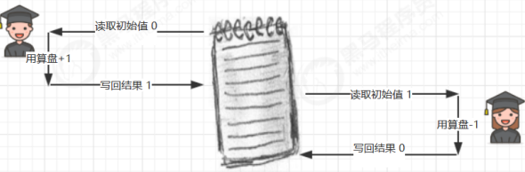

- 但是由于分时系统，有一天还是发生了事故 

- 小南刚读取了初始值 0 做了个 +1 运算，还没来得及写回结果 

- 老王说 [ 小南，你的时间到了，该别人了，记住结果走吧 ]，于是小南念叨着 [ 结果是1，结果是1...] 不甘心地 到一边待着去了（上下文切换） 

- 老王说 [ 小女，该你了 ]，小女看到了笔记本上还写着 0 做了一个 -1 运算，将结果 -1 写入笔记本 

- 这时小女的时间也用完了，老王又叫醒了小南：[小南，把你上次的题目算完吧]，小南将他脑海中的结果 1 写 入了笔记本

  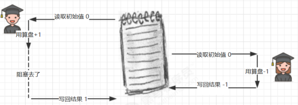

- 小南和小女都觉得自己没做错，但笔记本里的结果是 1 而不是 0

#### Java的体现

两个线程对初始值为 0 的静态变量一个做自增，一个做自减，各做 5000 次，结果是 0 吗？

```java
static int counter = 0;
public static void main(String[] args) throws InterruptedException {
    Thread t1 = new Thread(() -> {
        for (int i = 0; i < 5000; i++) {
            counter++;
        }
    }, "t1");
    Thread t2 = new Thread(() -> {
        for (int i = 0; i < 5000; i++) {
            counter--;
        }
    }, "t2");
    t1.start();
    t2.start();
    t1.join();
    t2.join();
    log.debug("{}",counter);
}
```

**问题分析**

以上的结果可能是正数、负数、零。为什么呢？因为 Java 中对静态变量的自增，自减并不是原子操作，要彻底理 解，必须从字节码来进行分析

 例如对于 i++ 而言（i 为静态变量），实际会产生如下的 JVM 字节码指令：

```
getstatic i // 获取静态变量i的值
iconst_1 // 准备常量1
iadd // 自增
putstatic i // 将修改后的值存入静态变量i
```

而对应 i-- 也是类似：

```
getstatic i // 获取静态变量i的值
iconst_1 // 准备常量1
isub // 自减
putstatic i // 将修改后的值存入静态变量i
```

而 Java 的内存模型如下，完成静态变量的自增，自减需要在主存和工作内存中进行数据交换：

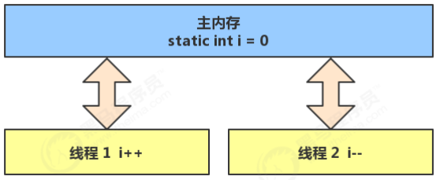

如果是单线程以上 8 行代码是顺序执行（不会交错）没有问题：


但多线程下这 8 行代码可能交错运行：

出现负数的情况：

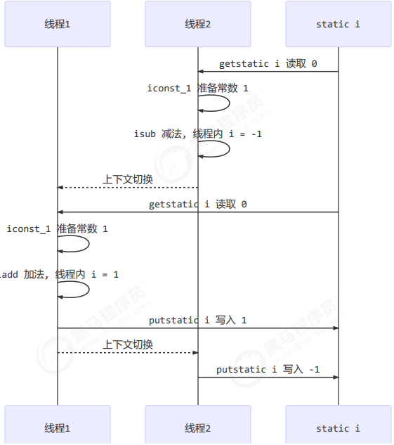

出现正数的情况：

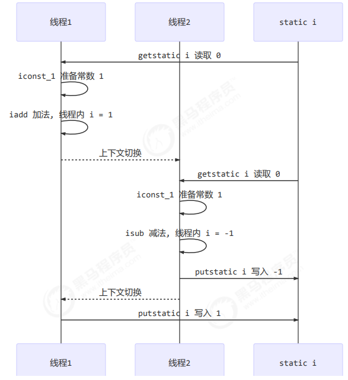

#### 临界区 Critical Section

- 一个程序运行多个线程本身是没有问题的 
- 问题出在多个线程访问共享资源 
  - 多个线程读共享资源其实也没有问题 
  - 多个线程对共享资源读写操作时发生指令交错，就会出现问题 
- 一段代码块内如果存在对共享资源的多线程读写操作，称这段代码块为临界区 

例如，下面代码中的临界区

```java
static int counter = 0;
static void increment() 
    // 临界区
{ 
    counter++;
}
static void decrement() 
    // 临界区
{ 
    counter--;
}
```

#### 竞态条件 Race Condition

多个线程在临界区内执行，由于代码的**执行序列不同**而导致结果无法预测，称之为发生了**竞态条件**

### 2. synchronized 解决方案

为了避免临界区的竞态条件发生，有多种手段可以达到目的。 

- 阻塞式的解决方案：synchronized，Lock 
- 非阻塞式的解决方案：原子变量 

此处使用阻塞式的解决方案：synchronized，来解决上述问题，即俗称的【对象锁】，它采用互斥的方式让同一 时刻至多只有一个线程能持有【对象锁】，其它线程再想获取这个【对象锁】时就会阻塞住。这样就能保证拥有锁 的线程可以安全的执行临界区内的代码，不用担心线程上下文切换

> 注意 
>
> 虽然 java 中互斥和同步都可以采用 synchronized 关键字来完成，但它们还是有区别的： 
>
> - 互斥是保证临界区的竞态条件发生，同一时刻只能有一个线程执行临界区代码 
> - 同步是由于线程执行的先后、顺序不同、需要一个线程等待其它线程运行到某个点

#### synchornized

**语法**

```java
synchronized(对象) // 线程1， 线程2(blocked)
{
    临界区
}
```

**解决**

```java
static int counter = 0;
static final Object room = new Object();
public static void main(String[] args) throws InterruptedException {
    Thread t1 = new Thread(() -> {
        for (int i = 0; i < 5000; i++) {
            synchronized (room) {
                counter++;
            }
        }
    }, "t1");
    Thread t2 = new Thread(() -> {
        for (int i = 0; i < 5000; i++) {
            synchronized (room) {
                counter--;
            }
        }
    }, "t2");
    t1.start();
    t2.start();
    t1.join();
    t2.join();
    log.debug("{}",counter);
}
```

可以做如下类比

- **synchronized(对象)** 中的对象，可以想象为一个房间（room），有唯一入口（门）房间只能一次进入一人 进行计算，线程 t1，t2 想象成两个人 
- 当线程 t1 执行到 **synchronized(room)** 时就好比 t1 进入了这个房间，并锁住了门拿走了钥匙，在门内执行 **count++** 代码 
- 这时候如果 t2 也运行到了 **synchronized(room)** 时，它发现门被锁住了，只能在门外等待，发生了上下文切 换，阻塞住了 
- 这中间即使 t1 的 cpu 时间片不幸用完，被踢出了门外（不要错误理解为锁住了对象就能一直执行下去哦）， 这时门还是锁住的，t1 仍拿着钥匙，t2 线程还在阻塞状态进不来，只有下次轮到 t1 自己再次获得时间片时才 能开门进入 
- 当 t1 执行完 **synchronized{}** 块内的代码，这时候才会从 obj 房间出来并解开门上的锁，唤醒 t2 线程把钥 匙给他。t2 线程这时才可以进入 obj 房间，锁住了门拿上钥匙，执行它的 **count--** 代码


synchronized 实际是用**对象锁**保证了**临界区内代码的原子性**，临界区内的代码对外是不可分割的，不会被线程切 换所打断。

#### 面向对象改进

把需要保护的共享变量放入一个类

```java
class Room {
    int value = 0;
    public void increment() {
        synchronized (this) {
            value++;
        }
    }
    public void decrement() {
        synchronized (this) {
            value--;
        }
    }
    public int get() {
        synchronized (this) {
            return value;
        }
    }
}
@Slf4j
public class Test1 {

    public static void main(String[] args) throws InterruptedException {
        Room room = new Room();
        Thread t1 = new Thread(() -> {
            for (int j = 0; j < 5000; j++) {
                room.increment();
            }
        }, "t1");
        Thread t2 = new Thread(() -> {
            for (int j = 0; j < 5000; j++) {
                room.decrement();
            }
        }, "t2");
        t1.start();
        t2.start();
        t1.join();
        t2.join();
        log.debug("count: {}" , room.get());
    }
}
```

### 3. 方法上的synchornized

```java
class Test{
    public synchronized void test() {

    }
}
等价于
    class Test{
        public void test() {
            synchronized(this) {

            }
        }
    }

class Test{
    public synchronized static void test() {
    }
}
等价于
    class Test{
        public static void test() {
            synchronized(Test.class) {

            }
        }
    }
```

#### 不加synchronized的方法

不加 synchronzied 的方法就好比不遵守规则的人，不去老实排队（好比翻窗户进去的）

#### 所谓的“线程八锁”

其实就是考察 synchronized 锁住的是哪个对象

情况1：12 或 21

```java
@Slf4j(topic = "c.Number")
class Number{
    public synchronized void a() {
        log.debug("1");
    }
    public synchronized void b() {
        log.debug("2");
    }
}
public static void main(String[] args) {
    Number n1 = new Number();
    new Thread(()->{ n1.a(); }).start();
    new Thread(()->{ n1.b(); }).start();
}
```

情况2：1s后12，或 2 1s后 1

```java
@Slf4j(topic = "c.Number")
class Number{
    public synchronized void a() {
        sleep(1);
        log.debug("1");
    }
    public synchronized void b() {
        log.debug("2");
    }
}
public static void main(String[] args) {
    Number n1 = new Number();
    new Thread(()->{ n1.a(); }).start();
    new Thread(()->{ n1.b(); }).start();
}
```

情况3：3 1s 12 或 23 1s 1 或 32 1s 1

```java
@Slf4j(topic = "c.Number")
class Number{
    public synchronized void a() {
        sleep(1);
        log.debug("1");
    }
    public synchronized void b() {
        log.debug("2");
    }
    public void c() {
        log.debug("3");
    }
}
public static void main(String[] args) {
    Number n1 = new Number();
    new Thread(()->{ n1.a(); }).start();
    new Thread(()->{ n1.b(); }).start();
    new Thread(()->{ n1.c(); }).start();
}
```

情况4：2 1s 后 1

```java
@Slf4j(topic = "c.Number")
class Number{
    public synchronized void a() {
        sleep(1);
        log.debug("1");
    }
    public synchronized void b() {
        log.debug("2");
    }
}
public static void main(String[] args) {
    Number n1 = new Number();
    Number n2 = new Number();
    new Thread(()->{ n1.a(); }).start();
    new Thread(()->{ n2.b(); }).start();
}
```

情况5：2 1s 后 1

```java
@Slf4j(topic = "c.Number")
class Number{
    public static synchronized void a() {
        sleep(1);
        log.debug("1");
    }
    public synchronized void b() {
        log.debug("2");
    }
}
public static void main(String[] args) {
    Number n1 = new Number();
    new Thread(()->{ n1.a(); }).start();
    new Thread(()->{ n1.b(); }).start();
}
```

情况6：1s 后12， 或 2 1s后 1

```java
@Slf4j(topic = "c.Number")
class Number{
    public static synchronized void a() {
        sleep(1);
        log.debug("1");
    }
    public static synchronized void b() {
        log.debug("2");
    }
}
public static void main(String[] args) {
    Number n1 = new Number();
    new Thread(()->{ n1.a(); }).start();
    new Thread(()->{ n1.b(); }).start();
}
```

情况7：2 1s 后 1

```java
@Slf4j(topic = "c.Number")
class Number{
    public static synchronized void a() {
        sleep(1);
        log.debug("1");
    }
    public synchronized void b() {
        log.debug("2");
    }
}
public static void main(String[] args) {
    Number n1 = new Number();
    Number n2 = new Number();
    new Thread(()->{ n1.a(); }).start();
    new Thread(()->{ n2.b(); }).start();
}
```

情况8：1s 后12， 或 2 1s后 1

```java
@Slf4j(topic = "c.Number")
class Number{
    public static synchronized void a() {
        sleep(1);
        log.debug("1");
    }
    public static synchronized void b() {
        log.debug("2");
    }
}
public static void main(String[] args) {
    Number n1 = new Number();
    Number n2 = new Number();
    new Thread(()->{ n1.a(); }).start();
    new Thread(()->{ n2.b(); }).start();
}
```

### 4. 变量的线程安全分析

#### 成员变量和静态变量是否线程安全

- 如果它们没有共享，则线程安全 
- 如果它们被共享了，根据它们的状态是否能够改变，又分两种情况 
  - 如果只有读操作，则线程安全 
  - 如果有读写操作，则这段代码是临界区，需要考虑线程安全

#### 局部变量是否线程安全

- 局部变量是线程安全的 
- 但局部变量引用的对象则未必 
  - 如果该对象没有逃离方法的作用访问，它是线程安全的 
  - 如果该对象逃离方法的作用范围，需要考虑线程安全

#### 局部变量线程安全分析

```java
public static void test1() {
    int i = 10;
    i++;
}
```

每个线程调用 test1() 方法时局部变量 i，会在每个线程的栈帧内存中被创建多份，因此不存在共享

```
public static void test1();
 descriptor: ()V
flags: ACC_PUBLIC, ACC_STATIC
 Code:
 stack=1, locals=1, args_size=0
 0: bipush 10
 2: istore_0
 3: iinc 0, 1
 6: return
 LineNumberTable:
 line 10: 0
 line 11: 3
 line 12: 6
 LocalVariableTable:
 Start Length Slot Name Signature
 3 4 0 i I
```

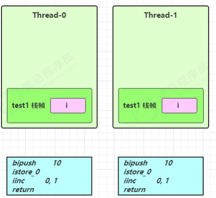

局部变量的引用稍有不同

成员变量的例子

```java
class ThreadUnsafe {
    ArrayList<String> list = new ArrayList<>();
    public void method1(int loopNumber) {
        for (int i = 0; i < loopNumber; i++) {
            // { 临界区, 会产生竞态条件
            method2();
            method3();
            // } 临界区
        }
    }
    private void method2() {
        list.add("1");
    }
    private void method3() {
        list.remove(0);
    }
}
```

执行

```java
static final int THREAD_NUMBER = 2;
static final int LOOP_NUMBER = 200;
public static void main(String[] args) {
    ThreadUnsafe test = new ThreadUnsafe();
    for (int i = 0; i < THREAD_NUMBER; i++) {
        new Thread(() -> {
            test.method1(LOOP_NUMBER);
        }, "Thread" + i).start();
    }
}
```

其中一种情况是，如果线程2 还未 add，线程1 remove 就会报错：

```
Exception in thread "Thread1" java.lang.IndexOutOfBoundsException: Index: 0, Size: 0 
 at java.util.ArrayList.rangeCheck(ArrayList.java:657) 
 at java.util.ArrayList.remove(ArrayList.java:496) 
 at cn.itcast.n6.ThreadUnsafe.method3(TestThreadSafe.java:35) 
 at cn.itcast.n6.ThreadUnsafe.method1(TestThreadSafe.java:26) 
 at cn.itcast.n6.TestThreadSafe.lambda$main$0(TestThreadSafe.java:14) 
 at java.lang.Thread.run(Thread.java:748) 
```

分析： 

- 无论哪个线程中的 method2 引用的都是同一个对象中的 list 成员变量 
- method3 与 method2 分析相同


将 list 修改为局部变量

```java
class ThreadSafe {
    public final void method1(int loopNumber) {
        ArrayList<String> list = new ArrayList<>();
        for (int i = 0; i < loopNumber; i++) {
            method2(list);
            method3(list);
        }
    }
    private void method2(ArrayList<String> list) {
        list.add("1");
    }
    private void method3(ArrayList<String> list) {
        list.remove(0);
    }
}
```

那么就不会有上述问题了

分析：

-  list 是局部变量，每个线程调用时会创建其不同实例，没有共享 
- 而 method2 的参数是从 method1 中传递过来的，与 method1 中引用同一个对象 
- method3 的参数分析与 method2 相同

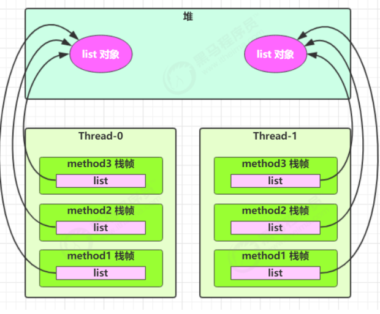

方法访问修饰符带来的思考，如果把 method2 和 method3 的方法修改为 public 会不会代理线程安全问题？ 

- 情况1：有其它线程调用 method2 和 method3 
- 情况2：在 情况1 的基础上，为 ThreadSafe 类添加子类，子类覆盖 method2 或 method3 方法，即

```java
class ThreadSafe {
    public final void method1(int loopNumber) {
        ArrayList<String> list = new ArrayList<>();
        for (int i = 0; i < loopNumber; i++) {
            method2(list);
            method3(list);
        }
    }
    private void method2(ArrayList<String> list) {
        list.add("1");
    }
    private void method3(ArrayList<String> list) {
        list.remove(0);
    }
}
class ThreadSafeSubClass extends ThreadSafe{
    @Override
    public void method3(ArrayList<String> list) {
        new Thread(() -> {
            list.remove(0);
        }).start();
    }
}
```

>从这个例子可以看出 private 或 final 提供【安全】的意义所在，请体会开闭原则中的【闭】

#### 常见的线程安全类

- String
- Integer 
- StringBuffer
- Random 
- Vector 
- Hashtable 
- java.util.concurrent 包下的类

这里说它们是线程安全的是指，多个线程调用它们同一个实例的某个方法时，是线程安全的。也可以理解为

```java
Hashtable table = new Hashtable();
new Thread(()->{
    table.put("key", "value1");
}).start();
new Thread(()->{
    table.put("key", "value2");
}).start();
```

- 它们的每个方法是原子的 
- 但注意它们多个方法的组合不是原子的

#### 线程安全类方法的组合

```java
Hashtable table = new Hashtable();
// 线程1，线程2
if( table.get("key") == null) {
    table.put("key", value);
}
```

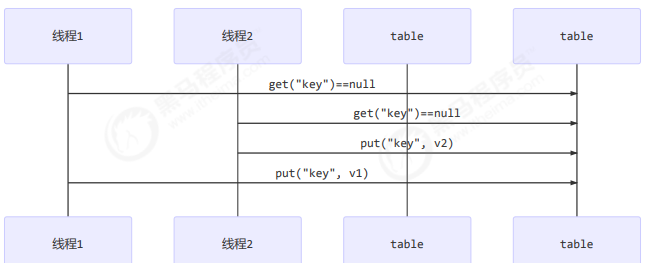

#### 不可变类线程安全性

String、Integer 等都是不可变类，因为其内部的状态不可以改变，因此它们的方法都是线程安全的 

String 有 replace，substring 等方法【可以】改变值，那么这些方法又是如何保证线程安全的？

```java
public class Immutable{
    private int value = 0;
    public Immutable(int value){
        this.value = value;
    }
    public int getValue(){
        return this.value;
    }
}
```

如果想增加一个增加的方法

```java
public class Immutable{
    private int value = 0;
    public Immutable(int value){
        this.value = value;
    }
    public int getValue(){
        return this.value;
    }

    public Immutable add(int v){
        return new Immutable(this.value + v);
    } 
}
```

#### 实例分析

例1：

```java
public class MyServlet extends HttpServlet {
    // 是否安全？
    Map<String,Object> map = new HashMap<>();
    // 是否安全？
    String S1 = "...";
    // 是否安全？
    final String S2 = "...";
    // 是否安全？
    Date D1 = new Date();
    // 是否安全？
    final Date D2 = new Date();

    public void doGet(HttpServletRequest request, HttpServletResponse response) {
        // 使用上述变量
    }
}
```

例2：

```java
public class MyServlet extends HttpServlet {
    // 是否安全？
    private UserService userService = new UserServiceImpl();

    public void doGet(HttpServletRequest request, HttpServletResponse response) {
        userService.update(...);
    }
}
public class UserServiceImpl implements UserService {
    // 记录调用次数
    private int count = 0;

    public void update() {
        // ...
        count++;
    }
}
```

例3：

```java
@Aspect
@Component
public class MyAspect {
    // 是否安全？
    private long start = 0L;

    @Before("execution(* *(..))")
    public void before() {
        start = System.nanoTime();
    }

    @After("execution(* *(..))")
    public void after() {
        long end = System.nanoTime();
        System.out.println("cost time:" + (end-start));
    }
}
```

例4：

```java
public class MyServlet extends HttpServlet {
    // 是否安全
    private UserService userService = new UserServiceImpl();

    public void doGet(HttpServletRequest request, HttpServletResponse response) {
        userService.update(...);
    }
}
public class UserServiceImpl implements UserService {
    // 是否安全
    private UserDao userDao = new UserDaoImpl();

    public void update() {
        userDao.update();
    }
}
public class UserDaoImpl implements UserDao { 
    public void update() {
        String sql = "update user set password = ? where username = ?";
        // 是否安全
        try (Connection conn = DriverManager.getConnection("","","")){
            // ...
        } catch (Exception e) {
            // ...
        }
    }
}
```

例5：

```java
public class MyServlet extends HttpServlet {
    // 是否安全
    private UserService userService = new UserServiceImpl();

    public void doGet(HttpServletRequest request, HttpServletResponse response) {
        userService.update(...);
    }
}
public class UserServiceImpl implements UserService {
    // 是否安全
    private UserDao userDao = new UserDaoImpl();

    public void update() {
        userDao.update();
    }
}

public class UserDaoImpl implements UserDao {
    // 是否安全
    private Connection conn = null;
    public void update() throws SQLException {
        String sql = "update user set password = ? where username = ?";
        conn = DriverManager.getConnection("","","");
        // ...
        conn.close();
    }
}
```

例6：

```java
public class MyServlet extends HttpServlet {
    // 是否安全
    private UserService userService = new UserServiceImpl();

    public void doGet(HttpServletRequest request, HttpServletResponse response) {
        userService.update(...);
    }
}
public class UserServiceImpl implements UserService { 
    public void update() {
        UserDao userDao = new UserDaoImpl();
        userDao.update();
    }
}
public class UserDaoImpl implements UserDao {
    // 是否安全
    private Connection = null;
    public void update() throws SQLException {
        String sql = "update user set password = ? where username = ?";
        conn = DriverManager.getConnection("","","");
        // ...
        conn.close();
    }
}
```

例7：

```java
public abstract class Test {

    public void bar() {
        // 是否安全
        SimpleDateFormat sdf = new SimpleDateFormat("yyyy-MM-dd HH:mm:ss");
        foo(sdf);
    }

    public abstract foo(SimpleDateFormat sdf);

    public static void main(String[] args) {
        new Test().bar();
    }
}
```

其中 foo 的行为是不确定的，可能导致不安全的发生，被称之为**外星方法**

```java
public void foo(SimpleDateFormat sdf) {
    String dateStr = "1999-10-11 00:00:00";
    for (int i = 0; i < 20; i++) {
        new Thread(() -> {
            try {
                sdf.parse(dateStr);
            } catch (ParseException e) {
                e.printStackTrace();
            }
        }).start();
    }
}
```

例8：

```java
private static Integer i = 0;
public static void main(String[] args) throws InterruptedException {
    List<Thread> list = new ArrayList<>();
    for (int j = 0; j < 2; j++) {
        Thread thread = new Thread(() -> {
            for (int k = 0; k < 5000; k++) {
                synchronized (i) {
                    i++;
                }
            }
        }, "" + j);
        list.add(thread);
    }
    list.stream().forEach(t -> t.start());
    list.stream().forEach(t -> {
        try {
            t.join();
        } catch (InterruptedException e) {
            e.printStackTrace();
        }
    });
    log.debug("{}", i);
}
```

### 5. Monitor概念

#### Java对象头

以 32 位虚拟机为例

普通对象

```
|--------------------------------------------------------------|
| 					Object Header (64 bits)				    |
|------------------------------------|-------------------------|
| 		Mark Word (32 bits) 		| Klass Word (32 bits)    |
|------------------------------------|-------------------------|
```

数组对象

```
|---------------------------------------------------------------------------------|
| 					Object Header (96 bits) 								 |
|--------------------------------|-----------------------|------------------------|
|	 Mark Word(32bits) 			| 	Klass Word(32bits)  | 	array length(32bits) |
|--------------------------------|-----------------------|------------------------|
```

其中 Mark Word 结构为

```
|-------------------------------------------------------|--------------------|
| 				Mark Word (32 bits) 				 | 		State 		 |
|-------------------------------------------------------|--------------------|
| 	hashcode:25 	    | age:4 | biased_lock:0 | 01    | 	  Normal 	    |
|-------------------------------------------------------|--------------------|
| 	thread:23 | epoch:2 | age:4 | biased_lock:1 | 01    | 	   Biased        |
|-------------------------------------------------------|--------------------|
| 	ptr_to_lock_record:30                       | 00 	| Lightweight Locked |
|-------------------------------------------------------|--------------------|
| 	ptr_to_heavyweight_monitor:30               | 10 	| Heavyweight Locked |
|-------------------------------------------------------|--------------------|
| 								             | 11 	 | Marked for GC 	  |
|-------------------------------------------------------|--------------------|
```

64 位虚拟机 Mark Word

```
|--------------------------------------------------------------------|--------------------|
|                           Mark Word (64 bits)                      |        State       |
|--------------------------------------------------------------------|--------------------|
| unused:25 | hashcode:31 | unused:1 | age:4 | biased_lock:0 | 01    |        Normal      |
|--------------------------------------------------------------------|--------------------|
| thread:54 | epoch:2 | unused:1 | age:4 | biased_lock:1     | 01    |        Biased      |
|--------------------------------------------------------------------|--------------------|
| ptr_to_lock_record:62                                      | 00    | Lightweight Locked |
|--------------------------------------------------------------------|--------------------|
| ptr_to_heavyweight_monitor:62                              | 10    | Heavyweight Locked |
|--------------------------------------------------------------------|--------------------|
|                                                            | 11    |    Marked for GC   |
|--------------------------------------------------------------------|--------------------|

```

#### 实例

故事角色 

- 老王 - JVM 
- 小南 - 线程 
- 小女 - 线程 
- 房间 - 对象 
- 房间门上 - 防盗锁 - Monitor 
- 房间门上 - 小南书包 - 轻量级锁 
- 房间门上 - 刻上小南大名 - 偏向锁 
- 批量重刻名 - 一个类的偏向锁撤销到达 20 阈值 
- 不能刻名字 - 批量撤销该类对象的偏向锁，设置该类不可偏向 

小南要使用房间保证计算不被其它人干扰（原子性），最初，他用的是防盗锁，当上下文切换时，锁住门。这样， 即使他离开了，别人也进不了门，他的工作就是安全的。 

但是，很多情况下没人跟他来竞争房间的使用权。小女是要用房间，但使用的时间上是错开的，小南白天用，小女 晚上用。每次上锁太麻烦了，有没有更简单的办法呢？ 

小南和小女商量了一下，约定不锁门了，而是谁用房间，谁把自己的书包挂在门口，但他们的书包样式都一样，因 此每次进门前得翻翻书包，看课本是谁的，如果是自己的，那么就可以进门，这样省的上锁解锁了。万一书包不是 自己的，那么就在门外等，并通知对方下次用锁门的方式。 

后来，小女回老家了，很长一段时间都不会用这个房间。小南每次还是挂书包，翻书包，虽然比锁门省事了，但仍 然觉得麻烦。 

于是，小南干脆在门上刻上了自己的名字：【小南专属房间，其它人勿用】，下次来用房间时，只要名字还在，那 么说明没人打扰，还是可以安全地使用房间。如果这期间有其它人要用这个房间，那么由使用者将小南刻的名字擦 掉，升级为挂书包的方式。

同学们都放假回老家了，小南就膨胀了，在 20 个房间刻上了自己的名字，想进哪个进哪个。后来他自己放假回老 家了，这时小女回来了（她也要用这些房间），结果就是得一个个地擦掉小南刻的名字，升级为挂书包的方式。老 王觉得这成本有点高，提出了一种批量重刻名的方法，他让小女不用挂书包了，可以直接在门上刻上自己的名字 

后来，刻名的现象越来越频繁，老王受不了了：算了，这些房间都不能刻名了，只能挂书包

### 6. wait notify

#### 实例-为什么需要wait

- 由于条件不满足，小南不能继续进行计算 

- 但小南如果一直占用着锁，其它人就得一直阻塞，效率太低

  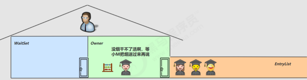

- 于是老王单开了一间休息室（调用 wait 方法），让小南到休息室（WaitSet）等着去了，但这时锁释放开， 其它人可以由老王随机安排进屋 

- 直到小M将烟送来，大叫一声 [ 你的烟到了 ] （调用 notify 方法）

  

- 小南于是可以离开休息室，重新进入竞争锁的队列

  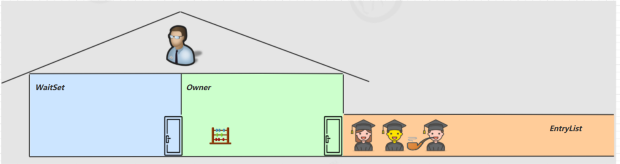

#### API 介绍

- **obj.wait()** 让进入 object 监视器的线程到 waitSet 等待 
- **obj.notify()** 在 object 上正在 waitSet 等待的线程中挑一个唤醒 
- **obj.notifyAll()** 让 object 上正在 waitSet 等待的线程全部唤醒

它们都是线程之间进行协作的手段，都属于 Object 对象的方法。必须获得此对象的锁，才能调用这几个方法

```java
final static Object obj = new Object();
public static void main(String[] args) {
    new Thread(() -> {
        synchronized (obj) {
            log.debug("执行....");
            try {
                obj.wait(); // 让线程在obj上一直等待下去
            } catch (InterruptedException e) {
                e.printStackTrace();
            }
            log.debug("其它代码....");
        }
    }).start();
    new Thread(() -> {
        synchronized (obj) {
            log.debug("执行....");
            try {
                obj.wait(); // 让线程在obj上一直等待下去
            } catch (InterruptedException e) {
                e.printStackTrace();
            }
            log.debug("其它代码....");
        }
    }).start();
    // 主线程两秒后执行
    sleep(2);
    log.debug("唤醒 obj 上其它线程");
    synchronized (obj) {
        obj.notify(); // 唤醒obj上一个线程
        // obj.notifyAll(); // 唤醒obj上所有等待线程
    }
}
```

notify 的一种结果

```
20:00:53.096 [Thread-0] c.TestWaitNotify - 执行.... 
20:00:53.099 [Thread-1] c.TestWaitNotify - 执行.... 
20:00:55.096 [main] c.TestWaitNotify - 唤醒 obj 上其它线程
20:00:55.096 [Thread-0] c.TestWaitNotify - 其它代码.... 
```

notifyAll 的结果

```
19:58:15.457 [Thread-0] c.TestWaitNotify - 执行.... 
19:58:15.460 [Thread-1] c.TestWaitNotify - 执行.... 
19:58:17.456 [main] c.TestWaitNotify - 唤醒 obj 上其它线程
19:58:17.456 [Thread-1] c.TestWaitNotify - 其它代码.... 
19:58:17.456 [Thread-0] c.TestWaitNotify - 其它代码.... 
```

**wait()** 方法会释放对象的锁，进入 WaitSet 等待区，从而让其他线程就机会获取对象的锁。无限制等待，直到 notify 为止 

**wait(long n)** 有时限的等待, 到 n 毫秒后结束等待，或是被 notify

### 7.  wait notify 的正确使用

#### sleep(long n) 和 wait(long n) 的区别

sleep 是 Thread 方法，而 wait 是 Object 的方法 2) sleep 不需要强制和 synchronized 配合使用，但 wait 需要 和 synchronized 一起用 3) sleep 在睡眠的同时，不会释放对象锁的，但 wait 在等待的时候会释放对象锁 4) 它们 状态 TIMED_WAITING

#### step 1

```java
static final Object room = new Object();
static boolean hasCigarette = false;
static boolean hasTakeout = false;
```

下面的解决方案好不好

```java
new Thread(() -> {
    synchronized (room) {
        log.debug("有烟没？[{}]", hasCigarette);
        if (!hasCigarette) {
            log.debug("没烟，先歇会！");
            sleep(2);
        }
        log.debug("有烟没？[{}]", hasCigarette);
        if (hasCigarette) {
            log.debug("可以开始干活了");
        }
    }
}, "小南").start();
for (int i = 0; i < 5; i++) {
    new Thread(() -> {
        synchronized (room) {
            log.debug("可以开始干活了");
        }
    }, "其它人").start();
}
sleep(1);
new Thread(() -> {
    // 这里能不能加 synchronized (room)？
    hasCigarette = true;
    log.debug("烟到了噢！");
}, "送烟的").start();
```

输出：

```
20:49:49.883 [小南] c.TestCorrectPosture - 有烟没？[false] 
20:49:49.887 [小南] c.TestCorrectPosture - 没烟，先歇会！
20:49:50.882 [送烟的] c.TestCorrectPosture - 烟到了噢！
20:49:51.887 [小南] c.TestCorrectPosture - 有烟没？[true] 
20:49:51.887 [小南] c.TestCorrectPosture - 可以开始干活了
20:49:51.887 [其它人] c.TestCorrectPosture - 可以开始干活了
20:49:51.887 [其它人] c.TestCorrectPosture - 可以开始干活了
20:49:51.888 [其它人] c.TestCorrectPosture - 可以开始干活了
20:49:51.888 [其它人] c.TestCorrectPosture - 可以开始干活了
20:49:51.888 [其它人] c.TestCorrectPosture - 可以开始干活了
```

- 其它干活的线程，都要一直阻塞，效率太低 
- 小南线程必须睡足 2s 后才能醒来，就算烟提前送到，也无法立刻醒来 
- 加了 synchronized (room) 后，就好比小南在里面反锁了门睡觉，烟根本没法送进门，main 没加 synchronized 就好像 main 线程是翻窗户进来的 
- 解决方法，使用 wait - notify 机制

#### step 2

```java
new Thread(() -> {
    synchronized (room) {
        log.debug("有烟没？[{}]", hasCigarette);
        if (!hasCigarette) {
            log.debug("没烟，先歇会！");
            try {
                room.wait(2000);
            } catch (InterruptedException e) {
                e.printStackTrace();
            }
        }
        log.debug("有烟没？[{}]", hasCigarette);
        if (hasCigarette) {
            log.debug("可以开始干活了");
        }
    }
}, "小南").start();
for (int i = 0; i < 5; i++) {
    new Thread(() -> {
        synchronized (room) {
            log.debug("可以开始干活了");
        }
    }, "其它人").start();
}
sleep(1);
new Thread(() -> {
    synchronized (room) {
        hasCigarette = true;
        log.debug("烟到了噢！");
        room.notify();
    }
}, "送烟的").start();
```

输出：

```
20:51:42.489 [小南] c.TestCorrectPosture - 有烟没？[false] 
20:51:42.493 [小南] c.TestCorrectPosture - 没烟，先歇会！
20:51:42.493 [其它人] c.TestCorrectPosture - 可以开始干活了
20:51:42.493 [其它人] c.TestCorrectPosture - 可以开始干活了
20:51:42.494 [其它人] c.TestCorrectPosture - 可以开始干活了
20:51:42.494 [其它人] c.TestCorrectPosture - 可以开始干活了
20:51:42.494 [其它人] c.TestCorrectPosture - 可以开始干活了
20:51:43.490 [送烟的] c.TestCorrectPosture - 烟到了噢！
20:51:43.490 [小南] c.TestCorrectPosture - 有烟没？[true] 
20:51:43.490 [小南] c.TestCorrectPosture - 可以开始干活了
```

- 解决了其它干活的线程阻塞的问题 
- 但如果有其它线程也在等待条件呢？

#### step 3

```java
new Thread(() -> {
    synchronized (room) {
        log.debug("有烟没？[{}]", hasCigarette);
        if (!hasCigarette) {
            log.debug("没烟，先歇会！");
            try {
                room.wait();
            } catch (InterruptedException e) {
                e.printStackTrace();
            }
        }
        log.debug("有烟没？[{}]", hasCigarette);
        if (hasCigarette) {
            log.debug("可以开始干活了");
        } else {
            log.debug("没干成活...");
        }
    }
}, "小南").start();
new Thread(() -> {
    synchronized (room) {
        Thread thread = Thread.currentThread();
        log.debug("外卖送到没？[{}]", hasTakeout);
        if (!hasTakeout) {
            log.debug("没外卖，先歇会！");
            try {
                room.wait();
            } catch (InterruptedException e) {
                e.printStackTrace();
            }
        }
        log.debug("外卖送到没？[{}]", hasTakeout);
        if (hasTakeout) {
            log.debug("可以开始干活了");
        } else {
            log.debug("没干成活...");
        }
    }
}, "小女").start();
sleep(1);
new Thread(() -> {
    synchronized (room) {
        hasTakeout = true;
        log.debug("外卖到了噢！");
        room.notify();
    }
}, "送外卖的").start();
```

输出：

```
20:53:12.173 [小南] c.TestCorrectPosture - 有烟没？[false] 
20:53:12.176 [小南] c.TestCorrectPosture - 没烟，先歇会！
20:53:12.176 [小女] c.TestCorrectPosture - 外卖送到没？[false] 
20:53:12.176 [小女] c.TestCorrectPosture - 没外卖，先歇会！
20:53:13.174 [送外卖的] c.TestCorrectPosture - 外卖到了噢！
20:53:13.174 [小南] c.TestCorrectPosture - 有烟没？[false] 
20:53:13.174 [小南] c.TestCorrectPosture - 没干成活... 
```

- notify 只能随机唤醒一个 WaitSet 中的线程，这时如果有其它线程也在等待，那么就可能唤醒不了正确的线 程，称之为【虚假唤醒】 
- 解决方法，改为 notifyAll

#### step 4

```java
new Thread(() -> {
    synchronized (room) {
        hasTakeout = true;
        log.debug("外卖到了噢！");
        room.notifyAll();
    }
}, "送外卖的").start();
```

输出：

```
20:55:23.978 [小南] c.TestCorrectPosture - 有烟没？[false] 
20:55:23.982 [小南] c.TestCorrectPosture - 没烟，先歇会！
20:55:23.982 [小女] c.TestCorrectPosture - 外卖送到没？[false] 
20:55:23.982 [小女] c.TestCorrectPosture - 没外卖，先歇会！
20:55:24.979 [送外卖的] c.TestCorrectPosture - 外卖到了噢！
20:55:24.979 [小女] c.TestCorrectPosture - 外卖送到没？[true] 
20:55:24.980 [小女] c.TestCorrectPosture - 可以开始干活了
20:55:24.980 [小南] c.TestCorrectPosture - 有烟没？[false] 
20:55:24.980 [小南] c.TestCorrectPosture - 没干成活... 
```

- 用 notifyAll 仅解决某个线程的唤醒问题，但使用 if + wait 判断仅有一次机会，一旦条件不成立，就没有重新 判断的机会了 
- 解决方法，用 while + wait，当条件不成立，再次 wait

#### step 5

将 if 改为 while

```java
if (!hasCigarette) {
    log.debug("没烟，先歇会！");
    try {
        room.wait();
    } catch (InterruptedException e) {
        e.printStackTrace();
    }
}
```

改动后

```java
while (!hasCigarette) {
    log.debug("没烟，先歇会！");
    try {
        room.wait();
    } catch (InterruptedException e) {
        e.printStackTrace();
    }
}
```

输出：

```
20:58:34.322 [小南] c.TestCorrectPosture - 有烟没？[false] 
20:58:34.326 [小南] c.TestCorrectPosture - 没烟，先歇会！
20:58:34.326 [小女] c.TestCorrectPosture - 外卖送到没？[false] 
20:58:34.326 [小女] c.TestCorrectPosture - 没外卖，先歇会！
20:58:35.323 [送外卖的] c.TestCorrectPosture - 外卖到了噢！
20:58:35.324 [小女] c.TestCorrectPosture - 外卖送到没？[true] 
20:58:35.324 [小女] c.TestCorrectPosture - 可以开始干活了
20:58:35.324 [小南] c.TestCorrectPosture - 没烟，先歇会！
```

#### 结论

```java
synchronized(lock) {
 while(条件不成立) {
 lock.wait();
 }
 // 干活
}
//另一个线程
synchronized(lock) {
 lock.notifyAll();
}
```

### 8. Park & Unpark

#### 基本使用

它们是 LockSupport 类中的方法

```java
// 暂停当前线程
LockSupport.park(); 
// 恢复某个线程的运行
LockSupport.unpark(暂停线程对象)
```

先 park 再 unpark

```java
Thread t1 = new Thread(() -> {
    log.debug("start...");
    sleep(1);
    log.debug("park...");
    LockSupport.park();
    log.debug("resume...");
},"t1");
t1.start();
sleep(2);
log.debug("unpark...");
LockSupport.unpark(t1);
```

输出

```
18:42:52.585 c.TestParkUnpark [t1] - start... 
18:42:53.589 c.TestParkUnpark [t1] - park... 
18:42:54.583 c.TestParkUnpark [main] - unpark... 
18:42:54.583 c.TestParkUnpark [t1] - resume... 
```

先 unpark 再 park

```java
Thread t1 = new Thread(() -> {
    log.debug("start...");
    sleep(2);
    log.debug("park...");
    LockSupport.park();
    log.debug("resume...");
}, "t1");
t1.start();
sleep(1);
log.debug("unpark...");
LockSupport.unpark(t1);
```

输出

```
18:43:50.765 c.TestParkUnpark [t1] - start... 
18:43:51.764 c.TestParkUnpark [main] - unpark... 
18:43:52.769 c.TestParkUnpark [t1] - park... 
18:43:52.769 c.TestParkUnpark [t1] - resume... 
```

#### 特点

与 Object 的 wait & notify 相比 

- wait，notify 和 notifyAll 必须配合 Object Monitor 一起使用，而 park，unpark 不必
- park & unpark 是以线程为单位来【阻塞】和【唤醒】线程，而 notify 只能随机唤醒一个等待线程，notifyAll  是唤醒所有等待线程，就不那么【精确】 
- park & unpark 可以先 unpark，而 wait & notify 不能先 notify

### 9. 重新理解线程状态转换

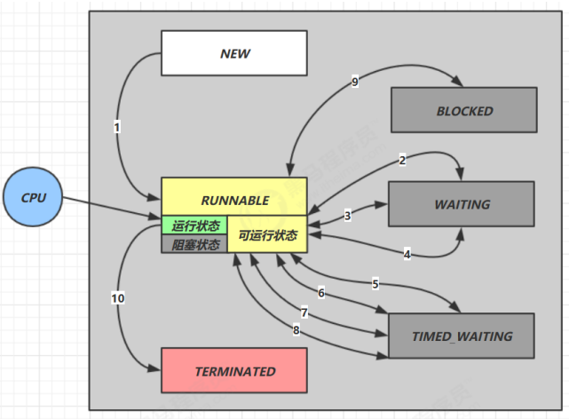

假设有线程 **Thread t**

#### 情况 1 NEW --> RUNNABLE

- 当调用 t.start() 方法时，由 **NEW --> RUNNABLE**

#### 情况 2 RUNNABLE <--> WAITING

**t 线程**用 synchronized(obj)**** 获取了对象锁后 

- 调用 **obj.wait()** 方法时，**t 线程**从 **RUNNABLE --> WAITING** 
- 调用 **obj.notify() ， obj.notifyAll() ， t.interrupt()** 时 
  - 竞争锁成功，**t 线程**从 **WAITING --> RUNNABLE** 
  - 竞争锁失败，**t 线程**从 **WAITING --> BLOCKED**

```java
public class TestWaitNotify {
    final static Object obj = new Object();
    public static void main(String[] args) {
        new Thread(() -> {
            synchronized (obj) {
                log.debug("执行....");
                try {
                    obj.wait();
                } catch (InterruptedException e) {
                    e.printStackTrace();
                }
                log.debug("其它代码...."); // 断点
            }
        },"t1").start();
        new Thread(() -> {
            synchronized (obj) {
                log.debug("执行....");
                try {
                    obj.wait();
                } catch (InterruptedException e) {
                    e.printStackTrace();
                }
                log.debug("其它代码...."); // 断点
            }
        },"t2").start();

        sleep(0.5);
        log.debug("唤醒 obj 上其它线程");
        synchronized (obj) {
            obj.notifyAll(); // 唤醒obj上所有等待线程 断点
        }
    }
}
```

#### 情况 3 RUNNABLE <--> WAITING

- **当前线程**调用 **t.join()** 方法时，**当前线程**从 **RUNNABLE --> WAITING** 
  - 注意是**当前线程**在**t 线程对象**的监视器上等待 
- **t 线程**运行结束，或调用了**当前线程**的 interrupt() 时，当前线程从 **WAITING --> RUNNABLE**

#### 情况 4 RUNNABLE <--> WAITING

- 当前线程调用 **LockSupport.park()** 方法会让当前线程从 RUNNABLE --> WAITING 
- 调用 **LockSupport.unpark(目标线程)** 或调用了线程 的 interrupt() ，会让目标线程从 **WAITING -->  RUNNABLE**

#### 情况 5 RUNNABLE <--> TIMED_WAITING

**t 线程**用 synchronized(obj) 获取了对象锁后 

- 调用 obj.wait(long n) 方法时，**t 线程**从 RUNNABLE --> TIMED_WAITING 
- **t 线程**等待时间超过了 n 毫秒，或调用 **obj.notify() ， obj.notifyAll() ， t.interrupt()** 时 
  - 竞争锁成功，**t 线程**从 **TIMED_WAITING --> RUNNABLE** 
  - 竞争锁失败，**t 线程**从 TIMED_WAITING --> BLOCKED

#### 情况 6 RUNNABLE <--> TIMED_WAITING 

- **当前线程**调用 **t.join(long n)** 方法时，**当前线程**从 **RUNNABLE --> TIMED_WAITING** 
  - 注意是**当前线程在t 线程对象**的监视器上等待 
- **当前线程**等待时间超过了 n 毫秒，或**t 线程**运行结束，或调用了**当前线程**的 **interrupt()** 时，**当前线程**从 **TIMED_WAITING --> RUNNABLE** 

#### 情况 7 RUNNABLE <--> TIMED_WAITING 

- 当前线程调用 **Thread.sleep(long n) ，**当前线程从 **RUNNABLE --> TIMED_WAITING** 
- 当前线程等待时间超过了 n 毫秒，当前线程从 **TIMED_WAITING --> RUNNABLE** 

#### 情况 8 RUNNABLE <--> TIMED_WAITING 

- 当前线程调用 LockSupport.parkNanos(long nanos) 或 LockSupport.parkUntil(long millis) 时，当前线 程从 RUNNABLE --> TIMED_WAITING 
- 调用 LockSupport.unpark(目标线程) 或调用了线程 的 interrupt() ，或是等待超时，会让目标线程从 TIMED_WAITING--> RUNNABLE 

#### 情况 9 RUNNABLE <--> BLOCKED 

- t 线程用 synchronized(obj) 获取了对象锁时如果竞争失败，从 RUNNABLE --> BLOCKED 
- 持 obj 锁线程的同步代码块执行完毕，会唤醒该对象上所有 BLOCKED 的线程重新竞争，如果其中 t 线程竞争 成功，从 BLOCKED --> RUNNABLE ，其它失败的线程仍然 BLOCKED 

#### 情况 10 RUNNABLE <--> TERMINATED 

- 当前线程所有代码运行完毕，进入 **TERMINATED**

### 10. 多把锁

#### 多把不相干的锁

一间大屋子有两个功能：睡觉、学习，互不相干。 

现在小南要学习，小女要睡觉，但如果只用一间屋子（一个对象锁）的话，那么并发度很低 

解决方法是准备多个房间（多个对象锁）

例如

```java
class BigRoom {
    public void sleep() {
        synchronized (this) {
            log.debug("sleeping 2 小时");
            Sleeper.sleep(2);
        }
    }
    public void study() {
        synchronized (this) {
            log.debug("study 1 小时");
            Sleeper.sleep(1);
        }
    }
}
```

执行

```java
BigRoom bigRoom = new BigRoom();
new Thread(() -> {
    bigRoom.compute();
},"小南").start();
new Thread(() -> {
    bigRoom.sleep();
},"小女").start();
```

某次结果

```
12:13:54.471 [小南] c.BigRoom - study 1 小时
12:13:55.476 [小女] c.BigRoom - sleeping 2 小时
```

改进

```java
class BigRoom {
    private final Object studyRoom = new Object();
    private final Object bedRoom = new Object();
    public void sleep() {
        synchronized (bedRoom) {
            log.debug("sleeping 2 小时");
            Sleeper.sleep(2);
        }
    }
    public void study() {
        synchronized (studyRoom) {
            log.debug("study 1 小时");
            Sleeper.sleep(1);
        }
    }
}
```

某次执行结果

```
12:15:35.069 [小南] c.BigRoom - study 1 小时
12:15:35.069 [小女] c.BigRoom - sleeping 2 小时
```

将锁的粒度细分 

- 好处，是可以增强并发度 
- 坏处，如果一个线程需要同时获得多把锁，就容易发生死锁

### 11. 活跃性

#### 死锁

有这样的情况：一个线程需要同时获取多把锁，这时就容易发生死锁 

**t1 线程** 获得 **A对象** 锁，接下来想获取 **B对象** 的锁 t2 线程 获得 **B对象** 锁，接下来想获取 A对象 的锁 例：

```java
Object A = new Object();
Object B = new Object();
Thread t1 = new Thread(() -> {
    synchronized (A) {
        log.debug("lock A");
        sleep(1);
        synchronized (B) {
            log.debug("lock B");
            log.debug("操作...");
        }
    }
}, "t1");
Thread t2 = new Thread(() -> {
    synchronized (B) {
        log.debug("lock B");
        sleep(0.5);
        synchronized (A) {
            log.debug("lock A");
            log.debug("操作...");
        }
    }
}, "t2");
t1.start();
t2.start();
```

#### 定位死锁

检测死锁可以使用 jconsole工具，或者使用 jps 定位进程 id，再用 jstack 定位死锁：

```sh
cmd > jps
Picked up JAVA_TOOL_OPTIONS: -Dfile.encoding=UTF-8
12320 Jps
22816 KotlinCompileDaemon
33200 TestDeadLock // JVM 进程
11508 Main
28468 Launcher
```

```shell
cmd > jstack 33200
Picked up JAVA_TOOL_OPTIONS: -Dfile.encoding=UTF-8
2018-12-29 05:51:40
Full thread dump Java HotSpot(TM) 64-Bit Server VM (25.91-b14 mixed mode):
"DestroyJavaVM" #13 prio=5 os_prio=0 tid=0x0000000003525000 nid=0x2f60 waiting on condition 
[0x0000000000000000]
java.lang.Thread.State: RUNNABLE
"Thread-1" #12 prio=5 os_prio=0 tid=0x000000001eb69000 nid=0xd40 waiting for monitor entry 
[0x000000001f54f000]
java.lang.Thread.State: BLOCKED (on object monitor)
at thread.TestDeadLock.lambda$main$1(TestDeadLock.java:28)
- waiting to lock <0x000000076b5bf1c0> (a java.lang.Object)
- locked <0x000000076b5bf1d0> (a java.lang.Object)
at thread.TestDeadLock$$Lambda$2/883049899.run(Unknown Source)
at java.lang.Thread.run(Thread.java:745)
"Thread-0" #11 prio=5 os_prio=0 tid=0x000000001eb68800 nid=0x1b28 waiting for monitor entry 
[0x000000001f44f000]
java.lang.Thread.State: BLOCKED (on object monitor)
at thread.TestDeadLock.lambda$main$0(TestDeadLock.java:15)
- waiting to lock <0x000000076b5bf1d0> (a java.lang.Object)
- locked <0x000000076b5bf1c0> (a java.lang.Object)
at thread.TestDeadLock$$Lambda$1/495053715.run(Unknown Source)
at java.lang.Thread.run(Thread.java:745)

// 略去部分输出
Found one Java-level deadlock:
=============================
"Thread-1":
waiting to lock monitor 0x000000000361d378 (object 0x000000076b5bf1c0, a java.lang.Object),
which is held by "Thread-0"
"Thread-0":
waiting to lock monitor 0x000000000361e768 (object 0x000000076b5bf1d0, a java.lang.Object),
which is held by "Thread-1"
Java stack information for the threads listed above:
===================================================
"Thread-1":
at thread.TestDeadLock.lambda$main$1(TestDeadLock.java:28)
- waiting to lock <0x000000076b5bf1c0> (a java.lang.Object)
- locked <0x000000076b5bf1d0> (a java.lang.Object)
at thread.TestDeadLock$$Lambda$2/883049899.run(Unknown Source)
at java.lang.Thread.run(Thread.java:745)
"Thread-0":
at thread.TestDeadLock.lambda$main$0(TestDeadLock.java:15)
- waiting to lock <0x000000076b5bf1d0> (a java.lang.Object)
- locked <0x000000076b5bf1c0> (a java.lang.Object)
at thread.TestDeadLock$$Lambda$1/495053715.run(Unknown Source)
at java.lang.Thread.run(Thread.java:745)
Found 1 deadlock.
```

- 避免死锁要注意加锁顺序 
- 另外如果由于某个线程进入了死循环，导致其它线程一直等待，对于这种情况 linux 下可以通过 top 先定位到 CPU 占用高的 Java 进程，再利用 top -Hp 进程id 来定位是哪个线程，最后再用 jstack 排查

#### 哲学家就餐问题


有五位哲学家，围坐在圆桌旁。 

- 他们只做两件事，思考和吃饭，思考一会吃口饭，吃完饭后接着思考。 
- 吃饭时要用两根筷子吃，桌上共有 5 根筷子，每位哲学家左右手边各有一根筷子。 
- 如果筷子被身边的人拿着，自己就得等待

筷子类

```java
class Chopstick {
    String name;
    public Chopstick(String name) {
        this.name = name;
    }
    @Override
    public String toString() {
        return "筷子{" + name + '}';
    }
}
```

哲学家类

```java
class Philosopher extends Thread {
    Chopstick left;
    Chopstick right;
    public Philosopher(String name, Chopstick left, Chopstick right) {
        super(name);
        this.left = left;
        this.right = right;
    }
    private void eat() {
        log.debug("eating...");
        Sleeper.sleep(1);
    }

    @Override
    public void run() {
        while (true) {
            // 获得左手筷子
            synchronized (left) {
                // 获得右手筷子
                synchronized (right) {
                    // 吃饭
                    eat();
                }
                // 放下右手筷子
            }
            // 放下左手筷子
        }
    }
}
```

就餐

```java
Chopstick c1 = new Chopstick("1");
Chopstick c2 = new Chopstick("2");
Chopstick c3 = new Chopstick("3");
Chopstick c4 = new Chopstick("4");
Chopstick c5 = new Chopstick("5");
new Philosopher("苏格拉底", c1, c2).start();
new Philosopher("柏拉图", c2, c3).start();
new Philosopher("亚里士多德", c3, c4).start();
new Philosopher("赫拉克利特", c4, c5).start();
new Philosopher("阿基米德", c5, c1).start();
```

执行不多会，就执行不下去了

```
12:33:15.575 [苏格拉底] c.Philosopher - eating... 
12:33:15.575 [亚里士多德] c.Philosopher - eating... 
12:33:16.580 [阿基米德] c.Philosopher - eating... 
12:33:17.580 [阿基米德] c.Philosopher - eating... 
// 卡在这里, 不向下运行
```

使用 jconsole 检测死锁，发现

```
-------------------------------------------------------------------------
名称: 阿基米德
状态: cn.itcast.Chopstick@1540e19d (筷子1) 上的BLOCKED, 拥有者: 苏格拉底
总阻止数: 2, 总等待数: 1

堆栈跟踪:
cn.itcast.Philosopher.run(TestDinner.java:48)
 - 已锁定 cn.itcast.Chopstick@6d6f6e28 (筷子5)
-------------------------------------------------------------------------
名称: 苏格拉底
状态: cn.itcast.Chopstick@677327b6 (筷子2) 上的BLOCKED, 拥有者: 柏拉图
总阻止数: 2, 总等待数: 1

堆栈跟踪:
cn.itcast.Philosopher.run(TestDinner.java:48)
 - 已锁定 cn.itcast.Chopstick@1540e19d (筷子1)
-------------------------------------------------------------------------
名称: 柏拉图
状态: cn.itcast.Chopstick@14ae5a5 (筷子3) 上的BLOCKED, 拥有者: 亚里士多德
总阻止数: 2, 总等待数: 0

堆栈跟踪:
cn.itcast.Philosopher.run(TestDinner.java:48)
 - 已锁定 cn.itcast.Chopstick@677327b6 (筷子2)
-------------------------------------------------------------------------
名称: 亚里士多德
状态: cn.itcast.Chopstick@7f31245a (筷子4) 上的BLOCKED, 拥有者: 赫拉克利特
总阻止数: 1, 总等待数: 1

堆栈跟踪:
cn.itcast.Philosopher.run(TestDinner.java:48)
 - 已锁定 cn.itcast.Chopstick@14ae5a5 (筷子3)
-------------------------------------------------------------------------
名称: 赫拉克利特
状态: cn.itcast.Chopstick@6d6f6e28 (筷子5) 上的BLOCKED, 拥有者: 阿基米德
总阻止数: 2, 总等待数: 0

堆栈跟踪:
cn.itcast.Philosopher.run(TestDinner.java:48)
 - 已锁定 cn.itcast.Chopstick@7f31245a (筷子4)
```

这种线程没有按预期结束，执行不下去的情况，归类为【活跃性】问题，除了死锁以外，还有活锁和饥饿者两种情 况

#### 活锁

活锁出现在两个线程互相改变对方的结束条件，最后谁也无法结束，例如

```java
public class TestLiveLock {
    static volatile int count = 10;
    static final Object lock = new Object();
    
    public static void main(String[] args) {
        new Thread(() -> {
            // 期望减到 0 退出循环
            while (count > 0) {
                sleep(0.2);
                count--;
                log.debug("count: {}", count);
            }
        }, "t1").start();
        new Thread(() -> {
            // 期望超过 20 退出循环
            while (count < 20) {
                sleep(0.2);
                count++;
                log.debug("count: {}", count);
            }
        }, "t2").start();
    }
}
```

#### 饥饿

很多教程中把饥饿定义为，一个线程由于优先级太低，始终得不到 CPU 调度执行，也不能够结束，饥饿的情况不 易演示，讲读写锁时会涉及饥饿问题

下面我讲一下我遇到的一个线程饥饿的例子，先来看看使用顺序加锁的方式解决之前的死锁问题

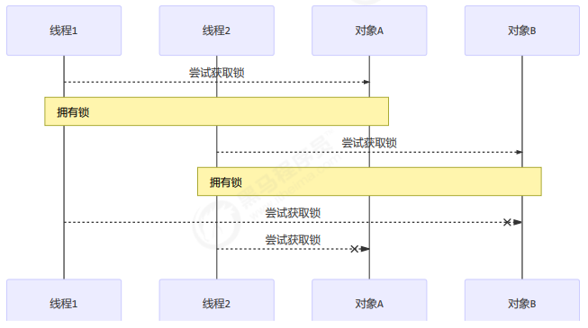

顺序加锁的解决方案

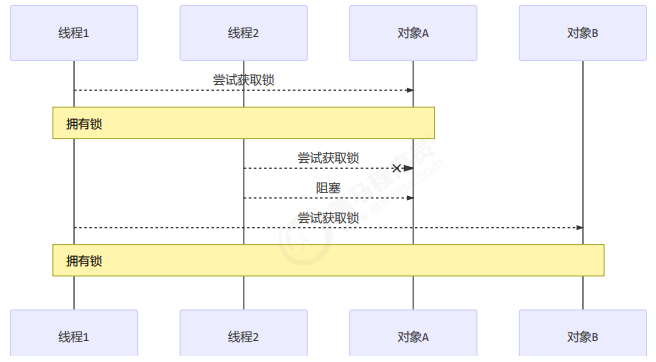

### 12. ReentrantLock

相对于 synchronized 它具备如下特点

- 可中断 
- 可以设置超时时间 
- 可以设置为公平锁 
- 支持多个条件变量

与 synchronized 一样，都支持可重入 

基本语法

```java
// 获取锁
reentrantLock.lock();
try {
    // 临界区
} finally {
    // 释放锁
    reentrantLock.unlock();
}
```

#### 可重入

可重入是指同一个线程如果首次获得了这把锁，那么因为它是这把锁的拥有者，因此有权利再次获取这把锁 

如果是不可重入锁，那么第二次获得锁时，自己也会被锁挡住

```java
static ReentrantLock lock = new ReentrantLock();
public static void main(String[] args) {
    method1();
}
public static void method1() {
    lock.lock();
    try {
        log.debug("execute method1");
        method2();
    } finally {
        lock.unlock();
    }
}
public static void method2() {
    lock.lock();
    try {
        log.debug("execute method2");
        method3();
    } finally {
        lock.unlock();
    }
}
public static void method3() {
    lock.lock();
    try {
        log.debug("execute method3");
    } finally {
        lock.unlock();
    }
}
```

#### 可打断

```java
ReentrantLock lock = new ReentrantLock();
Thread t1 = new Thread(() -> {
    log.debug("启动...");
    try {
        lock.lockInterruptibly();
    } catch (InterruptedException e) {
        e.printStackTrace();
        log.debug("等锁的过程中被打断");
        return;
    }
    try {
        log.debug("获得了锁");
    } finally {
        lock.unlock();
    }
}, "t1");
lock.lock();
log.debug("获得了锁");
t1.start();
try {
    sleep(1);
    t1.interrupt();
    log.debug("执行打断");
} finally {
    lock.unlock();
}
```

输出

```
18:02:40.520 [main] c.TestInterrupt - 获得了锁
18:02:40.524 [t1] c.TestInterrupt - 启动... 
18:02:41.530 [main] c.TestInterrupt - 执行打断
java.lang.InterruptedException 
 at 
java.util.concurrent.locks.AbstractQueuedSynchronizer.doAcquireInterruptibly(AbstractQueuedSynchr
onizer.java:898) 
 at 
java.util.concurrent.locks.AbstractQueuedSynchronizer.acquireInterruptibly(AbstractQueuedSynchron
izer.java:1222) 
 at java.util.concurrent.locks.ReentrantLock.lockInterruptibly(ReentrantLock.java:335) 
 at cn.itcast.n4.reentrant.TestInterrupt.lambda$main$0(TestInterrupt.java:17) 
 at java.lang.Thread.run(Thread.java:748) 
18:02:41.532 [t1] c.TestInterrupt - 等锁的过程中被打断
```

<u>注意如果是不可中断模式，那么即使使用了 interrupt 也不会让等待中断</u>

```java
ReentrantLock lock = new ReentrantLock();
Thread t1 = new Thread(() -> {
    log.debug("启动...");
    lock.lock();
    try {
        log.debug("获得了锁");
    } finally {
        lock.unlock();
    }
}, "t1");
lock.lock();
log.debug("获得了锁");
t1.start();
try {
    sleep(1);
    t1.interrupt();
    log.debug("执行打断");
    sleep(1);
} finally {
    log.debug("释放了锁");
    lock.unlock();
}
```

输出

```
18:06:56.261 [main] c.TestInterrupt - 获得了锁
18:06:56.265 [t1] c.TestInterrupt - 启动... 
18:06:57.266 [main] c.TestInterrupt - 执行打断 // 这时 t1 并没有被真正打断, 而是仍继续等待锁
18:06:58.267 [main] c.TestInterrupt - 释放了锁
18:06:58.267 [t1] c.TestInterrupt - 获得了锁
```

#### 锁超时

立刻失败

```java
ReentrantLock lock = new ReentrantLock();
Thread t1 = new Thread(() -> {
    log.debug("启动...");
    if (!lock.tryLock()) {
        log.debug("获取立刻失败，返回");
        return;
    }
    try {
        log.debug("获得了锁");
    } finally {
        lock.unlock();
    }
}, "t1");
lock.lock();
log.debug("获得了锁");
t1.start();
try {
    sleep(2);
} finally {
    lock.unlock();
}
```

输出

```
18:15:02.918 [main] c.TestTimeout - 获得了锁
18:15:02.921 [t1] c.TestTimeout - 启动... 
18:15:02.921 [t1] c.TestTimeout - 获取立刻失败，返回
```

超时失败

```java
ReentrantLock lock = new ReentrantLock();
Thread t1 = new Thread(() -> {
    log.debug("启动...");
    try {
        if (!lock.tryLock(1, TimeUnit.SECONDS)) {
            log.debug("获取等待 1s 后失败，返回");
            return;
        }
    } catch (InterruptedException e) {
        e.printStackTrace();
    }
    try {
        log.debug("获得了锁");
    } finally {
        lock.unlock();
    }
}, "t1");
lock.lock();
log.debug("获得了锁");
t1.start();
try {
    sleep(2);
} finally {
    lock.unlock();
}
```

输出

```
18:19:40.537 [main] c.TestTimeout - 获得了锁
18:19:40.544 [t1] c.TestTimeout - 启动... 
18:19:41.547 [t1] c.TestTimeout - 获取等待 1s 后失败，返回
```

使用 tryLock 解决哲学家就餐问题

```java
class Chopstick extends ReentrantLock {
    String name;
    public Chopstick(String name) {
        this.name = name;
    }
    @Override
    public String toString() {
        return "筷子{" + name + '}';
    }
}

class Philosopher extends Thread {
    Chopstick left;
    Chopstick right;
    public Philosopher(String name, Chopstick left, Chopstick right) {
        super(name);
        this.left = left;
        this.right = right;
    }
    @Override
    public void run() {
        while (true) {
            // 尝试获得左手筷子
            if (left.tryLock()) {
                try {
                    // 尝试获得右手筷子
                    if (right.tryLock()) {
                        try {
                            eat();
                        } finally {
                            right.unlock();
                        }
                    }
                } finally {
                    left.unlock();
                }
            }
        }
    }
    private void eat() {
        log.debug("eating...");
        Sleeper.sleep(1);
    }
}

```

#### 公平锁

ReentrantLock 默认是不公平的

```java
ReentrantLock lock = new ReentrantLock(false);
lock.lock();
for (int i = 0; i < 500; i++) {
    new Thread(() -> {
        lock.lock();
        try {
            System.out.println(Thread.currentThread().getName() + " running...");
        } finally {
            lock.unlock();
        }
    }, "t" + i).start();
}
// 1s 之后去争抢锁
Thread.sleep(1000);
new Thread(() -> {
    System.out.println(Thread.currentThread().getName() + " start...");
    lock.lock();
    try {
        System.out.println(Thread.currentThread().getName() + " running...");
    } finally {
        lock.unlock();
    }
}, "强行插入").start();
lock.unlock();
```

强行插入，有机会在中间输出

> 注意：该实验不一定总能复现

```
t39 running... 
t40 running... 
t41 running... 
t42 running... 
t43 running... 
强行插入 start... 
强行插入 running... 
t44 running... 
t45 running... 
t46 running... 
t47 running... 
t49 running...
```

改为公平锁后

```java
ReentrantLock lock = new ReentrantLock(true);
```

强行插入，总是在最后输出

```
t465 running... 
t464 running... 
t477 running... 
t442 running... 
t468 running... 
t493 running... 
t482 running... 
t485 running... 
t481 running... 
强行插入 running... 
```

公平锁一般没有必要，会降低并发度

#### 条件变量

synchronized 中也有条件变量，就是我们讲原理时那个 waitSet 休息室，当条件不满足时进入 waitSet 等待 

ReentrantLock 的条件变量比 synchronized 强大之处在于，它是支持多个条件变量的，这就好比 

- synchronized 是那些不满足条件的线程都在一间休息室等消息 
- 而 ReentrantLock 支持多间休息室，有专门等烟的休息室、专门等早餐的休息室、唤醒时也是按休息室来唤 醒

使用要点： 

- await 前需要获得锁 
- await 执行后，会释放锁，进入 conditionObject 等待 
- await 的线程被唤醒（或打断、或超时）取重新竞争 lock 锁 
- 竞争 lock 锁成功后，从 await 后继续执行

例子：

```java
static ReentrantLock lock = new ReentrantLock();
static Condition waitCigaretteQueue = lock.newCondition();
static Condition waitbreakfastQueue = lock.newCondition();
static volatile boolean hasCigrette = false;
static volatile boolean hasBreakfast = false;
public static void main(String[] args) {
    new Thread(() -> {
        try {
            lock.lock();
            while (!hasCigrette) {
                try {
                    waitCigaretteQueue.await();
                } catch (InterruptedException e) {
                    e.printStackTrace();
                }
            }
            log.debug("等到了它的烟");
        } finally {
            lock.unlock();
        }
    }).start();
    new Thread(() -> {
        try {
            lock.lock();
            while (!hasBreakfast) {
                try {
                    waitbreakfastQueue.await();
                } catch (InterruptedException e) {
                    e.printStackTrace();
                }
            }
            log.debug("等到了它的早餐");
        } finally {
            lock.unlock();
        }
    }).start();
    sleep(1);
    sendBreakfast();
    sleep(1);
    sendCigarette();
}
private static void sendCigarette() {
    lock.lock();
    try {
        log.debug("送烟来了");
        hasCigrette = true;
        waitCigaretteQueue.signal();
    } finally {
        lock.unlock();
    }
}
private static void sendBreakfast() {
    lock.lock();
    try {
        log.debug("送早餐来了");
        hasBreakfast = true;
        waitbreakfastQueue.signal();
    } finally {
        lock.unlock();
    }
}
```

