## 三、共享模型之管程

### 1. 共享带来的问题

#### 实例

老王（操作系统）有一个功能强大的算盘（CPU），现在想把它租出去，赚一点外快


- 小南、小女（线程）来使用这个算盘来进行一些计算，并按照时间给老王支付费用 

- 但小南不能一天24小时使用算盘，他经常要小憩一会（sleep），又或是去吃饭上厕所（阻塞 io 操作），有 时还需要一根烟，没烟时思路全无（wait）这些情况统称为（阻塞）

  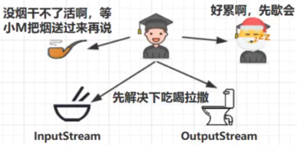

- 在这些时候，算盘没利用起来（不能收钱了），老王觉得有点不划算 

- 另外，小女也想用用算盘，如果总是小南占着算盘，让小女觉得不公平 

- 于是，老王灵机一动，想了个办法 [ 让他们每人用一会，轮流使用算盘 ] 

- 这样，当小南阻塞的时候，算盘可以分给小女使用，不会浪费，反之亦然 

- 最近执行的计算比较复杂，需要存储一些中间结果，而学生们的脑容量（工作内存）不够，所以老王申请了 一个笔记本（主存），把一些中间结果先记在本上

- 计算流程为

  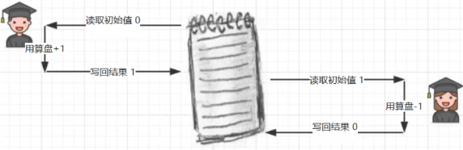

- 但是由于分时系统，有一天还是发生了事故 

- 小南刚读取了初始值 0 做了个 +1 运算，还没来得及写回结果 

- 老王说 [ 小南，你的时间到了，该别人了，记住结果走吧 ]，于是小南念叨着 [ 结果是1，结果是1...] 不甘心地 到一边待着去了（上下文切换） 

- 老王说 [ 小女，该你了 ]，小女看到了笔记本上还写着 0 做了一个 -1 运算，将结果 -1 写入笔记本 

- 这时小女的时间也用完了，老王又叫醒了小南：[小南，把你上次的题目算完吧]，小南将他脑海中的结果 1 写 入了笔记本

  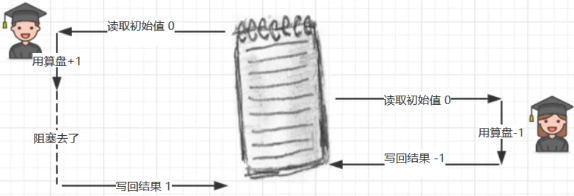

- 小南和小女都觉得自己没做错，但笔记本里的结果是 1 而不是 0

#### Java的体现

两个线程对初始值为 0 的静态变量一个做自增，一个做自减，各做 5000 次，由于分时系统及自增自减并非原子操作，其结果并不一定是0

```java
static int counter = 0;
public static void main(String[] args) throws InterruptedException {
    Thread t1 = new Thread(() -> {
        for (int i = 0; i < 5000; i++) {
            counter++;
        }
    }, "t1");
    Thread t2 = new Thread(() -> {
        for (int i = 0; i < 5000; i++) {
            counter--;
        }
    }, "t2");
    t1.start();
    t2.start();
    t1.join();
    t2.join();
    log.debug("{}",counter);
}
```

```
17:39:04 [main] c.Test1 - -2655
```

**问题分析**

以上的结果可能是正数、负数、零。因为 Java 中对静态变量的自增，自减并不是原子操作，要彻底理 解，必须从字节码来进行分析

 例如对于 i++ 而言（i 为静态变量），实际会产生如下的 JVM 字节码指令：

```
getstatic i // 获取静态变量i的值
iconst_1 // 准备常量1
iadd // 自增
putstatic i // 将修改后的值存入静态变量i
```

而对应 i-- 也是类似：

```
getstatic i // 获取静态变量i的值
iconst_1 // 准备常量1
isub // 自减
putstatic i // 将修改后的值存入静态变量i
```

而 Java 的内存模型如下，完成静态变量的自增，自减需要在主存和工作内存中进行数据交换：

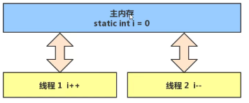

如果是单线程以上 8 行代码是顺序执行（不会交错）没有问题：

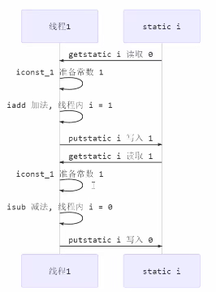

但多线程下这 8 行代码可能交错运行：

出现负数的情况：

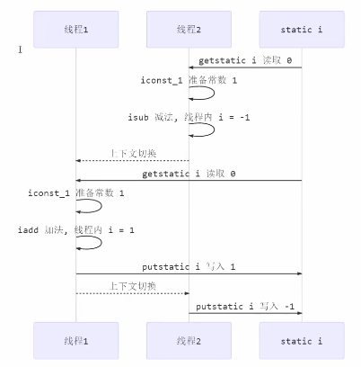

出现正数的情况：

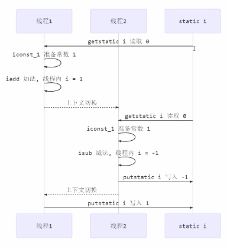

#### 临界区 Critical Section

- 一个程序运行多个线程本身是没有问题的 
- 问题出在多个线程访问共享资源 
  - 多个线程**读共享资源**其实也没有问题 
  - 多个线程对**共享资源读写操作**时发生指令交错，就会出现问题 
- 一段代码块内如果存在对**共享资源的多线程读写操作**，称这段代码块为**临界区** 

例如，下面代码中的临界区

```java
static int counter = 0;
static void increment() 
    // 临界区
{ 
    counter++;
}
static void decrement() 
    // 临界区
{ 
    counter--;
}
```

#### 竞态条件 Race Condition

多个线程在临界区内执行，由于代码的**执行序列不同**而导致结果无法预测，称之为发生了**竞态条件**

### 2. synchronized 解决方案

为了避免临界区的竞态条件发生，有多种手段可以达到目的。 

- 阻塞式的解决方案：synchronized，Lock 
- 非阻塞式的解决方案：原子变量 

此处使用阻塞式的解决方案：synchronized，来解决上述问题，即俗称的【对象锁】，它采用互斥的方式让同一 时刻至多只有一个线程能持有【对象锁】，其它线程再想获取这个【对象锁】时就会阻塞住。这样就能保证拥有锁 的线程可以安全的执行临界区内的代码，不用担心线程上下文切换

> 注意 
>
> 虽然 java 中互斥和同步都可以采用 synchronized 关键字来完成，但它们还是有区别的： 
>
> - 互斥是保证临界区的竞态条件不发生，同一时刻只能有一个线程执行临界区代码 
> - 同步是由于线程执行的先后、顺序不同、需要一个线程等待其它线程运行到某个点

#### synchornized

**语法**

```java
synchronized(对象) // 线程1， 线程2(blocked)
{
    临界区
}
```

**解决**

```java
static int counter = 0;
static final Object room = new Object();
public static void main(String[] args) throws InterruptedException {
    Thread t1 = new Thread(() -> {
        for (int i = 0; i < 5000; i++) {
            synchronized (room) {
                counter++;
            }
        }
    }, "t1");
    Thread t2 = new Thread(() -> {
        for (int i = 0; i < 5000; i++) {
            synchronized (room) {
                counter--;
            }
        }
    }, "t2");
    t1.start();
    t2.start();
    t1.join();
    t2.join();
    log.debug("{}",counter);
}
```

可以做如下类比

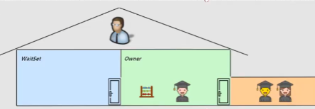

- **synchronized(对象)** 中的对象，可以想象为一个房间（room），有唯一入口（门）房间只能一次进入一人 进行计算，线程 t1，t2 想象成两个人 
- 当线程 t1 执行到 **synchronized(room)** 时就好比 t1 进入了这个房间，并锁住了门拿走了钥匙，在门内执行 **count++** 代码 
- 这时候如果 t2 也运行到了 **synchronized(room)** 时，它发现门被锁住了，只能在门外等待，发生了上下文切 换，阻塞住了 
- 这中间即使 t1 的 cpu 时间片不幸用完，被踢出了门外（不要错误理解为锁住了对象就能一直执行下去）， 这时门还是锁住的，t1 仍拿着钥匙，t2 线程还在阻塞状态进不来，只有下次轮到 t1 自己再次获得时间片时才 能开门进入 
- 当 t1 执行完 **synchronized{}** 块内的代码，这时候才会从 obj 房间出来并解开门上的锁，唤醒 t2 线程把钥 匙给他。t2 线程这时才可以进入 obj 房间，锁住了门拿上钥匙，执行它的 **count--** 代码

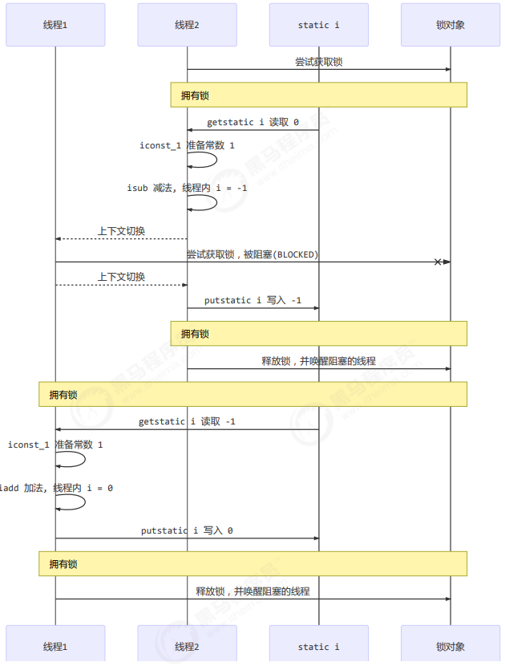

synchronized 实际是用**对象锁**保证了**临界区内代码的原子性**，临界区内的代码对外是不可分割的，不会被线程切 换所打断。

#### 面向对象改进

把需要保护的共享变量放入一个类

```java
class Room {
    int value = 0;
    public void increment() {
        synchronized (this) {
            value++;
        }
    }
    public void decrement() {
        synchronized (this) {
            value--;
        }
    }
    public int get() {
        synchronized (this) {
            return value;
        }
    }
}
@Slf4j
public class Test1 {

    public static void main(String[] args) throws InterruptedException {
        Room room = new Room();
        Thread t1 = new Thread(() -> {
            for (int j = 0; j < 5000; j++) {
                room.increment();
            }
        }, "t1");
        Thread t2 = new Thread(() -> {
            for (int j = 0; j < 5000; j++) {
                room.decrement();
            }
        }, "t2");
        t1.start();
        t2.start();
        t1.join();
        t2.join();
        log.debug("count: {}" , room.get());
    }
}
```

### 3. 方法上的synchornized

```java
class Test{
    public synchronized void test() {

    }
}
等价于
    class Test{
        public void test() {
            synchronized(this) {

            }
        }
    }

class Test{
    public synchronized static void test() {
    }
}
等价于
    class Test{
        public static void test() {
            synchronized(Test.class) {

            }
        }
    }
```

#### 不加synchronized的方法

不加 synchronzied 的方法就好比不遵守规则的人，不去老实排队（好比翻窗户进去的）

#### 所谓的“线程八锁”

其实就是考察 synchronized 锁住的是哪个对象

情况1：12 或 21

```java
@Slf4j(topic = "c.Number")
class Number{
    public synchronized void a() {
        log.debug("1");
    }
    public synchronized void b() {
        log.debug("2");
    }
}
public static void main(String[] args) {
    Number n1 = new Number();
    new Thread(()->{ n1.a(); }).start();
    new Thread(()->{ n1.b(); }).start();
}
```

情况2：1s后12，或 2 1s后 1

```java
@Slf4j(topic = "c.Number")
class Number{
    public synchronized void a() {
        sleep(1);
        log.debug("1");
    }
    public synchronized void b() {
        log.debug("2");
    }
}
public static void main(String[] args) {
    Number n1 = new Number();
    new Thread(()->{ n1.a(); }).start();
    new Thread(()->{ n1.b(); }).start();
}
```

情况3：3 1s 12 或 23 1s 1 或 32 1s 1

```java
@Slf4j(topic = "c.Number")
class Number{
    public synchronized void a() {
        sleep(1);
        log.debug("1");
    }
    public synchronized void b() {
        log.debug("2");
    }
    public void c() {
        log.debug("3");
    }
}
public static void main(String[] args) {
    Number n1 = new Number();
    new Thread(()->{ n1.a(); }).start();
    new Thread(()->{ n1.b(); }).start();
    new Thread(()->{ n1.c(); }).start();
}
```

情况4：2 1s 后 1

```java
@Slf4j(topic = "c.Number")
class Number{
    public synchronized void a() {
        sleep(1);
        log.debug("1");
    }
    public synchronized void b() {
        log.debug("2");
    }
}
public static void main(String[] args) {
    Number n1 = new Number();
    Number n2 = new Number();
    new Thread(()->{ n1.a(); }).start();
    new Thread(()->{ n2.b(); }).start();
}
```

情况5：2 1s 后 1

```java
@Slf4j(topic = "c.Number")
class Number{
    public static synchronized void a() {
        sleep(1);
        log.debug("1");
    }
    public synchronized void b() {
        log.debug("2");
    }
}
public static void main(String[] args) {
    Number n1 = new Number();
    new Thread(()->{ n1.a(); }).start();
    new Thread(()->{ n1.b(); }).start();
}
```

情况6：1s 后12， 或 2 1s后 1

```java
@Slf4j(topic = "c.Number")
class Number{
    public static synchronized void a() {
        sleep(1);
        log.debug("1");
    }
    public static synchronized void b() {
        log.debug("2");
    }
}
public static void main(String[] args) {
    Number n1 = new Number();
    new Thread(()->{ n1.a(); }).start();
    new Thread(()->{ n1.b(); }).start();
}
```

情况7：2 1s 后 1

```java
@Slf4j(topic = "c.Number")
class Number{
    public static synchronized void a() {
        sleep(1);
        log.debug("1");
    }
    public synchronized void b() {
        log.debug("2");
    }
}
public static void main(String[] args) {
    Number n1 = new Number();
    Number n2 = new Number();
    new Thread(()->{ n1.a(); }).start();
    new Thread(()->{ n2.b(); }).start();
}
```

情况8：1s 后12， 或 2 1s后 1

```java
@Slf4j(topic = "c.Number")
class Number{
    public static synchronized void a() {
        sleep(1);
        log.debug("1");
    }
    public static synchronized void b() {
        log.debug("2");
    }
}
public static void main(String[] args) {
    Number n1 = new Number();
    Number n2 = new Number();
    new Thread(()->{ n1.a(); }).start();
    new Thread(()->{ n2.b(); }).start();
}
```

### 4. 变量的线程安全分析

#### 成员变量和静态变量是否线程安全

- 如果它们没有共享，则线程安全 
- 如果它们被共享了，根据它们的状态是否能够改变，又分两种情况 
  - 如果只有读操作，则线程安全 
  - 如果有读写操作，则这段代码是临界区，需要考虑线程安全

#### 局部变量是否线程安全

- 局部变量是线程安全的 
- 但局部变量引用的对象则未必 
  - 如果该对象没有逃离方法的作用访问，它是线程安全的 
  - 如果该对象逃离方法的作用范围，需要考虑线程安全

#### 局部变量线程安全分析

```java
public static void test1() {
    int i = 10;
    i++;
}
```

每个线程调用 test1() 方法时局部变量 i，会在每个线程的栈帧内存中被创建多份，因此不存在共享

```
public static void test1();
 descriptor: ()V
flags: ACC_PUBLIC, ACC_STATIC
 Code:
 stack=1, locals=1, args_size=0
 0: bipush 10
 2: istore_0
 3: iinc 0, 1
 6: return
 LineNumberTable:
 line 10: 0
 line 11: 3
 line 12: 6
 LocalVariableTable:
 Start Length Slot Name Signature
 3 4 0 i I
```

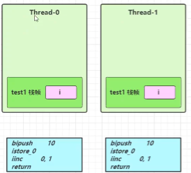

局部变量的引用稍有不同

成员变量的例子

```java
class ThreadUnsafe {
    ArrayList<String> list = new ArrayList<>();
    public void method1(int loopNumber) {
        for (int i = 0; i < loopNumber; i++) {
            // { 临界区, 会产生竞态条件
            method2();
            method3();
            // } 临界区
        }
    }
    private void method2() {
        list.add("1");
    }
    private void method3() {
        list.remove(0);
    }
}
```

执行

```java
static final int THREAD_NUMBER = 2;
static final int LOOP_NUMBER = 200;
public static void main(String[] args) {
    ThreadUnsafe test = new ThreadUnsafe();
    for (int i = 0; i < THREAD_NUMBER; i++) {
        new Thread(() -> {
            test.method1(LOOP_NUMBER);
        }, "Thread" + i).start();
    }
}
```

其中一种情况是，如果线程2 还未 add，线程1 remove 就会报错：

```
Exception in thread "Thread1" java.lang.IndexOutOfBoundsException: Index: 0, Size: 0 
 at java.util.ArrayList.rangeCheck(ArrayList.java:657) 
 at java.util.ArrayList.remove(ArrayList.java:496) 
 at cn.itcast.n6.ThreadUnsafe.method3(TestThreadSafe.java:35) 
 at cn.itcast.n6.ThreadUnsafe.method1(TestThreadSafe.java:26) 
 at cn.itcast.n6.TestThreadSafe.lambda$main$0(TestThreadSafe.java:14) 
 at java.lang.Thread.run(Thread.java:748) 
```

分析： 

- 无论哪个线程中的 method2 引用的都是同一个对象中的 list 成员变量 
- method3 与 method2 分析相同

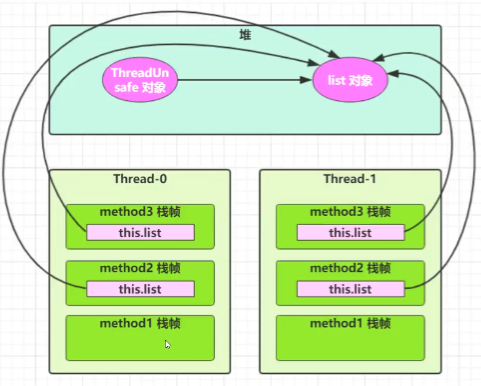

将 list 修改为局部变量

```java
class ThreadSafe {
    public final void method1(int loopNumber) {
        ArrayList<String> list = new ArrayList<>();
        for (int i = 0; i < loopNumber; i++) {
            method2(list);
            method3(list);
        }
    }
    private void method2(ArrayList<String> list) {
        list.add("1");
    }
    private void method3(ArrayList<String> list) {
        list.remove(0);
    }
}
```

那么就不会有上述问题了

分析：

-  list 是局部变量，每个线程调用时会创建其不同实例，没有共享 
- 而 method2 的参数是从 method1 中传递过来的，与 method1 中引用同一个对象 
- method3 的参数分析与 method2 相同

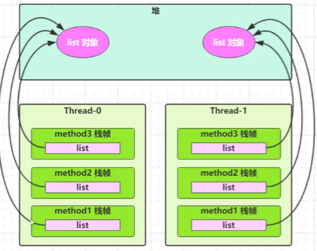

如果把 method2 和 method3 的方法修改为 public 会不会代理线程安全问题？ 

- 情况1：有其它线程调用 method2 和 method3 
- 情况2：在 情况1 的基础上，为 ThreadSafe 类添加子类，子类覆盖 method2 或 method3 方法，即

```java
class ThreadSafe {
    public final void method1(int loopNumber) {
        ArrayList<String> list = new ArrayList<>();
        for (int i = 0; i < loopNumber; i++) {
            method2(list);
            method3(list);
        }
    }
    public void method2(ArrayList<String> list) {
        list.add("1");
    }
    public void method3(ArrayList<String> list) {
        list.remove(0);
    }
}
class ThreadSafeSubClass extends ThreadSafe{
    @Override
    // 此处引入了新的线程，又产生了临界区
    public void method3(ArrayList<String> list) {
        new Thread(() -> {
            list.remove(0);
        }).start();
    }
}
```

>从这个例子可以看出 private 或 final 提供【安全】的意义所在，请体会开闭原则中的【闭】

#### 常见的线程安全类

- String
- Integer 
- StringBuffer
- Random 
- Vector 
- Hashtable 
- java.util.concurrent 包下的类

这里说它们是线程安全的是指，多个线程调用它们同一个实例的某个方法时，是线程安全的。也可以理解为

```java
Hashtable table = new Hashtable();
new Thread(()->{
    table.put("key", "value1");
}).start();
new Thread(()->{
    table.put("key", "value2");
}).start();
```

- 它们的每个方法是原子的 
- 但注意它们多个方法的组合不是原子的

#### 线程安全类方法的组合

组合就不是原子操作了

```java
Hashtable table = new Hashtable();
// 线程1，线程2
if( table.get("key") == null) {
    table.put("key", value);
}
```

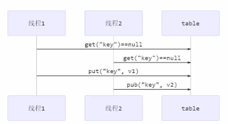

#### 不可变类线程安全性

String、Integer 等都是不可变类，因为其内部的状态不可以改变，因此它们的方法都是线程安全的 

String 有 replace，substring 等方法【可以】改变值，那么这些方法又是如何保证线程安全的？

```java
public class Immutable{
    private int value = 0;
    public Immutable(int value){
        this.value = value;
    }
    public int getValue(){
        return this.value;
    }
}
```

如果想增加一个增加的方法

```java
public class Immutable{
    private int value = 0;
    public Immutable(int value){
        this.value = value;
    }
    public int getValue(){
        return this.value;
    }

    public Immutable add(int v){
        return new Immutable(this.value + v);
    } 
}
```

#### 实例分析

例1：

```java
public class MyServlet extends HttpServlet {
    // 非线程安全
    Map<String,Object> map = new HashMap<>();
    // 是线程安全的
    String S1 = "...";
    // 是线程安全的
    final String S2 = "...";
    // 非线程安全
    Date D1 = new Date();
    // 非线程安全
    final Date D2 = new Date();

    public void doGet(HttpServletRequest request, HttpServletResponse response) {
        // 使用上述变量
    }
}
```

例2：

```java
public class MyServlet extends HttpServlet {
    // 非线程安全
    private UserService userService = new UserServiceImpl();

    public void doGet(HttpServletRequest request, HttpServletResponse response) {
        userService.update(...);
    }
}
public class UserServiceImpl implements UserService {
    // 记录调用次数
    private int count = 0;

    public void update() {
        // ...
        count++;
    }
}
```

例3：

```java
@Aspect
@Component
public class MyAspect {
    // 非线程安全
    private long start = 0L;

    @Before("execution(* *(..))")
    public void before() {
        start = System.nanoTime();
    }

    @After("execution(* *(..))")
    public void after() {
        long end = System.nanoTime();
        System.out.println("cost time:" + (end-start));
    }
}
```

例4：

```java
public class MyServlet extends HttpServlet {
    // 是线程安全的
    private UserService userService = new UserServiceImpl();

    public void doGet(HttpServletRequest request, HttpServletResponse response) {
        userService.update(...);
    }
}
public class UserServiceImpl implements UserService {
    // 是线程安全的
    private UserDao userDao = new UserDaoImpl();

    public void update() {
        userDao.update();
    }
}
public class UserDaoImpl implements UserDao { 
    public void update() {
        String sql = "update user set password = ? where username = ?";
        // 是线程安全的
        try (Connection conn = DriverManager.getConnection("","","")){
            // ...
        } catch (Exception e) {
            // ...
        }
    }
}
```

例5：

```java
public class MyServlet extends HttpServlet {
    // 非线程安全
    private UserService userService = new UserServiceImpl();

    public void doGet(HttpServletRequest request, HttpServletResponse response) {
        userService.update(...);
    }
}
public class UserServiceImpl implements UserService {
    // 非线程安全
    private UserDao userDao = new UserDaoImpl();

    public void update() {
        userDao.update();
    }
}

public class UserDaoImpl implements UserDao {
    // 非线程安全
    private Connection conn = null;
    public void update() throws SQLException {
        String sql = "update user set password = ? where username = ?";
        conn = DriverManager.getConnection("","","");
        // ...
        conn.close();
    }
}
```

例6：

```java
public class MyServlet extends HttpServlet {
    // 是线程安全
    private UserService userService = new UserServiceImpl();

    public void doGet(HttpServletRequest request, HttpServletResponse response) {
        userService.update(...);
    }
}
public class UserServiceImpl implements UserService { 
    public void update() {
        UserDao userDao = new UserDaoImpl();
        userDao.update();
    }
}
public class UserDaoImpl implements UserDao {
    // 是线程安全
    private Connection = null;
    public void update() throws SQLException {
        String sql = "update user set password = ? where username = ?";
        conn = DriverManager.getConnection("","","");
        // ...
        conn.close();
    }
}
```

例7：

```java
public abstract class Test {

    public void bar() {
        // 非线程安全
        SimpleDateFormat sdf = new SimpleDateFormat("yyyy-MM-dd HH:mm:ss");
        foo(sdf);
    }

    public abstract foo(SimpleDateFormat sdf);

    public static void main(String[] args) {
        new Test().bar();
    }
}
```

其中 foo 的行为是不确定的，可能导致不安全的发生，被称之为**外星方法**

```java
public void foo(SimpleDateFormat sdf) {
    String dateStr = "1999-10-11 00:00:00";
    for (int i = 0; i < 20; i++) {
        new Thread(() -> {
            try {
                sdf.parse(dateStr);
            } catch (ParseException e) {
                e.printStackTrace();
            }
        }).start();
    }
}
```

例8：

```java
// 非线程安全，因为i对象一直在变，并不会产生互斥
private static Integer i = 0;
public static void main(String[] args) throws InterruptedException {
    List<Thread> list = new ArrayList<>();
    for (int j = 0; j < 2; j++) {
        Thread thread = new Thread(() -> {
            for (int k = 0; k < 5000; k++) {
                synchronized (i) {
                    i++;
                }
            }
        }, "" + j);
        list.add(thread);
    }
    list.stream().forEach(t -> t.start());
    list.stream().forEach(t -> {
        try {
            t.join();
        } catch (InterruptedException e) {
            e.printStackTrace();
        }
    });
    log.debug("{}", i);
}
```

#### 卖票问题

```java
@Slf4j(topic = "c.Ticket")
public class Ticket {

    // random为线程安全
    static Random random = new Random();

    public static void main(String[] args) throws InterruptedException {
        // 模拟多人购票
        TicketWindow window = new TicketWindow(100);
        // 卖出的票数统计
        List<Integer> amountList = new Vector<>();
        // 所有线程的集合
        List<Thread> threadList = new ArrayList<>();

        for (int i = 0; i < 6000; i++) {
            Thread thread = new Thread(() -> {
                int amount = window.sell(randomAmount());
                amountList.add(amount);
            }, i + "");
            threadList.add(thread);
        }

        for (Thread t : threadList) {
            t.start();
        }

        for (Thread thread : threadList) {
            thread.join();
        }
        // 统计卖出的票数和剩余的票数
        log.debug("余票：{}", window.getCount());
        log.debug("卖出的票数：{}", amountList.stream().mapToInt(i -> i).sum());
    }

    // 随机1~5
    public static int randomAmount() {
        return random.nextInt(5) + 1;
    }

}

class TicketWindow {
    private int count;

    public TicketWindow(int i) {
        this.count = i;
    }

    // 获取余票数量
    public int getCount() {
        return count;
    }

    // 售票
    public synchronized int sell(int amount) {
        if (this.count >= amount) {
            this.count -= amount;
            return amount;
        }else {
            return 0;
        }
    }
}
```

### 5. Monitor概念

#### Java对象头

以 32 位虚拟机为例

##### 普通对象

```
|--------------------------------------------------------------|
| 					Object Header (64 bits)				    |
|------------------------------------|-------------------------|
| 		Mark Word (32 bits) 		| Klass Word (32 bits)    |
|------------------------------------|-------------------------|
```

##### 数组对象

```
|---------------------------------------------------------------------------------|
| 					Object Header (96 bits) 								 |
|--------------------------------|-----------------------|------------------------|
|	 Mark Word(32bits) 			| 	Klass Word(32bits)  | 	array length(32bits) |
|--------------------------------|-----------------------|------------------------|
```

##### Mark Word 结构

```
|-------------------------------------------------------|--------------------|
| 				Mark Word (32 bits) 				 | 		State 		 |
|-------------------------------------------------------|--------------------|
| 	hashcode:25 	    | age:4 | biased_lock:0 | 01    | 	  Normal 	    |
|-------------------------------------------------------|--------------------|
| 	thread:23 | epoch:2 | age:4 | biased_lock:1 | 01    | 	   Biased        |
|-------------------------------------------------------|--------------------|
| 	ptr_to_lock_record:30                       | 00 	| Lightweight Locked |
|-------------------------------------------------------|--------------------|
| 	ptr_to_heavyweight_monitor:30               | 10 	| Heavyweight Locked |
|-------------------------------------------------------|--------------------|
| 								             | 11 	 | Marked for GC 	  |
|-------------------------------------------------------|--------------------|
```

##### 64 位虚拟机 Mark Word

```
|--------------------------------------------------------------------|--------------------|
|                           Mark Word (64 bits)                      |        State       |
|--------------------------------------------------------------------|--------------------|
| unused:25 | hashcode:31 | unused:1 | age:4 | biased_lock:0 | 01    |        Normal      |
|--------------------------------------------------------------------|--------------------|
| thread:54 | epoch:2 | unused:1 | age:4 | biased_lock:1     | 01    |        Biased      |
|--------------------------------------------------------------------|--------------------|
| ptr_to_lock_record:62                                      | 00    | Lightweight Locked |
|--------------------------------------------------------------------|--------------------|
| ptr_to_heavyweight_monitor:62                              | 10    | Heavyweight Locked |
|--------------------------------------------------------------------|--------------------|
|                                                            | 11    |    Marked for GC   |
|--------------------------------------------------------------------|--------------------|

```

#### 概念

Monitor 被翻译为监视器或管程 

每个 Java 对象都可以关联一个 Monitor 对象，如果使用 synchronized 给对象上锁（重量级）之后，该对象头的 Mark Word 中就被设置指向 Monitor 对象的指针 

Monitor 结构如下

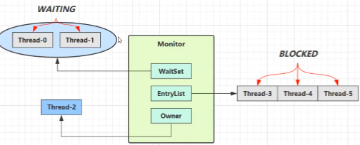

- 刚开始 Monitor 中 Owner 为 null 

- 当 Thread-2 执行 synchronized(obj) 就会将 Monitor 的所有者 Owner 置为 Thread-2，Monitor中只能有一 个 Owner 

- 在 Thread-2 上锁的过程中，如果 Thread-3，Thread-4，Thread-5 也来执行 synchronized(obj)，就会进入 EntryList BLOCKED 

- Thread-2 执行完同步代码块的内容，然后唤醒 EntryList 中等待的线程来竞争锁，竞争时是非公平的 

- 图中 WaitSet 中的 Thread-0，Thread-1 是之前获得过锁，但条件不满足进入 WAITING 状态的线程，后面讲 wait-notify 时会分析

  >注意：
  >
  >- synchronized 必须是进入同一个对象的 monitor 才有上述的效果 
  >- 不加 synchronized 的对象不会关联监视器，不遵从以上规则

#### synchronized原理

```java
static final Object lock = new Object();
static int counter = 0;
public static void main(String[] args) {
    synchronized (lock) {
        counter++;
    }
}
```

对应的字节码为

```
public static void main(java.lang.String[]);
 descriptor: ([Ljava/lang/String;)V
 flags: ACC_PUBLIC, ACC_STATIC
Code:
 stack=2, locals=3, args_size=1
 0: getstatic #2       // <- lock引用 （synchronized开始）
 3: dup
 4: astore_1           // lock引用 -> slot 1
 5: monitorenter       // 将 lock对象 MarkWord 置为 Monitor 指针
 6: getstatic #3       // <- i
 9: iconst_1           // 准备常数 1
 10: iadd              // +1
 11: putstatic #3      // -> i
 14: aload_1           // <- lock引用
 15: monitorexit       // 将 lock对象 MarkWord 重置, 唤醒 EntryList
 16: goto 24
 19: astore_2          // e -> slot 2 
 20: aload_1           // <- lock引用
 21: monitorexit       // 将 lock对象 MarkWord 重置, 唤醒 EntryList
 22: aload_2           // <- slot 2 (e)
 23: athrow            // throw e
 24: return
 Exception table:
 from to target type
 6 16 19 any
 19 22 19 any
 LineNumberTable:
 line 8: 0
 line 9: 6
 line 10: 14
 line 11: 24
 LocalVariableTable:
 Start Length Slot Name Signature
 0 25 0 args [Ljava/lang/String;
 StackMapTable: number_of_entries = 2
 frame_type = 255 /* full_frame */
 offset_delta = 19
 locals = [ class "[Ljava/lang/String;", class java/lang/Object ]
 stack = [ class java/lang/Throwable ]
 frame_type = 250 /* chop */
 offset_delta = 4
```

> 注意 
>
> 方法级别的 synchronized 不会在字节码指令中有所体现

#### 实例

故事角色 

- 老王 - JVM 
- 小南 - 线程 
- 小女 - 线程 
- 房间 - 对象 
- 房间门上 - 防盗锁 - Monitor 
- 房间门上 - 小南书包 - 轻量级锁 
- 房间门上 - 刻上小南大名 - 偏向锁 
- 批量重刻名 - 一个类的偏向锁撤销到达 20 阈值 
- 不能刻名字 - 批量撤销该类对象的偏向锁，设置该类不可偏向 

小南要使用房间保证计算不被其它人干扰（原子性），最初，他用的是防盗锁，当上下文切换时，锁住门。这样， 即使他离开了，别人也进不了门，他的工作就是安全的。 

但是，很多情况下没人跟他来竞争房间的使用权。小女是要用房间，但使用的时间上是错开的，小南白天用，小女 晚上用。每次上锁太麻烦了，有没有更简单的办法呢？ 

小南和小女商量了一下，约定不锁门了，而是谁用房间，谁把自己的书包挂在门口，但他们的书包样式都一样，因 此每次进门前得翻翻书包，看课本是谁的，如果是自己的，那么就可以进门，这样省的上锁解锁了。万一书包不是 自己的，那么就在门外等，并通知对方下次用锁门的方式。 

后来，小女回老家了，很长一段时间都不会用这个房间。小南每次还是挂书包，翻书包，虽然比锁门省事了，但仍 然觉得麻烦。 

于是，小南干脆在门上刻上了自己的名字：【小南专属房间，其它人勿用】，下次来用房间时，只要名字还在，那 么说明没人打扰，还是可以安全地使用房间。如果这期间有其它人要用这个房间，那么由使用者将小南刻的名字擦 掉，升级为挂书包的方式。

同学们都放假回老家了，小南就膨胀了，在 20 个房间刻上了自己的名字，想进哪个进哪个。后来他自己放假回老 家了，这时小女回来了（她也要用这些房间），结果就是得一个个地擦掉小南刻的名字，升级为挂书包的方式。老 王觉得这成本有点高，提出了一种批量重刻名的方法，他让小女不用挂书包了，可以直接在门上刻上自己的名字 

后来，刻名的现象越来越频繁，老王受不了了：算了，这些房间都不能刻名了，只能挂书包

#### synchronized 原理进阶

##### 轻量级锁

轻量级锁的使用场景：如果一个对象虽然有多线程要加锁，但加锁的时间是错开的（也就是没有竞争），那么可以 使用轻量级锁来优化。 

轻量级锁对使用者是透明的，即语法仍然是 **synchronized** 

假设有两个方法同步块，利用同一个对象加锁

```java
static final Object obj = new Object();
public static void method1() {
    synchronized( obj ) {
        // 同步块 A
        method2();
    }
}
public static void method2() {
    synchronized( obj ) {
        // 同步块 B
    }
}
```

- 创建锁记录（Lock Record）对象，每个线程都的栈帧都会包含一个锁记录的结构，内部可以存储锁定对象的 Mark Word

  

- 让锁记录中 Object reference 指向锁对象，并尝试用 cas 替换 Object 的 Mark Word，将 Mark Word 的值存 入锁记录

  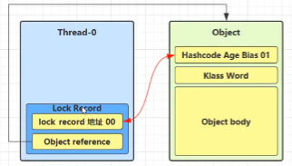

- 如果 cas 替换成功，对象头中存储了 **锁记录地址和状态 00** ，表示由该线程给对象加锁，这时图示如下

  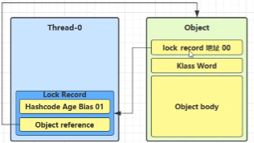

- 如果 cas 失败，有两种情况 

  - 如果是其它线程已经持有了该 Object 的轻量级锁，这时表明有竞争，进入锁膨胀过程 

  - 如果是自己执行了 synchronized 锁重入，那么再添加一条 Lock Record 作为重入的计数

    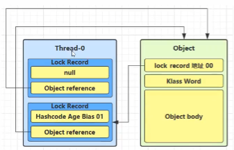

- 当退出 synchronized 代码块（解锁时）如果有取值为 null 的锁记录，表示有重入，这时重置锁记录，表示重 入计数减一

  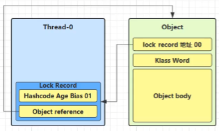

- 当退出 synchronized 代码块（解锁时）锁记录的值不为 null，这时使用 cas 将 Mark Word 的值恢复给对象 头 

  - 成功，则解锁成功 
  - 失败，说明轻量级锁进行了锁膨胀或已经升级为重量级锁，进入重量级锁解锁流程

##### 锁膨胀

如果在尝试加轻量级锁的过程中，CAS 操作无法成功，这时一种情况就是有其它线程为此对象加上了轻量级锁（有 竞争），这时需要进行锁膨胀，将轻量级锁变为重量级锁。

```java
static Object obj = new Object();
public static void method1() {
    synchronized( obj ) {
        // 同步块
    }
}
```

- 当 Thread-1 进行轻量级加锁时，Thread-0 已经对该对象加了轻量级锁

  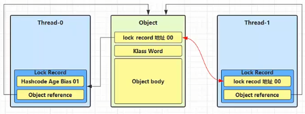

- 这时 Thread-1 加轻量级锁失败，进入锁膨胀流程 
  - 即为 Object 对象申请 Monitor 锁，让 Object 指向重量级锁地址 
  
  - 然后自己进入 Monitor 的 EntryList BLOCKED
  
    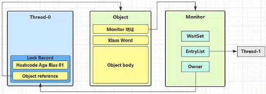
  
- 当Thread-0退出同步块解锁时，使用cas将Mark Word的值恢复给对象头，失败。这时会进入重量级解锁流程，即按照Monitor地址找到Monitor对象，设置Owner为null，唤醒EntryList中BLOCKED线程

##### 自旋优化

重量级锁竞争的时候，还可以使用自旋来进行优化，如果当前线程自旋成功（即这时候持锁线程已经退出了同步 块，释放了锁），这时当前线程就可以避免阻塞。

自旋重试成功的情况

| 线程 1 （core 1 上）     | 对象 Mark              | 线程 2 （core 2 上）     |
| ------------------------ | ---------------------- | ------------------------ |
| -                        | 10（重量锁）           | -                        |
| 访问同步块，获取 monitor | 10（重量锁）重量锁指针 | -                        |
| 成功（加锁）             | 10（重量锁）重量锁指针 | -                        |
| 执行同步块               | 10（重量锁）重量锁指针 | -                        |
| 执行同步块               | 10（重量锁）重量锁指针 | 访问同步块，获取 monitor |
| 执行同步块               | 10（重量锁）重量锁指针 | 自旋重试                 |
| 执行完毕                 | 10（重量锁）重量锁指针 | 自旋重试                 |
| 成功（解锁）             | 01（无锁）             | 自旋重试                 |
| -                        | 10（重量锁）重量锁指针 | 成功（加锁）             |
| -                        | 10（重量锁）重量锁指针 | 执行同步块               |
| -                        | …                      | …                        |

自旋重试失败的情况

| 线程 1 （core 1 上）     | 对象 Mark              | 线程 2 （core 2 上）     |
| ------------------------ | ---------------------- | ------------------------ |
| -                        | 10（重量锁）           | -                        |
| 访问同步块，获取 monitor | 10（重量锁）重量锁指针 | -                        |
| 成功（加锁）             | 10（重量锁）重量锁指针 | -                        |
| 执行同步块               | 10（重量锁）重量锁指针 | -                        |
| 执行同步块               | 10（重量锁）重量锁指针 | 访问同步块，获取 monitor |
| 执行同步块               | 10（重量锁）重量锁指针 | 自旋重试                 |
| 执行同步块               | 10（重量锁）重量锁指针 | 自旋重试                 |
| 执行同步块               | 10（重量锁）重量锁指针 | 自旋重试                 |
| 执行同步块               | 10（重量锁）重量锁指针 | 阻塞                     |
| -                        | …                      | …                        |

- 自旋会占用 CPU 时间，单核 CPU 自旋就是浪费，多核 CPU 自旋才能发挥优势。
- 在 Java 6 之后自旋锁是自适应的，比如对象刚刚的一次自旋操作成功过，那么认为这次自旋成功的可能性会 高，就多自旋几次；反之，就少自旋甚至不自旋，总之，比较智能。 
- Java 7 之后不能控制是否开启自旋功能

##### 偏向锁

轻量级锁在没有竞争时（就自己这个线程），每次重入仍然需要执行 CAS 操作。 

Java 6 中引入了偏向锁来做进一步优化：只有第一次使用 CAS 将线程 ID 设置到对象的 Mark Word 头，之后发现 这个线程 ID 是自己的就表示没有竞争，不用重新 CAS。以后只要不发生竞争，这个对象就归该线程所有 

例如：

```java
static final Object obj = new Object();
public static void m1() {
    synchronized( obj ) {
        // 同步块 A
        m2();
    }
}
public static void m2() {
    synchronized( obj ) {
        // 同步块 B
        m3();
    }
}
public static void m3() {
    synchronized( obj ) {
        // 同步块 C
    }
} 
```

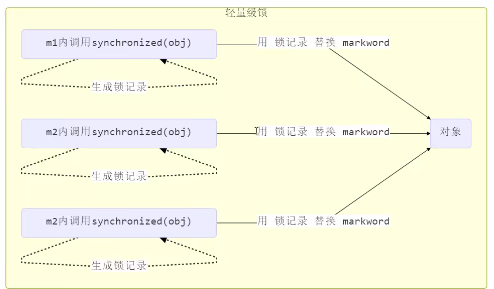

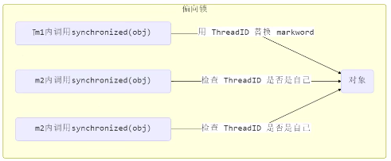

###### **偏向状态**

对象头格式

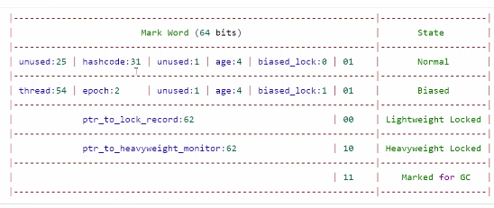

一个对象创建时： 

- 如果开启了偏向锁（默认开启），那么对象创建后，markword 值为 0x05 即最后 3 位为 101，这时它的 thread、epoch、age 都为 0 
- 偏向锁是默认是延迟的，不会在程序启动时立即生效，如果想避免延迟，可以加 VM 参数 - XX:BiasedLockingStartupDelay=0 来禁用延迟 
- 如果没有开启偏向锁，那么对象创建后，markword 值为 0x01 即最后 3 位为 001，这时它的 hashcode、 age 都为 0，第一次用到 hashcode 时才会赋值

1） 测试延迟特性

2） 测试偏向锁

```java
class Dog {}
```

利用 jol 第三方工具来查看对象头信息（注意这里我扩展了 jol 让它输出更为简洁）

```java
// - XX:BiasedLockingStartupDelay=0
@Slf4j(topic = "c.LookHeader")
public class LookHeader {

    public static void main(String[] args) throws InterruptedException {
        DogBiased dog = new DogBiased();
        log.debug(getMarkWord(ClassLayout.parseInstance(dog).toPrintable(), true));

        TimeUnit.SECONDS.sleep(4);

        log.debug(getMarkWord(ClassLayout.parseInstance(new DogBiased()).toPrintable(), true));
    }
}

class Dog {}
```

输出

```
17:15:23 [main] c.LookHeader - 00000000 00000000 00000000 00000000 00000000 00000000 00000000 00000101
17:15:27 [main] c.LookHeader - 00000000 00000000 00000000 00000000 00000000 00000000 00000000 00000101
```

>注意 
>
>处于偏向锁的对象解锁后，线程 id 仍存储于对象头中

3）测试禁用

在上面测试代码运行时在添加 VM 参数 **-XX:-UseBiasedLocking** 禁用偏向锁

输出

```
11:13:10.018 c.TestBiased [t1] - synchronized 前
00000000 00000000 00000000 00000000 00000000 00000000 00000000 00000001 
11:13:10.021 c.TestBiased [t1] - synchronized 中
00000000 00000000 00000000 00000000 00100000 00010100 11110011 10001000 
11:13:10.021 c.TestBiased [t1] - synchronized 后
00000000 00000000 00000000 00000000 00000000 00000000 00000000 00000001 
```

4）测试 hashCode 

- 正常状态对象一开始是没有 hashCode 的，第一次调用才生成

**撤销 - 调用对象 hashCode**

调用了对象的 hashCode，但偏向锁的对象 MarkWord 中存储的是线程 id，如果调用 hashCode 会导致偏向锁被 撤销 

- 轻量级锁会在锁记录中记录 hashCode 
- 重量级锁会在 Monitor 中记录 hashCode 在调用 hashCode 后使用偏向锁，记得去掉 **-XX:-UseBiasedLocking** 

输出

```
11:22:10.386 c.TestBiased [main] - 调用 hashCode:1778535015 
11:22:10.391 c.TestBiased [t1] - synchronized 前
00000000 00000000 00000000 01101010 00000010 01001010 01100111 00000001 
11:22:10.393 c.TestBiased [t1] - synchronized 中
00000000 00000000 00000000 00000000 00100000 11000011 11110011 01101000 
11:22:10.393 c.TestBiased [t1] - synchronized 后
00000000 00000000 00000000 01101010 00000010 01001010 01100111 00000001 

```

###### **撤销 - 其它线程使用对象**

当有其它线程使用偏向锁对象时，会将偏向锁升级为轻量级锁

```java
private static void test2() throws InterruptedException {
    Dog d = new Dog();
    Thread t1 = new Thread(() -> {
        synchronized (d) {
            log.debug(ClassLayout.parseInstance(d).toPrintableSimple(true));
        }
        synchronized (TestBiased.class) {
            TestBiased.class.notify();
        }
        // 如果不用 wait/notify 使用 join 必须打开下面的注释
        // 因为：t1 线程不能结束，否则底层线程可能被 jvm 重用作为 t2 线程，底层线程 id 是一样的
        /*try {
 System.in.read();
 } catch (IOException e) {
 e.printStackTrace();
 }*/
    }, "t1");
    t1.start();
    Thread t2 = new Thread(() -> {
        synchronized (TestBiased.class) {
            try {
                TestBiased.class.wait();
            } catch (InterruptedException e) {
                e.printStackTrace();
            }
        }
        log.debug(ClassLayout.parseInstance(d).toPrintableSimple(true));
        synchronized (d) {
            log.debug(ClassLayout.parseInstance(d).toPrintableSimple(true));
        }
        log.debug(ClassLayout.parseInstance(d).toPrintableSimple(true));
    }, "t2");
    t2.start();
}
```

输出

```
[t1] - 00000000 00000000 00000000 00000000 00011111 01000001 00010000 00000101 
[t2] - 00000000 00000000 00000000 00000000 00011111 01000001 00010000 00000101 
[t2] - 00000000 00000000 00000000 00000000 00011111 10110101 11110000 01000000 
[t2] - 00000000 00000000 00000000 00000000 00000000 00000000 00000000 00000001 
```

###### **撤销 - 调用 wait/notify**

因为使用wait/notify使用的是重量级锁

```java
public static void main(String[] args) throws InterruptedException {
    Dog d = new Dog();
    Thread t1 = new Thread(() -> {
        log.debug(ClassLayout.parseInstance(d).toPrintableSimple(true));
        synchronized (d) {
            log.debug(ClassLayout.parseInstance(d).toPrintableSimple(true));
            try {
                d.wait();
            } catch (InterruptedException e) {
                e.printStackTrace();
            }
            log.debug(ClassLayout.parseInstance(d).toPrintableSimple(true));
        }
    }, "t1");
    t1.start();
    new Thread(() -> {
        try {
            Thread.sleep(6000);
        } catch (InterruptedException e) {
            e.printStackTrace();
        }
        synchronized (d) {
            log.debug("notify");
            d.notify();
        }
    }, "t2").start();
}
```

输出

```
[t1] - 00000000 00000000 00000000 00000000 00000000 00000000 00000000 00000101 
[t1] - 00000000 00000000 00000000 00000000 00011111 10110011 11111000 00000101 
[t2] - notify 
[t1] - 00000000 00000000 00000000 00000000 00011100 11010100 00001101 11001010 
```

###### **批量重偏向**

如果对象虽然被多个线程访问，但没有竞争，这时偏向了线程 T1 的对象仍有机会重新偏向 T2，重偏向会重置对象 的 Thread ID 

当撤销偏向锁阈值超过 20 次后，jvm 会这样觉得，我是不是偏向错了呢，于是会在给这些对象加锁时重新偏向至 加锁线程

```java
private static void test3() throws InterruptedException {
    Vector<Dog> list = new Vector<>();
    Thread t1 = new Thread(() -> {
        for (int i = 0; i < 30; i++) {
            Dog d = new Dog();
            list.add(d);
            synchronized (d) {
                log.debug(i + "\t" + ClassLayout.parseInstance(d).toPrintableSimple(true));
            }
        }
        synchronized (list) {
            list.notify();
        } 
    }, "t1");
    t1.start();

    Thread t2 = new Thread(() -> {
        synchronized (list) {
            try {
                list.wait();
            } catch (InterruptedException e) {
                e.printStackTrace();
            }
        }
        log.debug("===============> ");
        for (int i = 0; i < 30; i++) {
            Dog d = list.get(i);
            log.debug(i + "\t" + ClassLayout.parseInstance(d).toPrintableSimple(true));
            synchronized (d) {
                log.debug(i + "\t" + ClassLayout.parseInstance(d).toPrintableSimple(true));
            }
            log.debug(i + "\t" + ClassLayout.parseInstance(d).toPrintableSimple(true));
        }
    }, "t2");
    t2.start();
}
```

输出

```
[t1] - 0 00000000 00000000 00000000 00000000 00011111 11110011 11100000 00000101 
[t1] - 1 00000000 00000000 00000000 00000000 00011111 11110011 11100000 00000101 
[t1] - 2 00000000 00000000 00000000 00000000 00011111 11110011 11100000 00000101 
[t1] - 3 00000000 00000000 00000000 00000000 00011111 11110011 11100000 00000101 
[t1] - 4 00000000 00000000 00000000 00000000 00011111 11110011 11100000 00000101 
[t1] - 5 00000000 00000000 00000000 00000000 00011111 11110011 11100000 00000101 
[t1] - 6 00000000 00000000 00000000 00000000 00011111 11110011 11100000 00000101 
[t1] - 7 00000000 00000000 00000000 00000000 00011111 11110011 11100000 00000101 
[t1] - 8 00000000 00000000 00000000 00000000 00011111 11110011 11100000 00000101 
[t1] - 9 00000000 00000000 00000000 00000000 00011111 11110011 11100000 00000101 
[t1] - 10 00000000 00000000 00000000 00000000 00011111 11110011 11100000 00000101 
[t1] - 11 00000000 00000000 00000000 00000000 00011111 11110011 11100000 00000101 
[t1] - 12 00000000 00000000 00000000 00000000 00011111 11110011 11100000 00000101 
[t1] - 13 00000000 00000000 00000000 00000000 00011111 11110011 11100000 00000101 
[t1] - 14 00000000 00000000 00000000 00000000 00011111 11110011 11100000 00000101 
[t1] - 15 00000000 00000000 00000000 00000000 00011111 11110011 11100000 00000101 
[t1] - 16 00000000 00000000 00000000 00000000 00011111 11110011 11100000 00000101 
[t1] - 17 00000000 00000000 00000000 00000000 00011111 11110011 11100000 00000101 
[t1] - 18 00000000 00000000 00000000 00000000 00011111 11110011 11100000 00000101 
[t1] - 19 00000000 00000000 00000000 00000000 00011111 11110011 11100000 00000101 
[t1] - 20 00000000 00000000 00000000 00000000 00011111 11110011 11100000 00000101 
[t1] - 21 00000000 00000000 00000000 00000000 00011111 11110011 11100000 00000101 
[t1] - 22 00000000 00000000 00000000 00000000 00011111 11110011 11100000 00000101 
[t1] - 23 00000000 00000000 00000000 00000000 00011111 11110011 11100000 00000101 
[t1] - 24 00000000 00000000 00000000 00000000 00011111 11110011 11100000 00000101 
[t1] - 25 00000000 00000000 00000000 00000000 00011111 11110011 11100000 00000101 
[t1] - 26 00000000 00000000 00000000 00000000 00011111 11110011 11100000 00000101 
[t1] - 27 00000000 00000000 00000000 00000000 00011111 11110011 11100000 00000101 
[t1] - 28 00000000 00000000 00000000 00000000 00011111 11110011 11100000 00000101 
[t1] - 29 00000000 00000000 00000000 00000000 00011111 11110011 11100000 00000101 
[t2] - ===============> 
[t2] - 0 00000000 00000000 00000000 00000000 00011111 11110011 11100000 00000101 
[t2] - 0 00000000 00000000 00000000 00000000 00100000 01011000 11110111 00000000 
[t2] - 0 00000000 00000000 00000000 00000000 00000000 00000000 00000000 00000001 
[t2] - 1 00000000 00000000 00000000 00000000 00011111 11110011 11100000 00000101 
[t2] - 1 00000000 00000000 00000000 00000000 00100000 01011000 11110111 00000000 
[t2] - 1 00000000 00000000 00000000 00000000 00000000 00000000 00000000 00000001 
[t2] - 2 00000000 00000000 00000000 00000000 00011111 11110011 11100000 00000101 
[t2] - 2 00000000 00000000 00000000 00000000 00100000 01011000 11110111 00000000 
[t2] - 2 00000000 00000000 00000000 00000000 00000000 00000000 00000000 00000001 
[t2] - 3 00000000 00000000 00000000 00000000 00011111 11110011 11100000 00000101 
[t2] - 3 00000000 00000000 00000000 00000000 00100000 01011000 11110111 00000000 
[t2] - 3 00000000 00000000 00000000 00000000 00000000 00000000 00000000 00000001 
[t2] - 4 00000000 00000000 00000000 00000000 00011111 11110011 11100000 00000101 
[t2] - 4 00000000 00000000 00000000 00000000 00100000 01011000 11110111 00000000 
[t2] - 4 00000000 00000000 00000000 00000000 00000000 00000000 00000000 00000001 
[t2] - 5 00000000 00000000 00000000 00000000 00011111 11110011 11100000 00000101 
[t2] - 5 00000000 00000000 00000000 00000000 00100000 01011000 11110111 00000000 
[t2] - 5 00000000 00000000 00000000 00000000 00000000 00000000 00000000 00000001 
[t2] - 6 00000000 00000000 00000000 00000000 00011111 11110011 11100000 00000101 
[t2] - 6 00000000 00000000 00000000 00000000 00100000 01011000 11110111 00000000 
[t2] - 6 00000000 00000000 00000000 00000000 00000000 00000000 00000000 00000001 
[t2] - 7 00000000 00000000 00000000 00000000 00011111 11110011 11100000 00000101 
[t2] - 7 00000000 00000000 00000000 00000000 00100000 01011000 11110111 00000000 
[t2] - 7 00000000 00000000 00000000 00000000 00000000 00000000 00000000 00000001 
[t2] - 8 00000000 00000000 00000000 00000000 00011111 11110011 11100000 00000101 
[t2] - 8 00000000 00000000 00000000 00000000 00100000 01011000 11110111 00000000 
[t2] - 8 00000000 00000000 00000000 00000000 00000000 00000000 00000000 00000001 
[t2] - 9 00000000 00000000 00000000 00000000 00011111 11110011 11100000 00000101 
[t2] - 9 00000000 00000000 00000000 00000000 00100000 01011000 11110111 00000000 
[t2] - 9 00000000 00000000 00000000 00000000 00000000 00000000 00000000 00000001 
[t2] - 10 00000000 00000000 00000000 00000000 00011111 11110011 11100000 00000101 
[t2] - 10 00000000 00000000 00000000 00000000 00100000 01011000 11110111 00000000 
[t2] - 10 00000000 00000000 00000000 00000000 00000000 00000000 00000000 00000001 
[t2] - 11 00000000 00000000 00000000 00000000 00011111 11110011 11100000 00000101 
[t2] - 11 00000000 00000000 00000000 00000000 00100000 01011000 11110111 00000000 
[t2] - 11 00000000 00000000 00000000 00000000 00000000 00000000 00000000 00000001 
[t2] - 12 00000000 00000000 00000000 00000000 00011111 11110011 11100000 00000101 
[t2] - 12 00000000 00000000 00000000 00000000 00100000 01011000 11110111 00000000 
[t2] - 12 00000000 00000000 00000000 00000000 00000000 00000000 00000000 00000001 
[t2] - 13 00000000 00000000 00000000 00000000 00011111 11110011 11100000 00000101 
[t2] - 13 00000000 00000000 00000000 00000000 00100000 01011000 11110111 00000000 
[t2] - 13 00000000 00000000 00000000 00000000 00000000 00000000 00000000 00000001 
[t2] - 14 00000000 00000000 00000000 00000000 00011111 11110011 11100000 00000101 
[t2] - 14 00000000 00000000 00000000 00000000 00100000 01011000 11110111 00000000 
[t2] - 14 00000000 00000000 00000000 00000000 00000000 00000000 00000000 00000001 
[t2] - 15 00000000 00000000 00000000 00000000 00011111 11110011 11100000 00000101 
[t2] - 15 00000000 00000000 00000000 00000000 00100000 01011000 11110111 00000000 
[t2] - 15 00000000 00000000 00000000 00000000 00000000 00000000 00000000 00000001 
[t2] - 16 00000000 00000000 00000000 00000000 00011111 11110011 11100000 00000101 
[t2] - 16 00000000 00000000 00000000 00000000 00100000 01011000 11110111 00000000 
[t2] - 16 00000000 00000000 00000000 00000000 00000000 00000000 00000000 00000001 
[t2] - 17 00000000 00000000 00000000 00000000 00011111 11110011 11100000 00000101 
[t2] - 17 00000000 00000000 00000000 00000000 00100000 01011000 11110111 00000000 
[t2] - 17 00000000 00000000 00000000 00000000 00000000 00000000 00000000 00000001 
[t2] - 18 00000000 00000000 00000000 00000000 00011111 11110011 11100000 00000101 
[t2] - 18 00000000 00000000 00000000 00000000 00100000 01011000 11110111 00000000 
[t2] - 18 00000000 00000000 00000000 00000000 00000000 00000000 00000000 00000001 
[t2] - 19 00000000 00000000 00000000 00000000 00011111 11110011 11100000 00000101 
[t2] - 19 00000000 00000000 00000000 00000000 00011111 11110011 11110001 00000101 
[t2] - 19 00000000 00000000 00000000 00000000 00011111 11110011 11110001 00000101 
[t2] - 20 00000000 00000000 00000000 00000000 00011111 11110011 11100000 00000101 
[t2] - 20 00000000 00000000 00000000 00000000 00011111 11110011 11110001 00000101 
[t2] - 20 00000000 00000000 00000000 00000000 00011111 11110011 11110001 00000101 
[t2] - 21 00000000 00000000 00000000 00000000 00011111 11110011 11100000 00000101 
[t2] - 21 00000000 00000000 00000000 00000000 00011111 11110011 11110001 00000101 
[t2] - 21 00000000 00000000 00000000 00000000 00011111 11110011 11110001 00000101 
[t2] - 22 00000000 00000000 00000000 00000000 00011111 11110011 11100000 00000101 
[t2] - 22 00000000 00000000 00000000 00000000 00011111 11110011 11110001 00000101 
[t2] - 22 00000000 00000000 00000000 00000000 00011111 11110011 11110001 00000101 
[t2] - 23 00000000 00000000 00000000 00000000 00011111 11110011 11100000 00000101 
[t2] - 23 00000000 00000000 00000000 00000000 00011111 11110011 11110001 00000101 
[t2] - 23 00000000 00000000 00000000 00000000 00011111 11110011 11110001 00000101 
[t2] - 24 00000000 00000000 00000000 00000000 00011111 11110011 11100000 00000101 
[t2] - 24 00000000 00000000 00000000 00000000 00011111 11110011 11110001 00000101 
[t2] - 24 00000000 00000000 00000000 00000000 00011111 11110011 11110001 00000101 
[t2] - 25 00000000 00000000 00000000 00000000 00011111 11110011 11100000 00000101 
[t2] - 25 00000000 00000000 00000000 00000000 00011111 11110011 11110001 00000101 
[t2] - 25 00000000 00000000 00000000 00000000 00011111 11110011 11110001 00000101 
[t2] - 26 00000000 00000000 00000000 00000000 00011111 11110011 11100000 00000101 
[t2] - 26 00000000 00000000 00000000 00000000 00011111 11110011 11110001 00000101 
[t2] - 26 00000000 00000000 00000000 00000000 00011111 11110011 11110001 00000101 
[t2] - 27 00000000 00000000 00000000 00000000 00011111 11110011 11100000 00000101 
[t2] - 27 00000000 00000000 00000000 00000000 00011111 11110011 11110001 00000101 
[t2] - 27 00000000 00000000 00000000 00000000 00011111 11110011 11110001 00000101 
[t2] - 28 00000000 00000000 00000000 00000000 00011111 11110011 11100000 00000101 
[t2] - 28 00000000 00000000 00000000 00000000 00011111 11110011 11110001 00000101 
[t2] - 28 00000000 00000000 00000000 00000000 00011111 11110011 11110001 00000101 
[t2] - 29 00000000 00000000 00000000 00000000 00011111 11110011 11100000 00000101 
[t2] - 29 00000000 00000000 00000000 00000000 00011111 11110011 11110001 00000101 
[t2] - 29 00000000 00000000 00000000 00000000 00011111 11110011 11110001 00000101 
```

###### **批量撤销**

当撤销偏向锁阈值超过 40 次后，jvm 会这样觉得，自己确实偏向错了，根本就不该偏向。于是整个类的所有对象 都会变为不可偏向的，新建的对象也是不可偏向的

```java
static Thread t1,t2,t3;
private static void test4() throws InterruptedException {
    Vector<Dog> list = new Vector<>();
    int loopNumber = 39;
    t1 = new Thread(() -> {
        for (int i = 0; i < loopNumber; i++) {
            Dog d = new Dog();
            list.add(d);
            synchronized (d) {
                log.debug(i + "\t" + ClassLayout.parseInstance(d).toPrintableSimple(true));
            }
        }
        LockSupport.unpark(t2);
    }, "t1");
    t1.start();
    t2 = new Thread(() -> {
        LockSupport.park();
        log.debug("===============> ");
        for (int i = 0; i < loopNumber; i++) {
            Dog d = list.get(i);
            log.debug(i + "\t" + ClassLayout.parseInstance(d).toPrintableSimple(true));
            synchronized (d) {
                log.debug(i + "\t" + ClassLayout.parseInstance(d).toPrintableSimple(true));
            }
            log.debug(i + "\t" + ClassLayout.parseInstance(d).toPrintableSimple(true));
        }
        LockSupport.unpark(t3);
    }, "t2");
    t2.start();
    t3 = new Thread(() -> {
        LockSupport.park();
        log.debug("===============> ");
        for (int i = 0; i < loopNumber; i++) {
            Dog d = list.get(i);
            log.debug(i + "\t" + ClassLayout.parseInstance(d).toPrintableSimple(true));
            synchronized (d) {
                log.debug(i + "\t" + ClassLayout.parseInstance(d).toPrintableSimple(true));
            }
            log.debug(i + "\t" + ClassLayout.parseInstance(d).toPrintableSimple(true));
        }
    }, "t3");
    t3.start();
    t3.join();
    log.debug(ClassLayout.parseInstance(new Dog()).toPrintableSimple(true));
}
```


##### 锁消除

```java
@Fork(1)
@BenchmarkMode(Mode.AverageTime)
@Warmup(iterations = 3)
@Measurement(iterations = 5)
@OutputTimeUnit(TimeUnit.NANOSECONDS)
public class LockRemove {
    static int x = 0;

    @Benchmark
    public void a() throws Exception {
        x++;
    }

    @Benchmark
    // JIT 即时编译器优化，分析object对象不可能被共享，则会取消锁
    public void b() throws Exception{
        Object o = new Object();
        synchronized (o) {
            x++;
        }
    }
}

public class LockRemoveTest {

    @Test
    public void test() throws RunnerException {
        Options options = new OptionsBuilder()
                .include(LockRemove.class.getSimpleName())
                .build();
        new Runner(options).run();
    }
}
```

**java -jar benchmarks.jar**

```
Benchmark     Mode  Cnt  Score   Error  Units
LockRemove.a  avgt    5  1.403 ± 0.008  ns/op
LockRemove.b  avgt    5  1.418 ± 0.088  ns/op
```

**java -XX:-EliminateLocks -jar benchmarks.jar**

```
Benchmark     Mode  Cnt   Score   Error  Units
LockRemove.a  avgt    5   1.391 ± 0.006  ns/op
LockRemove.b  avgt    5  16.185 ± 0.088  ns/op
```

##### 锁粗化 

对相同对象多次加锁，导致线程发生多次重入，可以使用锁粗化方式来优化，这不同于之前讲的细分锁的粒度。

### 6. wait notify

#### 实例-为什么需要wait

- 由于条件不满足，小南不能继续进行计算 

- 但小南如果一直占用着锁，其它人就得一直阻塞，效率太低

  

- 于是老王单开了一间休息室（调用 wait 方法），让小南到休息室（WaitSet）等着去了，但这时锁释放开， 其它人可以由老王随机安排进屋 

- 直到小M将烟送来，大叫一声 [ 你的烟到了 ] （调用 notify 方法）

  

- 小南于是可以离开休息室，重新进入竞争锁的队列

  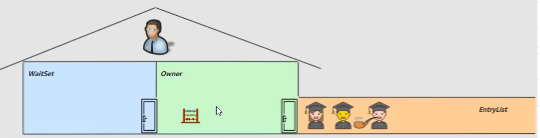

#### wait notify原理

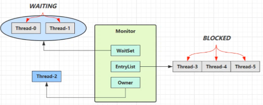

- Owner 线程发现条件不满足，调用 wait 方法，即可进入 WaitSet 变为 WAITING 状态 
- BLOCKED 和 WAITING 的线程都处于阻塞状态，不占用 CPU 时间片 
- BLOCKED 线程会在 Owner 线程释放锁时唤醒 
- WAITING 线程会在 Owner 线程调用 notify 或 notifyAll 时唤醒，但唤醒后并不意味者立刻获得锁，仍需进入 EntryList 重新竞争

#### API 介绍

- **obj.wait()** 让进入 object 监视器的线程到 waitSet 等待 
- **obj.notify()** 在 object 上正在 waitSet 等待的线程中挑一个唤醒 
- **obj.notifyAll()** 让 object 上正在 waitSet 等待的线程全部唤醒

它们都是线程之间进行协作的手段，都属于 Object 对象的方法。必须获得此对象的锁，即必须获得monitor也就是重量级锁，才能调用这几个方法

```java
final static Object obj = new Object();
public static void main(String[] args) {
    new Thread(() -> {
        synchronized (obj) {
            log.debug("执行....");
            try {
                obj.wait(); // 让线程在obj上一直等待下去
            } catch (InterruptedException e) {
                e.printStackTrace();
            }
            log.debug("其它代码....");
        }
    }).start();
    new Thread(() -> {
        synchronized (obj) {
            log.debug("执行....");
            try {
                obj.wait(); // 让线程在obj上一直等待下去
            } catch (InterruptedException e) {
                e.printStackTrace();
            }
            log.debug("其它代码....");
        }
    }).start();
    // 主线程两秒后执行
    sleep(2);
    log.debug("唤醒 obj 上其它线程");
    synchronized (obj) {
        obj.notify(); // 唤醒obj上的一个线程
        // obj.notifyAll(); // 唤醒obj上所有等待线程
    }
}
```

notify 的一种结果

```
20:00:53.096 [Thread-0] c.TestWaitNotify - 执行.... 
20:00:53.099 [Thread-1] c.TestWaitNotify - 执行.... 
20:00:55.096 [main] c.TestWaitNotify - 唤醒 obj 上其它线程
20:00:55.096 [Thread-0] c.TestWaitNotify - 其它代码.... 
```

notifyAll 的结果

```
19:58:15.457 [Thread-0] c.TestWaitNotify - 执行.... 
19:58:15.460 [Thread-1] c.TestWaitNotify - 执行.... 
19:58:17.456 [main] c.TestWaitNotify - 唤醒 obj 上其它线程
19:58:17.456 [Thread-1] c.TestWaitNotify - 其它代码.... 
19:58:17.456 [Thread-0] c.TestWaitNotify - 其它代码.... 
```

**wait()** 方法会释放对象的锁，进入 WaitSet 等待区，从而让其他线程就机会获取对象的锁。无限制等待，直到 notify 为止 

**wait(long n)** 有时限的等待, 到 n 毫秒后结束等待，或是被 notify

### 7.  wait notify 的正确使用

#### sleep(long n) 和 wait(long n) 的区别

1）sleep 是 Thread 方法，而 wait 是 Object 的方法 

2）sleep 不需要强制和 synchronized 配合使用，但 wait 需要 和 synchronized 一起用 

3）sleep 在睡眠的同时，不会释放对象锁的，但 wait 在等待的时候会释放对象锁 

4）它们 状态 TIMED_WAITING

#### step 1

```java
static final Object room = new Object();
static boolean hasCigarette = false;
static boolean hasTakeout = false;
```

下面的解决方案好不好

```java
new Thread(() -> {
    synchronized (room) {
        log.debug("有烟没？[{}]", hasCigarette);
        if (!hasCigarette) {
            log.debug("没烟，先歇会！");
            sleep(2);
        }
        log.debug("有烟没？[{}]", hasCigarette);
        if (hasCigarette) {
            log.debug("可以开始干活了");
        }
    }
}, "小南").start();
for (int i = 0; i < 5; i++) {
    new Thread(() -> {
        synchronized (room) {
            log.debug("可以开始干活了");
        }
    }, "其它人").start();
}
sleep(1);
new Thread(() -> {
    // 这里能不能加 synchronized (room)？
    hasCigarette = true;
    log.debug("烟到了噢！");
}, "送烟的").start();
```

输出：

```
20:49:49.883 [小南] c.TestCorrectPosture - 有烟没？[false] 
20:49:49.887 [小南] c.TestCorrectPosture - 没烟，先歇会！
20:49:50.882 [送烟的] c.TestCorrectPosture - 烟到了噢！
20:49:51.887 [小南] c.TestCorrectPosture - 有烟没？[true] 
20:49:51.887 [小南] c.TestCorrectPosture - 可以开始干活了
20:49:51.887 [其它人] c.TestCorrectPosture - 可以开始干活了
20:49:51.887 [其它人] c.TestCorrectPosture - 可以开始干活了
20:49:51.888 [其它人] c.TestCorrectPosture - 可以开始干活了
20:49:51.888 [其它人] c.TestCorrectPosture - 可以开始干活了
20:49:51.888 [其它人] c.TestCorrectPosture - 可以开始干活了
```

- 其它干活的线程，都要一直阻塞，效率太低 
- 小南线程必须睡足 2s 后才能醒来，就算烟提前送到，也无法立刻醒来 
- 加了 synchronized (room) 后，就好比小南在里面反锁了门睡觉，烟根本没法送进门，main 没加 synchronized 就好像 main 线程是翻窗户进来的 
- 解决方法，使用 wait - notify 机制

#### step 2

```java
new Thread(() -> {
    synchronized (room) {
        log.debug("有烟没？[{}]", hasCigarette);
        if (!hasCigarette) {
            log.debug("没烟，先歇会！");
            try {
                room.wait(2000);
            } catch (InterruptedException e) {
                e.printStackTrace();
            }
        }
        log.debug("有烟没？[{}]", hasCigarette);
        if (hasCigarette) {
            log.debug("可以开始干活了");
        }
    }
}, "小南").start();
for (int i = 0; i < 5; i++) {
    new Thread(() -> {
        synchronized (room) {
            log.debug("可以开始干活了");
        }
    }, "其它人").start();
}
sleep(1);
new Thread(() -> {
    synchronized (room) {
        hasCigarette = true;
        log.debug("烟到了噢！");
        room.notify();
    }
}, "送烟的").start();
```

输出：

```
20:51:42.489 [小南] c.TestCorrectPosture - 有烟没？[false] 
20:51:42.493 [小南] c.TestCorrectPosture - 没烟，先歇会！
20:51:42.493 [其它人] c.TestCorrectPosture - 可以开始干活了
20:51:42.493 [其它人] c.TestCorrectPosture - 可以开始干活了
20:51:42.494 [其它人] c.TestCorrectPosture - 可以开始干活了
20:51:42.494 [其它人] c.TestCorrectPosture - 可以开始干活了
20:51:42.494 [其它人] c.TestCorrectPosture - 可以开始干活了
20:51:43.490 [送烟的] c.TestCorrectPosture - 烟到了噢！
20:51:43.490 [小南] c.TestCorrectPosture - 有烟没？[true] 
20:51:43.490 [小南] c.TestCorrectPosture - 可以开始干活了
```

- 解决了其它干活的线程阻塞的问题 
- 但如果有其它线程也在等待条件呢？

#### step 3

```java
new Thread(() -> {
    synchronized (room) {
        log.debug("有烟没？[{}]", hasCigarette);
        if (!hasCigarette) {
            log.debug("没烟，先歇会！");
            try {
                room.wait();
            } catch (InterruptedException e) {
                e.printStackTrace();
            }
        }
        log.debug("有烟没？[{}]", hasCigarette);
        if (hasCigarette) {
            log.debug("可以开始干活了");
        } else {
            log.debug("没干成活...");
        }
    }
}, "小南").start();
new Thread(() -> {
    synchronized (room) {
        Thread thread = Thread.currentThread();
        log.debug("外卖送到没？[{}]", hasTakeout);
        if (!hasTakeout) {
            log.debug("没外卖，先歇会！");
            try {
                room.wait();
            } catch (InterruptedException e) {
                e.printStackTrace();
            }
        }
        log.debug("外卖送到没？[{}]", hasTakeout);
        if (hasTakeout) {
            log.debug("可以开始干活了");
        } else {
            log.debug("没干成活...");
        }
    }
}, "小女").start();
sleep(1);
new Thread(() -> {
    synchronized (room) {
        hasTakeout = true;
        log.debug("外卖到了噢！");
        room.notify();
    }
}, "送外卖的").start();
```

输出：

```
20:53:12.173 [小南] c.TestCorrectPosture - 有烟没？[false] 
20:53:12.176 [小南] c.TestCorrectPosture - 没烟，先歇会！
20:53:12.176 [小女] c.TestCorrectPosture - 外卖送到没？[false] 
20:53:12.176 [小女] c.TestCorrectPosture - 没外卖，先歇会！
20:53:13.174 [送外卖的] c.TestCorrectPosture - 外卖到了噢！
20:53:13.174 [小南] c.TestCorrectPosture - 有烟没？[false] 
20:53:13.174 [小南] c.TestCorrectPosture - 没干成活... 
```

- notify 只能随机唤醒一个 WaitSet 中的线程，这时如果有其它线程也在等待，那么就可能唤醒不了正确的线 程，称之为【虚假唤醒】 
- 解决方法，改为 notifyAll

#### step 4

```java
new Thread(() -> {
    synchronized (room) {
        hasTakeout = true;
        log.debug("外卖到了噢！");
        room.notifyAll();
    }
}, "送外卖的").start();
```

输出：

```
20:55:23.978 [小南] c.TestCorrectPosture - 有烟没？[false] 
20:55:23.982 [小南] c.TestCorrectPosture - 没烟，先歇会！
20:55:23.982 [小女] c.TestCorrectPosture - 外卖送到没？[false] 
20:55:23.982 [小女] c.TestCorrectPosture - 没外卖，先歇会！
20:55:24.979 [送外卖的] c.TestCorrectPosture - 外卖到了噢！
20:55:24.979 [小女] c.TestCorrectPosture - 外卖送到没？[true] 
20:55:24.980 [小女] c.TestCorrectPosture - 可以开始干活了
20:55:24.980 [小南] c.TestCorrectPosture - 有烟没？[false] 
20:55:24.980 [小南] c.TestCorrectPosture - 没干成活... 
```

- 用 notifyAll 仅解决某个线程的唤醒问题，但使用 if + wait 判断仅有一次机会，一旦条件不成立，就没有重新 判断的机会了 
- 解决方法，用 while + wait，当条件不成立，再次 wait

#### step 5

将 if 改为 while

```java
if (!hasCigarette) {
    log.debug("没烟，先歇会！");
    try {
        room.wait();
    } catch (InterruptedException e) {
        e.printStackTrace();
    }
}
```

改动后

```java
while (!hasCigarette) {
    log.debug("没烟，先歇会！");
    try {
        room.wait();
    } catch (InterruptedException e) {
        e.printStackTrace();
    }
}
```

输出：

```
20:58:34.322 [小南] c.TestCorrectPosture - 有烟没？[false] 
20:58:34.326 [小南] c.TestCorrectPosture - 没烟，先歇会！
20:58:34.326 [小女] c.TestCorrectPosture - 外卖送到没？[false] 
20:58:34.326 [小女] c.TestCorrectPosture - 没外卖，先歇会！
20:58:35.323 [送外卖的] c.TestCorrectPosture - 外卖到了噢！
20:58:35.324 [小女] c.TestCorrectPosture - 外卖送到没？[true] 
20:58:35.324 [小女] c.TestCorrectPosture - 可以开始干活了
20:58:35.324 [小南] c.TestCorrectPosture - 没烟，先歇会！
```

#### 结论

```java
synchronized(lock) {
 while(条件不成立) {
 lock.wait();
 }
 // 干活
}
//另一个线程
synchronized(lock) {
 lock.notifyAll();
}
```

#### 同步模式之保护性暂停

##### 定义

即 Guarded Suspension，用在一个线程等待另一个线程的执行结果 

要点 

- 有一个结果需要从一个线程传递到另一个线程，让他们关联同一个 GuardedObject 

- 如果有结果不断从一个线程到另一个线程那么可以使用消息队列（见生产者/消费者） 

- JDK 中，join 的实现、Future 的实现，采用的就是此模式 

- 因为要等待另一方的结果，因此归类到同步模式

  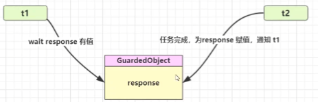

##### 实现

```java
class GuardedObject {
    private Object response;
    private final Object lock = new Object();
    public Object get() {
        synchronized (lock) {
            // 条件不满足则等待
            while (response == null) {
                try {
                    lock.wait();
                } catch (InterruptedException e) {
                    e.printStackTrace();
                }
            }
            return response;
        }
    }
    public void complete(Object response) {
        synchronized (lock) {
            // 条件满足，通知等待线程
            this.response = response;
            lock.notifyAll();
        }
    }
}
```

##### 应用

```java
@Slf4j(topic = "c.GuardedTest")
public class GuardedTest {

    public static void main(String[] args) {
        GuardedObject guardedObject = new GuardedObject();
        // 线程1 等待线程2的下载结果
        new Thread(() -> {
            try {
                // 等待结果
                log.debug("等待结果");
                Object o = guardedObject.get();
                List<String> list = (List<String>)guardedObject.get();
                log.debug("结果大小：{}", list.size());
            } catch (InterruptedException e) {
                e.printStackTrace();
            }
        }, "t1").start();

        new Thread(() -> {
            log.debug("执行下载");
            try {
                List<String> download = Downloader.download("https://www.baidu.com");
                guardedObject.complete(download);
            } catch (IOException e) {
                e.printStackTrace();
            }
        }, "t2").start();
    }
}

class GuardedObject {
    // 结果
    private Object response;

    // 获取结果
    public Object get() throws InterruptedException {
        synchronized (this) {
            // 没有结果，虚假唤醒
            while (response == null) {
                this.wait();
            }

            return response;
        }
    }

    // 产生结果
    public void complete(Object response) {
        synchronized (this) {
            // 给结果成员变量赋值
            this.response = response;
            this.notifyAll();
        }
    }
}

public abstract class Downloader {

    public static List<String> download(String url) throws IOException {
        HttpURLConnection connection = (HttpURLConnection) new URL(url).openConnection();
        List<String> lines = new ArrayList<>();

        try (BufferedReader reader = new BufferedReader(new InputStreamReader(connection.getInputStream(), StandardCharsets.UTF_8))) {
            String line;
            while ((line = reader.readLine()) != null) {
                lines.add(line);
            }
        }

        return lines;
    }

}
```

执行结果

```
23:44:59 [t1] c.GuardedTest - 等待结果
23:44:59 [t2] c.GuardedTest - 执行下载
23:45:00 [t1] c.GuardedTest - 结果大小：3
```

##### 带超时版 **GuardedObject**

控制超时时间

```java
class GuardedObjectV2 {
    private Object response;
    public Object get(long millis) {
        synchronized (this) {
            // 1) 记录最初时间
            long begin = System.currentTimeMillis();
            // 2) 已经经历的时间
            long timePassed = 0;
            while (response == null) {
                // 4) 假设 millis 是 1000，结果在 400 时唤醒了，那么还有 600 要等
                long waitTime = millis - timePassed;
                log.debug("waitTime: {}", waitTime);
                if (waitTime <= 0) {
                    log.debug("break...");
                    break;
                }
                try {
                    this.wait(waitTime);
                } catch (InterruptedException e) {
                    e.printStackTrace();
                }
                // 3) 如果提前被唤醒，这时已经经历的时间假设为 400
                timePassed = System.currentTimeMillis() - begin;
                log.debug("timePassed: {}, object is null {}", 
                          timePassed, response == null);
            }
            return response;
        }
    }
    
    public void complete(Object response) {
        synchronized (this) {
            // 条件满足，通知等待线程
            this.response = response;
            log.debug("notify...");
            this.notifyAll();
        }
    }
}
```

- 测试，没有超时

```java
public static void main(String[] args) {
    GuardedObjectV2 v2 = new GuardedObjectV2();
    new Thread(() -> {
        sleep(1);
        v2.complete(null);
        sleep(1);
        v2.complete(Arrays.asList("a", "b", "c"));
    }).start();
    
    Object response = v2.get(2500);
    
    if (response != null) {
        log.debug("get response: [{}] lines", ((List<String>) response).size());
    } else {
        log.debug("can't get response");
    }
}
```

输出

```
08:49:39.917 [main] c.GuardedObjectV2 - waitTime: 2500
08:49:40.917 [Thread-0] c.GuardedObjectV2 - notify...
08:49:40.917 [main] c.GuardedObjectV2 - timePassed: 1003, object is null true
08:49:40.917 [main] c.GuardedObjectV2 - waitTime: 1497
08:49:41.918 [Thread-0] c.GuardedObjectV2 - notify...
08:49:41.918 [main] c.GuardedObjectV2 - timePassed: 2004, object is null false
08:49:41.918 [main] c.TestGuardedObjectV2 - get response: [3] lines
```

- 测试超时

```java
// 等待时间不足
List<String> lines = v2.get(1500);
```

输出

```
08:47:54.963 [main] c.GuardedObjectV2 - waitTime: 1500
08:47:55.963 [Thread-0] c.GuardedObjectV2 - notify...
08:47:55.963 [main] c.GuardedObjectV2 - timePassed: 1002, object is null true
08:47:55.963 [main] c.GuardedObjectV2 - waitTime: 498
08:47:56.461 [main] c.GuardedObjectV2 - timePassed: 1500, object is null true
08:47:56.461 [main] c.GuardedObjectV2 - waitTime: 0
08:47:56.461 [main] c.GuardedObjectV2 - break...
08:47:56.461 [main] c.TestGuardedObjectV2 - can't get response
08:47:56.963 [Thread-0] c.GuardedObjectV2 - notify...
```

#####  原理之 join

是调用者轮询检查线程 alive 状态

```java
t1.join();
```

等价于下面的代码

```java
synchronized (t1) {
    // 调用者线程进入 t1 的 waitSet 等待, 直到 t1 运行结束
    while (t1.isAlive()) {
        t1.wait(0);
    }
}
```

> 注意 
>
> join 体现的是【保护性暂停】模式

##### 多任务版 GuardedObject

图中 Futures 就好比居民楼一层的信箱（每个信箱有房间编号），左侧的 t0，t2，t4 就好比等待邮件的居民，右 侧的 t1，t3，t5 就好比邮递员

如果需要在多个类之间使用 GuardedObject 对象，作为参数传递不是很方便，因此设计一个用来解耦的中间类， 这样不仅能够解耦【结果等待者】和【结果生产者】，还能够同时支持多个任务的管理


新增 id 用来标识 Guarded Object

```java
class GuardedObject {
    // 标识 Guarded Object
    private int id;
    public GuardedObject(int id) {
        this.id = id;
    }
    public int getId() {
        return id;
    }
    // 结果
    private Object response;
    // 获取结果
    // timeout 表示要等待多久 2000
    public Object get(long timeout) {
        synchronized (this) {
            // 开始时间 15:00:00
            long begin = System.currentTimeMillis();
            // 经历的时间
            long passedTime = 0;
            while (response == null) {
                // 这一轮循环应该等待的时间
                long waitTime = timeout - passedTime;
                // 经历的时间超过了最大等待时间时，退出循环
                if (timeout - passedTime <= 0) {
                    break;
                }
                try {
                    this.wait(waitTime); // 虚假唤醒 15:00:01
                } catch (InterruptedException e) {
                    e.printStackTrace();
                }
                // 求得经历时间
                passedTime = System.currentTimeMillis() - begin; // 15:00:02 1s
            }
            return response;
        }
    }
    // 产生结果
    public void complete(Object response) {
        synchronized (this) {
            // 给结果成员变量赋值
            this.response = response;
            this.notifyAll();
        }
    }
}
```

中间解耦类

```java
class Mailboxes {
    private static Map<Integer, GuardedObject> boxes = new Hashtable<>();
    private static int id = 1;
    // 产生唯一 id
    private static synchronized int generateId() {
        return id++;
    }
    public static GuardedObject getGuardedObject(int id) {
        return boxes.remove(id);
    }
    public static GuardedObject createGuardedObject() {
        GuardedObject go = new GuardedObject(generateId());
        boxes.put(go.getId(), go);
        return go;
    }
    public static Set<Integer> getIds() {
        return boxes.keySet();
    }
}
```

业务相关类

```java
class People extends Thread{
    @Override
    public void run() {
        // 收信
        GuardedObject guardedObject = Mailboxes.createGuardedObject();
        log.debug("开始收信 id:{}", guardedObject.getId());
        Object mail = guardedObject.get(5000);
        log.debug("收到信 id:{}, 内容:{}", guardedObject.getId(), mail);
    }
}

class Postman extends Thread {
    private int id;
    private String mail;
    public Postman(int id, String mail) {
        this.id = id;
        this.mail = mail;
    }
    @Override
    public void run() {
        GuardedObject guardedObject = Mailboxes.getGuardedObject(id);
        log.debug("送信 id:{}, 内容:{}", id, mail);
        guardedObject.complete(mail);
    }
}
```

测试

```java
public static void main(String[] args) throws InterruptedException {
    for (int i = 0; i < 3; i++) {
        new People().start();
    }
    Sleeper.sleep(1);
    for (Integer id : Mailboxes.getIds()) {
        new Postman(id, "内容" + id).start();
    }
}
```

某次运行结果

```
10:35:05.689 c.People [Thread-1] - 开始收信 id:3
10:35:05.689 c.People [Thread-2] - 开始收信 id:1
10:35:05.689 c.People [Thread-0] - 开始收信 id:2
10:35:06.688 c.Postman [Thread-4] - 送信 id:2, 内容:内容2
10:35:06.688 c.Postman [Thread-5] - 送信 id:1, 内容:内容1
10:35:06.688 c.People [Thread-0] - 收到信 id:2, 内容:内容2
10:35:06.688 c.People [Thread-2] - 收到信 id:1, 内容:内容1
10:35:06.688 c.Postman [Thread-3] - 送信 id:3, 内容:内容3
10:35:06.689 c.People [Thread-1] - 收到信 id:3, 内容:内容3
```

#### 异步模式之生产者/消费者

##### 定义

要点 

- 与前面的保护性暂停中的 GuardObject 不同，不需要产生结果和消费结果的线程一一对应 

- 消费队列可以用来平衡生产和消费的线程资源 

- 生产者仅负责产生结果数据，不关心数据该如何处理，而消费者专心处理结果数据 

- 消息队列是有容量限制的，满时不会再加入数据，空时不会再消耗数据 

- JDK 中各种阻塞队列，采用的就是这种模式

  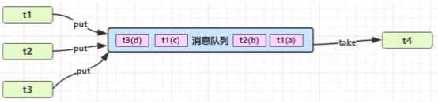

##### 实现

```java
@Slf4j(topic = "c.ProviderAndCumsumer")
public class ProviderAndCumsumer {

    public static void main(String[] args) throws InterruptedException {
        MessageQueue queue = new MessageQueue(2);

        for (int i = 0; i < 3; i++) {
            int id = i;
            new Thread(() -> {
                try {
                    queue.put(new Message(id, "值" + id));
                } catch (InterruptedException e) {
                    e.printStackTrace();
                }
            }, "生产者" + i).start();
        }

        new Thread(() -> {
            while (true) {
                try {
                    TimeUnit.SECONDS.sleep(1);
                    Message take = queue.take();
                } catch (InterruptedException e) {
                    e.printStackTrace();
                }
            }
        }, "消费者").start();
    }
}

// 消息队列类,java线程之间通信
@Slf4j(topic = "c.MessageQueue")
class MessageQueue {
    // 消息队列集合
    private final LinkedList<Message> list = new LinkedList<>();
    // 消息队列容量
    private int capcity;

    public MessageQueue(int capcity) {
        this.capcity = capcity;
    }

    // 获取消息方法
    public Message take() throws InterruptedException {
        synchronized (list) {
            // 检查队列是否为空
            while (list.isEmpty()) {
                log.debug("队列为空，消费者线程等待");
                list.wait();
            }

            // 从队列头部获取消息返回
            Message message = list.removeFirst();
            log.debug("已消费消息 {}", message);
            list.notifyAll();
            return message;
        }
    }

    // 存入消息
    public void put(Message message) throws InterruptedException {
        synchronized (list) {
            // 检查队列是否已满
            while (list.size() == capcity) {
                log.debug("对列已满，生产者线程等待");
                list.wait();
            }

            // 将消息加入队列尾部
            list.addLast(message);
            log.debug("已生产消息 {}", message);
            list.notifyAll();
        }
    }
}

// 消息对象
final class Message {
    private int id;

    private Object value;

    public Message(int id, Object value) {
        this.id = id;
        this.value = value;
    }

    public int getId() {
        return id;
    }

    public Object getValue() {
        return value;
    }

    @Override
    public String toString() {
        return "Message{" +
                "id=" + id +
                ", value=" + value +
                '}';
    }
}
```

某次运行结果

```
13:33:09 [生产者1] c.MessageQueue - 已生产消息 Message{id=1, value=值1}
13:33:09 [生产者2] c.MessageQueue - 已生产消息 Message{id=2, value=值2}
13:33:09 [生产者0] c.MessageQueue - 对列已满，生产者线程等待
13:33:10 [消费者] c.MessageQueue - 已消费消息 Message{id=1, value=值1}
13:33:10 [生产者0] c.MessageQueue - 已生产消息 Message{id=0, value=值0}
13:33:11 [消费者] c.MessageQueue - 已消费消息 Message{id=2, value=值2}
13:33:12 [消费者] c.MessageQueue - 已消费消息 Message{id=0, value=值0}
13:33:13 [消费者] c.MessageQueue - 队列为空，消费者线程等待
```

### 8. Park & Unpark

#### 基本使用

它们是 LockSupport 类中的方法

```java
// 暂停当前线程
LockSupport.park(); 
// 恢复某个线程的运行
LockSupport.unpark(暂停线程对象)
```

先 park 再 unpark

```java
Thread t1 = new Thread(() -> {
    log.debug("start...");
    sleep(1);
    log.debug("park...");
    LockSupport.park();
    log.debug("resume...");
},"t1");
t1.start();
sleep(2);
log.debug("unpark...");
LockSupport.unpark(t1);
```

输出

```
18:42:52.585 c.TestParkUnpark [t1] - start... 
18:42:53.589 c.TestParkUnpark [t1] - park... 
18:42:54.583 c.TestParkUnpark [main] - unpark... 
18:42:54.583 c.TestParkUnpark [t1] - resume... 
```

先 unpark 再 park

```java
Thread t1 = new Thread(() -> {
    log.debug("start...");
    sleep(2);
    log.debug("park...");
    LockSupport.park();
    log.debug("resume...");
}, "t1");
t1.start();
sleep(1);
log.debug("unpark...");
LockSupport.unpark(t1);
```

输出

```
18:43:50.765 c.TestParkUnpark [t1] - start... 
18:43:51.764 c.TestParkUnpark [main] - unpark... 
18:43:52.769 c.TestParkUnpark [t1] - park... 
18:43:52.769 c.TestParkUnpark [t1] - resume... 
```

#### 特点

与 Object 的 wait & notify 相比 

- wait，notify 和 notifyAll 必须配合 Object Monitor 一起使用，而 park，unpark 不必
- park & unpark 是以线程为单位来【阻塞】和【唤醒】线程，而 notify 只能随机唤醒一个等待线程，notifyAll  是唤醒所有等待线程，就不那么【精确】 
- park & unpark 可以先 unpark，而 wait & notify 不能先 notify

#### 原理

每个线程都有自己的一个 Parker 对象，由三部分组成 **_counter** ， **_cond** 和 **_mutex** 打个比喻 

- 线程就像一个旅人，Parker 就像他随身携带的背包，条件变量就好比背包中的帐篷。_counter 就好比背包中 的备用干粮（0 为耗尽，1 为充足） 

- 调用 park 就是要看需不需要停下来歇息 

  - 如果备用干粮耗尽，那么钻进帐篷歇息 
  - 如果备用干粮充足，那么不需停留，继续前进 

- 调用 unpark，就好比令干粮充足 

  - 如果这时线程还在帐篷，就唤醒让他继续前进 

  - 如果这时线程还在运行，那么下次他调用 park 时，仅是消耗掉备用干粮，不需停留继续前进 

    - 因为背包空间有限，多次调用 unpark 仅会补充一份备用干粮

    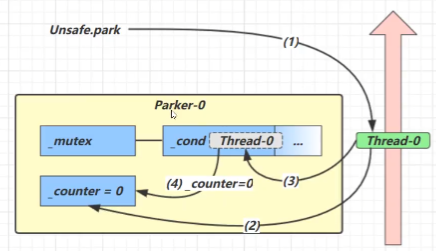

  1. 当前线程调用 Unsafe.park() 方法 
  2. 检查 _counter ，本情况为 0，这时，获得 _mutex 互斥锁 
  3. 线程进入 _cond 条件变量阻塞 
  4. 设置 _counter = 0

  

  1. 调用 Unsafe.unpark(Thread_0) 方法，设置 _counter 为 1
  2. 唤醒 _cond 条件变量中的 Thread_0 
  3. Thread_0 恢复运行
  4. 设置 _counter 为 0

  

  1. 调用 Unsafe.unpark(Thread_0) 方法，设置 _counter 为 1 
  2. 当前线程调用 Unsafe.park() 方法 
  3. 检查 _counter ，本情况为 1，这时线程无需阻塞，继续运行 
  4. 设置 _counter 为 0

### 9. 重新理解线程状态转换

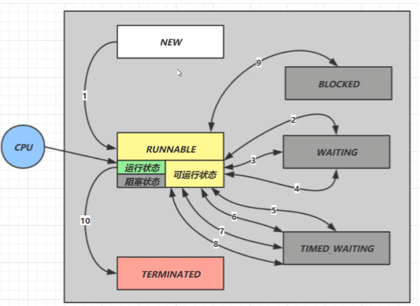

假设有线程 **Thread t**

#### 情况 1 NEW --> RUNNABLE

- 当调用 t.start() 方法时，由 **NEW --> RUNNABLE**

#### 情况 2 RUNNABLE <--> WAITING

**t 线程**用 **synchronized(obj)** 获取了对象锁后 

-  调用 **obj.wait()** 方法时，**t 线程**从 **RUNNABLE --> WAITING** 
- 调用 **obj.notify() ， obj.notifyAll() ， t.interrupt()** 时 
  - 竞争锁成功，**t 线程**从 **WAITING --> RUNNABLE** 
  - 竞争锁失败，**t 线程**从 **WAITING --> BLOCKED**

```java
public class TestWaitNotify {
    final static Object obj = new Object();
    public static void main(String[] args) {
        new Thread(() -> {
            synchronized (obj) {
                log.debug("执行....");
                try {
                    obj.wait();
                } catch (InterruptedException e) {
                    e.printStackTrace();
                }
                log.debug("其它代码...."); // 断点
            }
        },"t1").start();
        new Thread(() -> {
            synchronized (obj) {
                log.debug("执行....");
                try {
                    obj.wait();
                } catch (InterruptedException e) {
                    e.printStackTrace();
                }
                log.debug("其它代码...."); // 断点
            }
        },"t2").start();

        sleep(0.5);
        log.debug("唤醒 obj 上其它线程");
        synchronized (obj) {
            obj.notifyAll(); // 唤醒obj上所有等待线程 断点
        }
    }
}
```

#### 情况 3 RUNNABLE <--> WAITING

- **当前线程**调用 **t.join()** 方法时，**当前线程**从 **RUNNABLE --> WAITING** 
  - 注意是**当前线程**在**t 线程对象**的监视器上等待 
- **t 线程**运行结束，或调用了**当前线程**的 interrupt() 时，当前线程从 **WAITING --> RUNNABLE**

#### 情况 4 RUNNABLE <--> WAITING

- 当前线程调用 **LockSupport.park()** 方法会让当前线程从 RUNNABLE --> WAITING 
- 调用 **LockSupport.unpark(目标线程)** 或调用了线程 的 interrupt() ，会让目标线程从 **WAITING -->  RUNNABLE**

#### 情况 5 RUNNABLE <--> TIMED_WAITING

**t 线程**用 synchronized(obj) 获取了对象锁后 

- 调用 obj.wait(long n) 方法时，**t 线程**从 RUNNABLE --> TIMED_WAITING 
- **t 线程**等待时间超过了 n 毫秒，或调用 **obj.notify() ， obj.notifyAll() ， t.interrupt()** 时 
  - 竞争锁成功，**t 线程**从 **TIMED_WAITING --> RUNNABLE** 
  - 竞争锁失败，**t 线程**从 TIMED_WAITING --> BLOCKED

#### 情况 6 RUNNABLE <--> TIMED_WAITING 

- **当前线程**调用 **t.join(long n)** 方法时，**当前线程**从 **RUNNABLE --> TIMED_WAITING** 
  - 注意是**当前线程在t 线程对象**的监视器上等待 
- **当前线程**等待时间超过了 n 毫秒，或**t 线程**运行结束，或调用了**当前线程**的 **interrupt()** 时，**当前线程**从 **TIMED_WAITING --> RUNNABLE** 

#### 情况 7 RUNNABLE <--> TIMED_WAITING 

- 当前线程调用 **Thread.sleep(long n) ，**当前线程从 **RUNNABLE --> TIMED_WAITING** 
- 当前线程等待时间超过了 n 毫秒，当前线程从 **TIMED_WAITING --> RUNNABLE** 

#### 情况 8 RUNNABLE <--> TIMED_WAITING 

- 当前线程调用 LockSupport.parkNanos(long nanos) 或 LockSupport.parkUntil(long millis) 时，当前线 程从 RUNNABLE --> TIMED_WAITING 
- 调用 LockSupport.unpark(目标线程) 或调用了线程 的 interrupt() ，或是等待超时，会让目标线程从 TIMED_WAITING--> RUNNABLE 

#### 情况 9 RUNNABLE <--> BLOCKED 

- t 线程用 synchronized(obj) 获取了对象锁时如果竞争失败，从 RUNNABLE --> BLOCKED 
- 持 obj 锁线程的同步代码块执行完毕，会唤醒该对象上所有 BLOCKED 的线程重新竞争，如果其中 t 线程竞争 成功，从 BLOCKED --> RUNNABLE ，其它失败的线程仍然 BLOCKED 

#### 情况 10 RUNNABLE --> TERMINATED 

- 当前线程所有代码运行完毕，进入 **TERMINATED**

### 10. 多把锁

#### 多把不相干的锁

一间大屋子有两个功能：睡觉、学习，互不相干。 

现在小南要学习，小女要睡觉，但如果只用一间屋子（一个对象锁）的话，那么并发度很低 

解决方法是准备多个房间（多个对象锁）

例如

```java
@Slf4j(topic = "c.TestMultiLock")
public class TestMultiLock {

    public static void main(String[] args) {
        BigRoom bigRoom = new BigRoom();
        new Thread(bigRoom::study,"小南").start();

        new Thread(bigRoom::sleep,"小女").start();
    }
}

@Slf4j(topic = "c.BigRoom")
class BigRoom{

    public void sleep() {
        synchronized (this) {
            log.debug("sleeping 2 小时");
            try {
                TimeUnit.SECONDS.sleep(2);
            } catch (InterruptedException e) {
                e.printStackTrace();
            }
        }
    }
    public void study() {
        synchronized (this) {
            log.debug("study 1 小时");
            try {
                TimeUnit.SECONDS.sleep(2);
            } catch (InterruptedException e) {
                e.printStackTrace();
            }
        }
    }
}
```

某次结果

```
22:42:34 [小南] c.BigRoom - study 1 小时
22:42:36 [小女] c.BigRoom - sleeping 2 小时
```

改进

```java
class BigRoom {
    private final Object studyRoom = new Object();
    private final Object bedRoom = new Object();
    public void sleep() {
        synchronized (bedRoom) {
            log.debug("sleeping 2 小时");
            try {
                TimeUnit.SECONDS.sleep(2);
            } catch (InterruptedException e) {
                e.printStackTrace();
            }
        }
    }
    public void study() {
        synchronized (studyRoom) {
            log.debug("study 1 小时");
             try {
                TimeUnit.SECONDS.sleep(2);
            } catch (InterruptedException e) {
                e.printStackTrace();
            }
        }
    }
}
```

某次执行结果

```
22:44:55 [小南] c.BigRoom - study 1 小时
22:44:55 [小女] c.BigRoom - sleeping 2 小时
```

将锁的粒度细分 

- 好处，是可以增强并发度 
- 坏处，如果一个线程需要同时获得多把锁，就容易发生死锁

### 11. 活跃性

#### 死锁

有这样的情况：一个线程需要同时获取多把锁，这时就容易发生死锁 

**t1 线程** 获得 **A对象** 锁，接下来想获取 **B对象** 的锁 

t2 线程 获得 **B对象** 锁，接下来想获取 A对象 的锁 

例：

```java
Object A = new Object();
Object B = new Object();
Thread t1 = new Thread(() -> {
    synchronized (A) {
        log.debug("lock A");
         try {
                TimeUnit.SECONDS.sleep(1);
            } catch (InterruptedException e) {
                e.printStackTrace();
            }
        synchronized (B) {
            log.debug("lock B");
            log.debug("操作...");
        }
    }
}, "t1");
Thread t2 = new Thread(() -> {
    synchronized (B) {
        log.debug("lock B");
        try {
            TimeUnit.MILLISECONDS.sleep(500);
        } catch (InterruptedException e) {
            e.printStackTrace();
        }
        synchronized (A) {
            log.debug("lock A");
            log.debug("操作...");
        }
    }
}, "t2");
t1.start();
t2.start();
```

##### 定位死锁

检测死锁可以使用 jconsole工具，或者使用 jps 定位进程 id，再用 jstack 定位死锁：

```sh
cmd > jps
Picked up JAVA_TOOL_OPTIONS: -Dfile.encoding=UTF-8
12320 Jps
22816 KotlinCompileDaemon
33200 TestDeadLock // JVM 进程
11508 Main
28468 Launcher
```

```shell
cmd > jstack 33200
Picked up JAVA_TOOL_OPTIONS: -Dfile.encoding=UTF-8
2018-12-29 05:51:40
Full thread dump Java HotSpot(TM) 64-Bit Server VM (25.91-b14 mixed mode):
"DestroyJavaVM" #13 prio=5 os_prio=0 tid=0x0000000003525000 nid=0x2f60 waiting on condition 
[0x0000000000000000]
java.lang.Thread.State: RUNNABLE
"Thread-1" #12 prio=5 os_prio=0 tid=0x000000001eb69000 nid=0xd40 waiting for monitor entry 
[0x000000001f54f000]
java.lang.Thread.State: BLOCKED (on object monitor)
at thread.TestDeadLock.lambda$main$1(TestDeadLock.java:28)
- waiting to lock <0x000000076b5bf1c0> (a java.lang.Object)
- locked <0x000000076b5bf1d0> (a java.lang.Object)
at thread.TestDeadLock$$Lambda$2/883049899.run(Unknown Source)
at java.lang.Thread.run(Thread.java:745)
"Thread-0" #11 prio=5 os_prio=0 tid=0x000000001eb68800 nid=0x1b28 waiting for monitor entry 
[0x000000001f44f000]
java.lang.Thread.State: BLOCKED (on object monitor)
at thread.TestDeadLock.lambda$main$0(TestDeadLock.java:15)
- waiting to lock <0x000000076b5bf1d0> (a java.lang.Object)
- locked <0x000000076b5bf1c0> (a java.lang.Object)
at thread.TestDeadLock$$Lambda$1/495053715.run(Unknown Source)
at java.lang.Thread.run(Thread.java:745)

// 略去部分输出
Found one Java-level deadlock:
=============================
"Thread-1":
waiting to lock monitor 0x000000000361d378 (object 0x000000076b5bf1c0, a java.lang.Object),
which is held by "Thread-0"
"Thread-0":
waiting to lock monitor 0x000000000361e768 (object 0x000000076b5bf1d0, a java.lang.Object),
which is held by "Thread-1"
Java stack information for the threads listed above:
===================================================
"Thread-1":
at thread.TestDeadLock.lambda$main$1(TestDeadLock.java:28)
- waiting to lock <0x000000076b5bf1c0> (a java.lang.Object)
- locked <0x000000076b5bf1d0> (a java.lang.Object)
at thread.TestDeadLock$$Lambda$2/883049899.run(Unknown Source)
at java.lang.Thread.run(Thread.java:745)
"Thread-0":
at thread.TestDeadLock.lambda$main$0(TestDeadLock.java:15)
- waiting to lock <0x000000076b5bf1d0> (a java.lang.Object)
- locked <0x000000076b5bf1c0> (a java.lang.Object)
at thread.TestDeadLock$$Lambda$1/495053715.run(Unknown Source)
at java.lang.Thread.run(Thread.java:745)
Found 1 deadlock.
```

- 避免死锁要注意加锁顺序 
- 另外如果由于某个线程进入了死循环，导致其它线程一直等待，对于这种情况 linux 下可以通过 top 先定位到 CPU 占用高的 Java 进程，再利用 top -Hp 进程id 来定位是哪个线程，最后再用 jstack 排查

##### 哲学家就餐问题

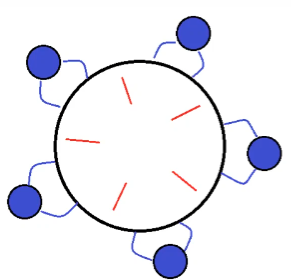

有五位哲学家，围坐在圆桌旁。 

- 他们只做两件事，思考和吃饭，思考一会吃口饭，吃完饭后接着思考。 
- 吃饭时要用两根筷子吃，桌上共有 5 根筷子，每位哲学家左右手边各有一根筷子。 
- 如果筷子被身边的人拿着，自己就得等待

筷子类

```java
class Chopstick {
    String name;
    public Chopstick(String name) {
        this.name = name;
    }
    @Override
    public String toString() {
        return "筷子{" + name + '}';
    }
}
```

哲学家类

```java
class Philosopher extends Thread {
    Chopstick left;
    Chopstick right;
    public Philosopher(String name, Chopstick left, Chopstick right) {
        super(name);
        this.left = left;
        this.right = right;
    }
    private void eat() {
        log.debug("eating...");
        try {
            TimeUnit.SECONDS.sleep(1);
        } catch (InterruptedException e) {
            e.printStackTrace();
        }
    }

    @Override
    public void run() {
        while (true) {
            // 获得左手筷子
            synchronized (left) {
                // 获得右手筷子
                synchronized (right) {
                    // 吃饭
                    eat();
                }
                // 放下右手筷子
            }
            // 放下左手筷子
        }
    }
}
```

就餐

```java
Chopstick c1 = new Chopstick("1");
Chopstick c2 = new Chopstick("2");
Chopstick c3 = new Chopstick("3");
Chopstick c4 = new Chopstick("4");
Chopstick c5 = new Chopstick("5");
new Philosopher("苏格拉底", c1, c2).start();
new Philosopher("柏拉图", c2, c3).start();
new Philosopher("亚里士多德", c3, c4).start();
new Philosopher("赫拉克利特", c4, c5).start();
new Philosopher("阿基米德", c5, c1).start();
```

执行不多会，就执行不下去了

```
12:33:15.575 [苏格拉底] c.Philosopher - eating... 
12:33:15.575 [亚里士多德] c.Philosopher - eating... 
12:33:16.580 [阿基米德] c.Philosopher - eating... 
12:33:17.580 [阿基米德] c.Philosopher - eating... 
// 卡在这里, 不向下运行
```

使用 jconsole 检测死锁，发现

```
-------------------------------------------------------------------------
名称: 阿基米德
状态: cn.itcast.Chopstick@1540e19d (筷子1) 上的BLOCKED, 拥有者: 苏格拉底
总阻止数: 2, 总等待数: 1

堆栈跟踪:
cn.itcast.Philosopher.run(TestDinner.java:48)
 - 已锁定 cn.itcast.Chopstick@6d6f6e28 (筷子5)
-------------------------------------------------------------------------
名称: 苏格拉底
状态: cn.itcast.Chopstick@677327b6 (筷子2) 上的BLOCKED, 拥有者: 柏拉图
总阻止数: 2, 总等待数: 1

堆栈跟踪:
cn.itcast.Philosopher.run(TestDinner.java:48)
 - 已锁定 cn.itcast.Chopstick@1540e19d (筷子1)
-------------------------------------------------------------------------
名称: 柏拉图
状态: cn.itcast.Chopstick@14ae5a5 (筷子3) 上的BLOCKED, 拥有者: 亚里士多德
总阻止数: 2, 总等待数: 0

堆栈跟踪:
cn.itcast.Philosopher.run(TestDinner.java:48)
 - 已锁定 cn.itcast.Chopstick@677327b6 (筷子2)
-------------------------------------------------------------------------
名称: 亚里士多德
状态: cn.itcast.Chopstick@7f31245a (筷子4) 上的BLOCKED, 拥有者: 赫拉克利特
总阻止数: 1, 总等待数: 1

堆栈跟踪:
cn.itcast.Philosopher.run(TestDinner.java:48)
 - 已锁定 cn.itcast.Chopstick@14ae5a5 (筷子3)
-------------------------------------------------------------------------
名称: 赫拉克利特
状态: cn.itcast.Chopstick@6d6f6e28 (筷子5) 上的BLOCKED, 拥有者: 阿基米德
总阻止数: 2, 总等待数: 0

堆栈跟踪:
cn.itcast.Philosopher.run(TestDinner.java:48)
 - 已锁定 cn.itcast.Chopstick@7f31245a (筷子4)
```

这种线程没有按预期结束，执行不下去的情况，归类为【活跃性】问题，除了死锁以外，还有活锁和饥饿者两种情 况

#### 活锁

活锁出现在两个线程互相改变对方的结束条件，最后谁也无法结束，例如

```java
public class TestLiveLock {
    static volatile int count = 10;
    static final Object lock = new Object();
    
    public static void main(String[] args) {
        new Thread(() -> {
            // 期望减到 0 退出循环
            while (count > 0) {
                try {
                    TimeUnit.MILLISECONDS.sleep(200);
                } catch (InterruptedException e) {
                    e.printStackTrace();
                }
                count--;
                log.debug("count: {}", count);
            }
        }, "t1").start();
        new Thread(() -> {
            // 期望超过 20 退出循环
            while (count < 20) {
 try {
                    TimeUnit.MILLISECONDS.sleep(200);
                } catch (InterruptedException e) {
                    e.printStackTrace();
                }
                count++;
                log.debug("count: {}", count);
            }
        }, "t2").start();
    }
}
```

#### 饥饿

很多教程中把饥饿定义为，一个线程由于优先级太低，始终得不到 CPU 调度执行，也不能够结束，饥饿的情况不 易演示，讲读写锁时会涉及饥饿问题

下面我讲一下我遇到的一个线程饥饿的例子，先来看看使用顺序加锁的方式解决之前的死锁问题

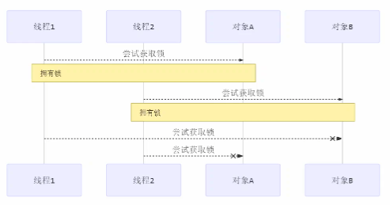

顺序加锁的解决方案，此方法能够解决死锁问题，但是容易造成线程饥饿，如哲学家问题采用顺序加锁

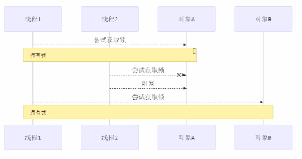

### 12. ReentrantLock

相对于 synchronized 它具备如下特点

- 可中断 
- 可以设置超时时间 
- 可以设置为公平锁 
- 支持多个条件变量

与 synchronized 一样，都支持可重入 

基本语法

```java
// 获取锁
reentrantLock.lock();
try {
    // 临界区
} finally {
    // 释放锁
    reentrantLock.unlock();
}
```

#### 可重入

可重入是指同一个线程如果首次获得了这把锁，那么因为它是这把锁的拥有者，因此有权利再次获取这把锁 

如果是不可重入锁，那么第二次获得锁时，自己也会被锁挡住

```java
@Slf4j(topic = "c.ReentrantLock")
public class ReentrantLockForReentrant {

    private static ReentrantLock lock = new ReentrantLock();

    public static void main(String[] args) {
        lock.lock();
        try {
            log.debug("enter main...");
            method1();
        }finally {
            lock.unlock();
        }
    }

    public static void method1() {
        lock.lock();
        try {
            log.debug("enter method1...");
            method2();
        }finally {
            lock.unlock();
        }
    }

    private static void method2() {
        lock.lock();
        try {
            log.debug("enter method2...");
        }finally {
            lock.unlock();
        }
    }
}
```

#### 可打断

```java
@Slf4j(topic = "c.ReentrantLockForInterrupt")
public class ReentrantLockForInterrupt {

    private static ReentrantLock lock = new ReentrantLock();

    public static void main(String[] args) throws InterruptedException {
        Thread t1 = new Thread(() -> {
            // 如果没有竞争那么此方法就会获取lock对象锁
            // 如果有竞争就进入阻塞队列，可以被其它线程用 interrupt方法打断
            try {
                log.debug("尝试获得锁");
                lock.lockInterruptibly();
            } catch (InterruptedException e) {
                e.printStackTrace();
                log.debug("没有获得锁，返回");
                return;
            }

            try {
                log.debug("获取到锁");
            }finally {
                lock.unlock();
            }
        }, "t1");

        lock.lock();
        t1.start();

        TimeUnit.SECONDS.sleep(1);
        log.debug("打断 t1");
        t1.interrupt();
    }
}
```

输出

```
23:48:07 [t1] c.ReentrantLockForInterrupt - 尝试获得锁
23:48:08 [main] c.ReentrantLockForInterrupt - 打断 t1
23:48:08 [t1] c.ReentrantLockForInterrupt - 没有获得锁，返回
java.lang.InterruptedException
	at java.util.concurrent.locks.AbstractQueuedSynchronizer.doAcquireInterruptibly(AbstractQueuedSynchronizer.java:898)
```

<u>注意如果是不可中断模式，那么即使使用了 interrupt 也不会让等待中断</u>

```java
ReentrantLock lock = new ReentrantLock();
Thread t1 = new Thread(() -> {
    log.debug("启动...");
    lock.lock();
    try {
        log.debug("获得了锁");
    } finally {
        lock.unlock();
    }
}, "t1");
lock.lock();
log.debug("获得了锁");
t1.start();
try {
    sleep(1);
    t1.interrupt();
    log.debug("执行打断");
    sleep(1);
} finally {
    log.debug("释放了锁");
    lock.unlock();
}
```

输出

```
18:06:56.261 [main] c.TestInterrupt - 获得了锁
18:06:56.265 [t1] c.TestInterrupt - 启动... 
18:06:57.266 [main] c.TestInterrupt - 执行打断 // 这时 t1 并没有被真正打断, 而是仍继续等待锁
18:06:58.267 [main] c.TestInterrupt - 释放了锁
18:06:58.267 [t1] c.TestInterrupt - 获得了锁
```

#### 锁超时

立刻失败

```java
ReentrantLock lock = new ReentrantLock();
Thread t1 = new Thread(() -> {
    log.debug("启动...");
    if (!lock.tryLock()) {
        log.debug("获取立刻失败，返回");
        return;
    }
    try {
        log.debug("获得了锁");
    } finally {
        lock.unlock();
    }
}, "t1");
lock.lock();
log.debug("获得了锁");
t1.start();
try {
   TimeUnit.SECONDS.sleep(2);
} finally {
    lock.unlock();
}
```

输出

```
18:15:02.918 [main] c.TestTimeout - 获得了锁
18:15:02.921 [t1] c.TestTimeout - 启动... 
18:15:02.921 [t1] c.TestTimeout - 获取立刻失败，返回
```

超时失败

```java
ReentrantLock lock = new ReentrantLock();
Thread t1 = new Thread(() -> {
    log.debug("启动...");
    try {
        if (!lock.tryLock(1, TimeUnit.SECONDS)) {
            log.debug("获取等待 1s 后失败，返回");
            return;
        }
    } catch (InterruptedException e) {
        e.printStackTrace();
    }
    try {
        log.debug("获得了锁");
    } finally {
        lock.unlock();
    }
}, "t1");
lock.lock();
log.debug("获得了锁");
t1.start();
try {
    TimeUnit.SECONDS.sleep(2);
} finally {
    lock.unlock();
}
```

输出

```
18:19:40.537 [main] c.TestTimeout - 获得了锁
18:19:40.544 [t1] c.TestTimeout - 启动... 
18:19:41.547 [t1] c.TestTimeout - 获取等待 1s 后失败，返回
```

使用 tryLock 解决哲学家就餐问题

```java
class Chopstick extends ReentrantLock {
    String name;
    public Chopstick(String name) {
        this.name = name;
    }
    @Override
    public String toString() {
        return "筷子{" + name + '}';
    }
}

class Philosopher extends Thread {
    Chopstick left;
    Chopstick right;
    public Philosopher(String name, Chopstick left, Chopstick right) {
        super(name);
        this.left = left;
        this.right = right;
    }
    @Override
    public void run() {
        while (true) {
            // 尝试获得左手筷子
            if (left.tryLock()) {
                try {
                    // 尝试获得右手筷子
                    if (right.tryLock()) {
                        try {
                            eat();
                        } finally {
                            right.unlock();
                        }
                    }
                } finally {
                    left.unlock();
                }
            }
        }
    }
    private void eat() {
        log.debug("eating...");
        TimeUnit.SECONDS.sleep(1);
    }
}

```

#### 公平锁

ReentrantLock 默认是不公平的

```java
ReentrantLock lock = new ReentrantLock(false);
lock.lock();
for (int i = 0; i < 500; i++) {
    new Thread(() -> {
        lock.lock();
        try {
            System.out.println(Thread.currentThread().getName() + " running...");
        } finally {
            lock.unlock();
        }
    }, "t" + i).start();
}
// 1s 之后去争抢锁
Thread.sleep(1000);
new Thread(() -> {
    System.out.println(Thread.currentThread().getName() + " start...");
    lock.lock();
    try {
        System.out.println(Thread.currentThread().getName() + " running...");
    } finally {
        lock.unlock();
    }
}, "强行插入").start();
lock.unlock();
```

强行插入，有机会在中间输出

> 注意：该实验不一定总能复现

```
t39 running... 
t40 running... 
t41 running... 
t42 running... 
t43 running... 
强行插入 start... 
强行插入 running... 
t44 running... 
t45 running... 
t46 running... 
t47 running... 
t49 running...
```

改为公平锁后

```java
ReentrantLock lock = new ReentrantLock(true);
```

强行插入，总是在最后输出

```
t465 running... 
t464 running... 
t477 running... 
t442 running... 
t468 running... 
t493 running... 
t482 running... 
t485 running... 
t481 running... 
强行插入 running... 
```

公平锁一般没有必要，会降低并发度

#### 条件变量

synchronized 中也有条件变量，就是我们讲原理时那个 waitSet 休息室，当条件不满足时进入 waitSet 等待 

ReentrantLock 的条件变量比 synchronized 强大之处在于，它是支持多个条件变量的，这就好比 

- synchronized 是那些不满足条件的线程都在一间休息室等消息 
- 而 ReentrantLock 支持多间休息室，有专门等烟的休息室、专门等早餐的休息室、唤醒时也是按休息室来唤 醒

使用要点： 

- await 前需要获得锁 
- await 执行后，会释放锁，进入 conditionObject 等待 
- await 的线程被唤醒（或打断、或超时）取重新竞争 lock 锁 
- 竞争 lock 锁成功后，从 await 后继续执行

例子：

```java
static ReentrantLock lock = new ReentrantLock();
static Condition waitCigaretteQueue = lock.newCondition();
static Condition waitbreakfastQueue = lock.newCondition();
static volatile boolean hasCigrette = false;
static volatile boolean hasBreakfast = false;
public static void main(String[] args) {
    new Thread(() -> {
        try {
            lock.lock();
            while (!hasCigrette) {
                try {
                    // 进入休息室等待
                    waitCigaretteQueue.await();
                } catch (InterruptedException e) {
                    e.printStackTrace();
                }
            }
            log.debug("等到了它的烟");
        } finally {
            lock.unlock();
        }
    }).start();
    new Thread(() -> {
        try {
            lock.lock();
            while (!hasBreakfast) {
                try {
                    // 进入休息室等待
                    waitbreakfastQueue.await();
                } catch (InterruptedException e) {
                    e.printStackTrace();
                }
            }
            log.debug("等到了它的早餐");
        } finally {
            lock.unlock();
        }
    }).start();
    TimeUnit.SECONDS.sleep(1);
    sendBreakfast();
    TimeUnit.SECONDS.sleep(1);
    sendCigarette();
}
private static void sendCigarette() {
    lock.lock();
    try {
        log.debug("送烟来了");
        hasCigrette = true;
        // 唤醒
        waitCigaretteQueue.signal();
    } finally {
        lock.unlock();
    }
}
private static void sendBreakfast() {
    lock.lock();
    try {
        log.debug("送早餐来了");
        hasBreakfast = true;
        // 唤醒
        waitbreakfastQueue.signal();
    } finally {
        lock.unlock();
    }
}
```

### 13. 同步模式之顺序控制

#### 固定运行顺序

比如，必须先 2 后 1 打印

##### wait notify 版

```java
// 用来同步的对象
static Object obj = new Object();
// t2 运行标记， 代表 t2 是否执行过
static boolean t2runed = false;
public static void main(String[] args) {
    Thread t1 = new Thread(() -> {
        synchronized (obj) {
            // 如果 t2 没有执行过
            while (!t2runed) { 
                try {
                    // t1 先等一会
                    obj.wait(); 
                } catch (InterruptedException e) {
                    e.printStackTrace();
                }
            }
        }
        System.out.println(1);
    });
    Thread t2 = new Thread(() -> {
        System.out.println(2);
        synchronized (obj) {
            // 修改运行标记
            t2runed = true;
            // 通知 obj 上等待的线程（可能有多个，因此需要用 notifyAll）
            obj.notifyAll();
        }
    });
    t1.start();
    t2.start();
}
```

##### Park Unpark 版

可以看到，实现上很麻烦： 

- 首先，需要保证先 wait 再 notify，否则 wait 线程永远得不到唤醒。因此使用了『运行标记』来判断该不该 wait 
- 第二，如果有些干扰线程错误地 notify 了 wait 线程，条件不满足时还要重新等待，使用了 while 循环来解决 此问题 
- 最后，唤醒对象上的 wait 线程需要使用 notifyAll，因为『同步对象』上的等待线程可能不止一个 

可以使用 LockSupport 类的 park 和 unpark 来简化上面的题目：

```java
Thread t1 = new Thread(() -> {
    try { Thread.sleep(1000); } catch (InterruptedException e) { }
    // 当没有『许可』时，当前线程暂停运行；有『许可』时，用掉这个『许可』，当前线程恢复运行
    LockSupport.park();
    System.out.println("1");
});
Thread t2 = new Thread(() -> {
    System.out.println("2");
    // 给线程 t1 发放『许可』（多次连续调用 unpark 只会发放一个『许可』）
    LockSupport.unpark(t1);
});
t1.start();
t2.start();
```

park 和 unpark 方法比较灵活，他俩谁先调用，谁后调用无所谓。并且是以线程为单位进行『暂停』和『恢复』， 不需要『同步对象』和『运行标记』

#### 交替输出

线程 1 输出 a 5 次，线程 2 输出 b 5 次，线程 3 输出 c 5 次。现在要求输出 abcabcabcabcabc 怎么实现

##### wait notify 版

```java
class SyncWaitNotify {
    private int flag;
    private int loopNumber;
    public SyncWaitNotify(int flag, int loopNumber) {
        this.flag = flag;
        this.loopNumber = loopNumber;
    }
    public void print(int waitFlag, int nextFlag, String str) {
        for (int i = 0; i < loopNumber; i++) {
            synchronized (this) {
                while (this.flag != waitFlag) {
                    try {
                        this.wait();
                    } catch (InterruptedException e) {
                        e.printStackTrace();
                    }
                }
                System.out.print(str);
                flag = nextFlag;
                this.notifyAll();
            }
        }
    }
}

SyncWaitNotify syncWaitNotify = new SyncWaitNotify(1, 5);
new Thread(() -> {
 syncWaitNotify.print(1, 2, "a");
}).start();
new Thread(() -> {
 syncWaitNotify.print(2, 3, "b");
}).start();
new Thread(() -> {
 syncWaitNotify.print(3, 1, "c");
}).start();

```

##### Lock 条件变量版

```java
class AwaitSignal extends ReentrantLock {
    public void start(Condition first) {
        this.lock();
        try {
            log.debug("start");
            first.signal();
        } finally {
            this.unlock();
        }
    }
    public void print(String str, Condition current, Condition next) {
        for (int i = 0; i < loopNumber; i++) {
            this.lock();
            try {
                current.await();
                log.debug(str);
                next.signal();
            } catch (InterruptedException e) {
                e.printStackTrace();
            } finally {
                this.unlock();
            }
        }
    }
    // 循环次数
    private int loopNumber;
    public AwaitSignal(int loopNumber) {
        this.loopNumber = loopNumber;
    }
}

AwaitSignal as = new AwaitSignal(5);
Condition aWaitSet = as.newCondition();
Condition bWaitSet = as.newCondition();
Condition cWaitSet = as.newCondition();
new Thread(() -> {
    as.print("a", aWaitSet, bWaitSet);
}).start();
new Thread(() -> {
    as.print("b", bWaitSet, cWaitSet);
}).start();
new Thread(() -> {
    as.print("c", cWaitSet, aWaitSet);
}).start();
as.start(aWaitSet);
```

> 注意
>
> 该实现没有考虑 a，b，c 线程都就绪再开始

##### Park Unpark 版

```java
class SyncPark {
    private int loopNumber;
    private Thread[] threads;
    public SyncPark(int loopNumber) {
        this.loopNumber = loopNumber;
    }
    public void setThreads(Thread... threads) {
        this.threads = threads;
    }
    public void print(String str) {
        for (int i = 0; i < loopNumber; i++) {
            LockSupport.park();
            System.out.print(str);
            LockSupport.unpark(nextThread());
        }
    }
    private Thread nextThread() {
        Thread current = Thread.currentThread();
        int index = 0;
        for (int i = 0; i < threads.length; i++) {
            if(threads[i] == current) {
                index = i;
                break;
            }
        }
        if(index < threads.length - 1) {
            return threads[index+1];
        } else {
            return threads[0];
        }
    }
    public void start() {
        for (Thread thread : threads) {
            thread.start();
        }
        LockSupport.unpark(threads[0]);
    }
}


SyncPark syncPark = new SyncPark(5);
Thread t1 = new Thread(() -> {
    syncPark.print("a");
});
Thread t2 = new Thread(() -> {
    syncPark.print("b");
});
Thread t3 = new Thread(() -> {
    syncPark.print("c\n");
});
syncPark.setThreads(t1, t2, t3);
syncPark.start();
```

