## 四、共享模型之内存

### 1. Java内存模型

JMM 即 Java Memory Model，它定义了主存、工作内存抽象概念，底层对应着 CPU 寄存器、缓存、硬件内存、 CPU 指令优化等。 

JMM 体现在以下几个方面 

- 原子性 - 保证指令不会受到线程上下文切换的影响 
- 可见性 - 保证指令不会受 cpu 缓存的影响 
- 有序性 - 保证指令不会受 cpu 指令并行优化的影响

### 2. 可见性

#### 退不出的循环

main 线程对 run 变量的修改对于 t 线程不可见，导致了 t 线程无法停止：

```java
static boolean run = true;
public static void main(String[] args) throws InterruptedException {
    Thread t = new Thread(()->{
        while(run){
            // ....
        }
    });
    t.start();
    sleep(1);
    run = false; // 线程t不会如预想的停下来
}
```

1. 初始状态， t 线程刚开始从主内存读取了 run 的值到工作内存。

   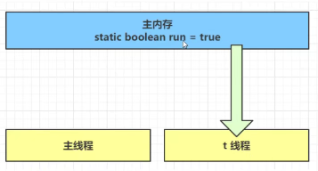

2.  因为 t 线程要频繁从主内存中读取 run 的值，JIT 编译器会将 run 的值缓存至自己工作内存中的高速缓存中， 减少对主存中 run 的访问，提高效率

   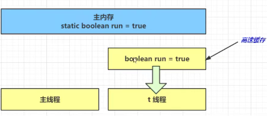

3. 1 秒之后，main 线程修改了 run 的值，并同步至主存，而 t 是从自己工作内存中的高速缓存中读取这个变量 的值，结果永远是旧值

   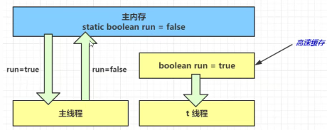

#### 解决方法

volatile（易变关键字）

 它可以用来修饰成员变量和静态成员变量，他可以避免线程从自己的工作缓存中查找变量的值，必须到主存中获取 它的值，线程操作 volatile 变量都是直接操作主存

#### 可见性 vs 原子性

前面例子体现的实际就是可见性，它保证的是在多个线程之间，一个线程对 volatile 变量的修改对另一个线程可 见， 不能保证原子性，仅用在一个写线程，多个读线程的情况： 上例从字节码理解是这样的：

```
getstatic run // 线程 t 获取 run true 
getstatic run // 线程 t 获取 run true 
getstatic run // 线程 t 获取 run true 
getstatic run // 线程 t 获取 run true 
putstatic run // 线程 main 修改 run 为 false， 仅此一次
getstatic run // 线程 t 获取 run false 
```

比较一下之前我们将线程安全时举的例子：两个线程一个 i++ 一个 i-- ，只能保证看到最新值，不能解决指令交错

```
// 假设i的初始值为0 
getstatic i // 线程2-获取静态变量i的值 线程内i=0 
getstatic i // 线程1-获取静态变量i的值 线程内i=0 
iconst_1 // 线程1-准备常量1 
iadd // 线程1-自增 线程内i=1 
putstatic i // 线程1-将修改后的值存入静态变量i 静态变量i=1 
iconst_1 // 线程2-准备常量1 
isub // 线程2-自减 线程内i=-1 
putstatic i // 线程2-将修改后的值存入静态变量i 静态变量i=-1
```

>注意 synchronized 语句块既可以保证代码块的原子性，也同时保证代码块内变量的可见性。但缺点是 synchronized 是属于重量级操作，性能相对更低
>
>如果在前面示例的死循环中加入 System.out.println() 会发现即使不加 volatile 修饰符，线程 t 也能正确看到 对 run 变量的修改了

#### volatile 原理

volatile 的底层实现原理是内存屏障，Memory Barrier（Memory Fence） 

- 对 volatile 变量的写指令后会加入写屏障 
- 对 volatile 变量的读指令前会加入读屏障

##### 1. 如何保证可见性

写屏障（sfence）保证在该屏障之前的，对共享变量的改动，都同步到主存当中

```java
public void actor2(I_Result r) {
    num = 2;
    ready = true; // ready 是 volatile 赋值带写屏障
    // 写屏障
}
```

而读屏障（lfence）保证在该屏障之后，对共享变量的读取，加载的是主存中最新数据

```java
public void actor1(I_Result r) {
    // 读屏障
    // ready 是 volatile 读取值带读屏障
    if(ready) {
        r.r1 = num + num;
    } else {
        r.r1 = 1;
    }
}
```

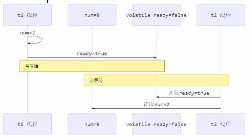

##### 2. 如何保证有序性

写屏障会确保指令重排序时，不会将写屏障之前的代码排在写屏障之后

```java
public void actor2(I_Result r) {
    num = 2;
    ready = true; // ready 是 volatile 赋值带写屏障
    // 写屏障
}
```

读屏障会确保指令重排序时，不会将读屏障之后的代码排在读屏障之前

```java
public void actor1(I_Result r) {
    // 读屏障
    // ready 是 volatile 读取值带读屏障
    if(ready) {
        r.r1 = num + num;
    } else {
        r.r1 = 1;
    }
}
```

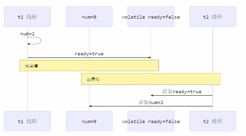

还是那句话，不能解决指令交错： 

- 写屏障仅仅是保证之后的读能够读到最新的结果，但不能保证读跑到它前面去 

- 而有序性的保证也只是保证了本线程内相关代码不被重排序

  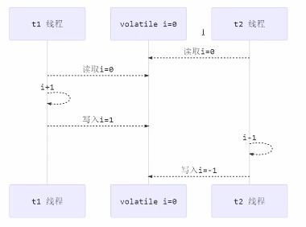

##### 3. double-checked locking 问题

以著名的 double-checked locking 单例模式为例

```java
public final class Singleton {
    private Singleton() { }
    private static Singleton INSTANCE = null;
    public static Singleton getInstance() { 
        if(INSTANCE == null) { // t2
            // 首次访问会同步，而之后的使用没有 synchronized
            synchronized(Singleton.class) {
                if (INSTANCE == null) { // t1
                    INSTANCE = new Singleton();
                } 
            }
        }
        return INSTANCE;
    }
}
```

以上的实现特点是： 

- 懒惰实例化 
- 首次使用 getInstance() 才使用 synchronized 加锁，后续使用时无需加锁 
- 有隐含的，但很关键的一点：第一个 if 使用了 INSTANCE 变量，是在同步块之外

但在多线程环境下，上面的代码是有问题的，getInstance 方法对应的字节码为：

```
0: getstatic #2 // Field INSTANCE:Lcn/itcast/n5/Singleton;
3: ifnonnull 37
6: ldc #3 // class cn/itcast/n5/Singleton
8: dup
9: astore_0
10: monitorenter
11: getstatic #2 // Field INSTANCE:Lcn/itcast/n5/Singleton;
14: ifnonnull 27
17: new #3 // class cn/itcast/n5/Singleton
20: dup
21: invokespecial #4 // Method "<init>":()V
24: putstatic #2 // Field INSTANCE:Lcn/itcast/n5/Singleton;
27: aload_0
28: monitorexit
29: goto 37
32: astore_1
33: aload_0
34: monitorexit
35: aload_1
36: athrow
37: getstatic #2 // Field INSTANCE:Lcn/itcast/n5/Singleton;
40: areturn
```

其中 

- 17 表示创建对象，将对象引用入栈 // new Singleton 
- 20 表示复制一份对象引用 // 引用地址 
- 21 表示利用一个对象引用，调用构造方法 
- 24 表示利用一个对象引用，赋值给 static INSTANCE 

也许 jvm 会优化为：先执行 24，再执行 21。如果两个线程 t1，t2 按如下时间序列执行：

关键在于 0: getstatic 这行代码在 monitor 控制之外，它就像之前举例中不守规则的人，可以越过 monitor 读取 INSTANCE 变量的值 

这时 t1 还未完全将构造方法执行完毕，如果在构造方法中要执行很多初始化操作，那么 t2 拿到的是将是一个未初 始化完毕的单例 

对 INSTANCE 使用 volatile 修饰即可，可以禁用指令重排，但要注意在 JDK 5 以上的版本的 volatile 才会真正有效

##### 4. double-checked locking 解决

```java
public final class Singleton {
    private Singleton() { }
    private static volatile Singleton INSTANCE = null;
    public static Singleton getInstance() {
        // 实例没创建，才会进入内部的 synchronized代码块
        if (INSTANCE == null) { 
            synchronized (Singleton.class) { // t2
                // 也许有其它线程已经创建实例，所以再判断一次
                if (INSTANCE == null) { // t1
                    INSTANCE = new Singleton();
                }
            }
        }
        return INSTANCE;
    }
}
```

字节码上看不出来 volatile 指令的效果

```
// -------------------------------------> 加入对 INSTANCE 变量的读屏障
0: getstatic #2 // Field INSTANCE:Lcn/itcast/n5/Singleton;
3: ifnonnull 37
6: ldc #3 // class cn/itcast/n5/Singleton
8: dup
9: astore_0
10: monitorenter -----------------------> 保证原子性、可见性
11: getstatic #2 // Field INSTANCE:Lcn/itcast/n5/Singleton;
14: ifnonnull 27
17: new #3 // class cn/itcast/n5/Singleton
20: dup
21: invokespecial #4 // Method "<init>":()V
24: putstatic #2 // Field INSTANCE:Lcn/itcast/n5/Singleton;
// -------------------------------------> 加入对 INSTANCE 变量的写屏障
27: aload_0
28: monitorexit ------------------------> 保证原子性、可见性
29: goto 37
32: astore_1
33: aload_0
34: monitorexit
35: aload_1
36: athrow
37: getstatic #2 // Field INSTANCE:Lcn/itcast/n5/Singleton;
40: areturn
```

如上面的注释内容所示，读写 volatile 变量时会加入内存屏障（Memory Barrier（Memory Fence）），保证下面 两点： 

- 可见性 
  - 写屏障（sfence）保证在该屏障之前的 t1 对共享变量的改动，都同步到主存当中 
  - 而读屏障（lfence）保证在该屏障之后 t2 对共享变量的读取，加载的是主存中最新数据 
- 有序性 
  - 写屏障会确保指令重排序时，不会将写屏障之前的代码排在写屏障之后 
  - 读屏障会确保指令重排序时，不会将读屏障之后的代码排在读屏障之前 
- 更底层是读写变量时使用 lock 指令来多核 CPU 之间的可见性与有序性

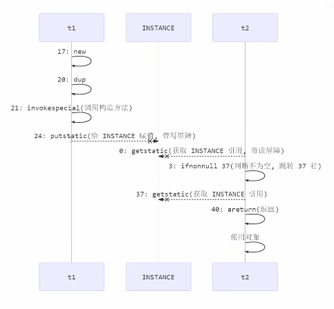


### 3. 终止模式之两阶段终止模式

Two Phase Termination

在一个线程T1中“优雅”终止T2，这的【优雅】指的是给T2一个处理后事的机会

#### 1. 错误思路

- 使用线程对象的 stop() 方法停止线程 
  - stop 方法会真正杀死线程，如果这时线程锁住了共享资源，那么当它被杀死后就再也没有机会释放锁， 其它线程将永远无法获取锁 
- 使用 System.exit(int) 方法停止线程 
  - 目的仅是停止一个线程，但这种做法会让整个程序都停止

#### 2. 两阶段终止模式

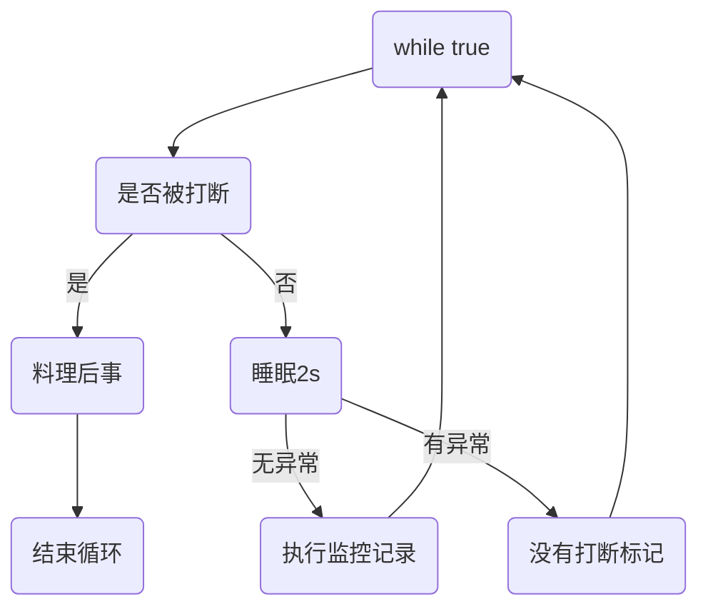

##### 利用 isInterrupted

interrupt 可以打断正在执行的线程，无论这个线程是在 sleep，wait，还是正常运行

```java
@Slf4j(topic = "c.TwoPhaseTermination")
public class TwoPhaseTermination {

    public static void main(String[] args) throws InterruptedException {
        TwoPhase tp = new TwoPhase();
        tp.start();

        TimeUnit.SECONDS.sleep(4);
        tp.stop();
    }

}

@Slf4j(topic = "c.TwoPhase")
class TwoPhase {
    private Thread monitor;

    // 启动监控线程
    public void start() {
        monitor = new Thread(() -> {
            while (true) {
                Thread current = Thread.currentThread();
                if (current.isInterrupted()) {
                    log.debug("料理后事");
                    break;
                }

                try {
                    TimeUnit.SECONDS.sleep(1);
                    log.debug("执行监控记录");
                } catch (InterruptedException e) {
                    log.debug("执行监控记录");
                    e.printStackTrace();
                    current.interrupt();
                }
            }
        }, "monitor");

        monitor.start();
    }

    // 停止监控线程
    public void stop() {
        monitor.interrupt();
    }
}
```

结果

```
15:40:38 [monitor] c.TwoPhase - 执行监控记录
15:40:39 [monitor] c.TwoPhase - 执行监控记录
15:40:40 [monitor] c.TwoPhase - 执行监控记录
15:40:41 [monitor] c.TwoPhase - 执行监控记录
15:40:41 [monitor] c.TwoPhase - 料理后事
java.lang.InterruptedException: sleep interrupted
	at java.lang.Thread.sleep(Native Method)
	at java.lang.Thread.sleep(Thread.java:340)
	at java.util.concurrent.TimeUnit.sleep(TimeUnit.java:386)
	at org.lql.chaptertwo.TwoPhase.lambda$start$0(TwoPhaseTermination.java:45)
	at java.lang.Thread.run(Thread.java:748)
```

##### 利用停止标记

```java
// 停止标记用 volatile 是为了保证该变量在多个线程之间的可见性
// 我们的例子中，即主线程把它修改为 true 对 t1 线程可见
class TPTVolatile {
    private Thread thread;
    private volatile boolean stop = false;
    public void start(){
        thread = new Thread(() -> {
            while(true) {
                Thread current = Thread.currentThread();
                if(stop) {
                    log.debug("料理后事");
                    break;
                }
                try {
                    TimeUnit.SECONDS.sleep(1);
                    log.debug("将结果保存");
                } catch (InterruptedException e) {
                }
            }
        },"监控线程");
        thread.start();
    }
    public void stop() {
        stop = true;
        thread.interrupt();
    }
}
```

调用

```java
TPTVolatile t = new TPTVolatile();
t.start();
Thread.sleep(3500);
log.debug("stop");
t.stop();
```

结果

```
11:54:52.003 c.TPTVolatile [监控线程] - 将结果保存
11:54:53.006 c.TPTVolatile [监控线程] - 将结果保存
11:54:54.007 c.TPTVolatile [监控线程] - 将结果保存
11:54:54.502 c.TestTwoPhaseTermination [main] - stop 
11:54:54.502 c.TPTVolatile [监控线程] - 料理后事
```

### 4. 同步模式之 Balking

#### 1. 定义

Balking （犹豫）模式用在一个线程发现另一个线程或本线程已经做了某一件相同的事，那么本线程就无需再做 了，直接结束返回

#### 2. 实现

```java
public class MonitorService {
    // 用来表示是否已经有线程已经在执行启动了
    private volatile boolean starting;
    public void start() {
        log.info("尝试启动监控线程...");
        synchronized (this) {
            if (starting) {
                return;
            }
            starting = true;
        }

        // 真正启动监控线程...
    }
}
```

当前端页面多次点击按钮调用 start 时 

输出

```
[http-nio-8080-exec-1] cn.itcast.monitor.service.MonitorService - 该监控线程已启动?(false)
[http-nio-8080-exec-1] cn.itcast.monitor.service.MonitorService - 监控线程已启动...
[http-nio-8080-exec-2] cn.itcast.monitor.service.MonitorService - 该监控线程已启动?(true)
[http-nio-8080-exec-3] cn.itcast.monitor.service.MonitorService - 该监控线程已启动?(true)
[http-nio-8080-exec-4] cn.itcast.monitor.service.MonitorService - 该监控线程已启动?(true)
```

它还经常用来实现线程安全的单例

```java
public final class Singleton {
    private Singleton() {
    }
    private static Singleton INSTANCE = null;
    public static synchronized Singleton getInstance() {
        if (INSTANCE != null) {
            return INSTANCE;
        }

        INSTANCE = new Singleton();
        return INSTANCE;
    }
}
```

对比一下保护性暂停模式：保护性暂停模式用在一个线程等待另一个线程的执行结果，当条件不满足时线程等待。

### 5. 有序性

JVM 会在不影响正确性的前提下，可以调整语句的执行顺序

```java
static int i;
static int j;
// 在某个线程内执行如下赋值操作
i = ...; 
j = ...; 
```

可以看到，至于是先执行 i 还是 先执行 j ，对最终的结果不会产生影响。所以，上面代码真正执行时，既可以是

```java
i = ...; 
j = ...;
```

也可以是

```java
j = ...;
i = ...; 
```

这种特性称之为『指令重排』，多线程下『指令重排』会影响正确性。

#### 指令级并行原理

##### 1. 名词

###### Clock Cycle Time

主频的概念大家接触的比较多，而 CPU 的 Clock Cycle Time（时钟周期时间），等于主频的倒数，意思是 CPU 能 够识别的最小时间单位，比如说 4G 主频的 CPU 的 Clock Cycle Time 就是 0.25 ns，作为对比，我们墙上挂钟的 Cycle Time 是 1s 

例如，运行一条加法指令一般需要一个时钟周期时间

###### CPI

有的指令需要更多的时钟周期时间，所以引出了 CPI （Cycles Per Instruction）指令平均时钟周期数

###### IPC

IPC（Instruction Per Clock Cycle） 即 CPI 的倒数，表示每个时钟周期能够运行的指令数

###### CPU 执行时间

程序的 CPU 执行时间，即我们前面提到的 user + system 时间，可以用下面的公式来表示

`程序 CPU 执行时间 = 指令数 * CPI * Clock Cycle Time `

##### 2. 鱼罐头的故事

加工一条鱼需要 50 分钟，只能一条鱼、一条鱼顺序加工...

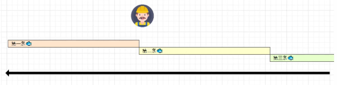

可以将每个鱼罐头的加工流程细分为 5 个步骤： 

- 去鳞清洗 10分钟 

- 蒸煮沥水 10分钟 

- 加注汤料 10分钟 

- 杀菌出锅 10分钟 

- 真空封罐 10分钟

  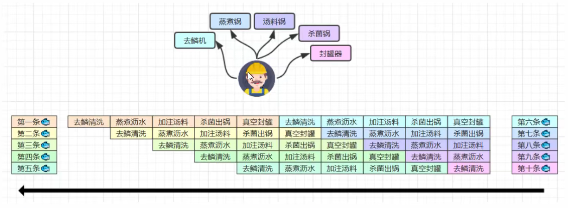

  即使只有一个工人，最理想的情况是：他能够在 10 分钟内同时做好这 5 件事，因为对第一条鱼的真空装罐，不会 影响对第二条鱼的杀菌出锅...

##### 3. 指令重排序优化

事实上，现代处理器会设计为一个时钟周期完成一条执行时间最长的 CPU 指令。为什么这么做呢？可以想到指令 还可以再划分成一个个更小的阶段，例如，每条指令都可以分为： **取指令 - 指令译码 - 执行指令 - 内存访问 - 数据 写回** 这 5 个阶段

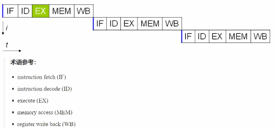

在不改变程序结果的前提下，这些指令的各个阶段可以通过重排序和组合来实现指令级并行，这一技术在 80's 中 叶到 90's 中叶占据了计算架构的重要地位。

> 提示： 
>
> 分阶段，分工是提升效率的关键！

指令重排的前提是，重排指令不能影响结果，例如

```java
// 可以重排的例子
int a = 10; // 指令1
int b = 20; // 指令2
System.out.println( a + b );
// 不能重排的例子
int a = 10; // 指令1
int b = a - 5; // 指令2
```

##### 4. 支持流水线的处理器

现代 CPU 支持**多级指令流水线**，例如支持同时执行 取指令 - 指令译码 - 执行指令 - 内存访问 - 数据写回 的处理 器，就可以称之为**五级指令流水线**。这时 CPU 可以在一个时钟周期内，同时运行五条指令的不同阶段（相当于一 条执行时间最长的复杂指令），IPC = 1，本质上，流水线技术并不能缩短单条指令的执行时间，但它变相地提高了 指令地吞吐率。

> 提示： 
>
> 奔腾四（Pentium 4）支持高达 35 级流水线，但由于功耗太高被废弃

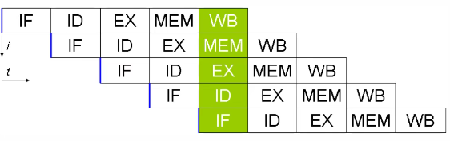

##### 5. SuperScalar 处理器

大多数处理器包含多个执行单元，并不是所有计算功能都集中在一起，可以再细分为整数运算单元、浮点数运算单 元等，这样可以把多条指令也可以做到并行获取、译码等，CPU 可以在一个时钟周期内，执行多于一条指令，IPC > 1

#### 诡异的结果

```java
int num = 0;
boolean ready = false;
// 线程1 执行此方法
public void actor1(I_Result r) {
    if(ready) {
        r.r1 = num + num;
    } else {
        r.r1 = 1;
    }
}
// 线程2 执行此方法
public void actor2(I_Result r) { 
    num = 2;
    ready = true; 
}
```

I_Result 是一个对象，有一个属性 r1 用来保存结果，可能的结果有几种？ 

分析 

- 情况1：线程1 先执行，这时 ready = false，所以进入 else 分支结果为 1 
- 情况2：线程2 先执行 num = 2，但没来得及执行 ready = true，线程1 执行，还是进入 else 分支，结果为1 
- 情况3：线程2 执行到 ready = true，线程1 执行，这回进入 if 分支，结果为 4（因为 num 已经执行过了） 

实际结果还有可能是 0 ， 这种情况下是：线程2 执行 ready = true，切换到线程1，进入 if 分支，相加为 0，再切回线程2 执行 num = 2 

这种现象叫做指令重排，是 JIT 编译器在运行时的一些优化，这个现象需要通过大量测试才能复现： 

借助 java 并发压测工具 jcstress https://wiki.openjdk.java.net/display/CodeTools/jcstress

```java
@JCStressTest
@Outcome(id = {"1", "4"}, expect = Expect.ACCEPTABLE, desc = "ok")
@Outcome(id = "0", expect = Expect.ACCEPTABLE_INTERESTING, desc = "!!!!")
@State
public class ConcurrencyTest {
    int num = 0;
    boolean ready = false;
    @Actor
    public void actor1(I_Result r) {
        if(ready) {
            r.r1 = num + num;
        } else {
            r.r1 = 1;
        }
    }
    @Actor
    public void actor2(I_Result r) {
        num = 2;
        ready = true;
    }
}
```

执行

```
mvn clean install 
java -jar target/jcstress.jar 
```

结果：

```
*** INTERESTING tests 
 Some interesting behaviors observed. This is for the plain curiosity.
 
 2 matching test results. 
       [OK] test.ConcurrencyTest 
    (JVM args: [-XX:-TieredCompilation]) 
 Observed state Occurrences Expectation Interpretation 
             0      1,729 ACCEPTABLE_INTERESTING !!!! 
             1      42,617,915 ACCEPTABLE ok 
             4      5,146,627 ACCEPTABLE ok 
             
        [OK] test.ConcurrencyTest 
     (JVM args: []) 
 Observed state Occurrences Expectation Interpretation 
              0    1,652 ACCEPTABLE_INTERESTING !!!! 
              1    46,460,657 ACCEPTABLE ok 
              4    4,571,072 ACCEPTABLE ok 
```

可以看到，出现结果为 0 的情况有 638 次，虽然次数相对很少，但毕竟是出现了。

#### 解决方法

volatile 修饰的变量，可以禁用指令重排

```java
@JCStressTest
@Outcome(id = {"1", "4"}, expect = Expect.ACCEPTABLE, desc = "ok")
@Outcome(id = "0", expect = Expect.ACCEPTABLE_INTERESTING, desc = "!!!!")
@State
public class ConcurrencyTest {
    int num = 0;
    volatile boolean ready = false;
    @Actor
    public void actor1(I_Result r) {
        if(ready) {
            r.r1 = num + num;
        } else {
            r.r1 = 1;
        }
    }
    @Actor
    public void actor2(I_Result r) {
        num = 2;
        ready = true;
    }
}
```

结果为：

```
*** INTERESTING tests 
 Some interesting behaviors observed. This is for the plain curiosity. 
 0 matching test results. 
```

#### happens-before

happens-before 规定了对共享变量的写操作对其它线程的读操作可见，它是可见性与有序性的一套规则总结，抛 开以下 happens-before 规则，JMM 并不能保证一个线程对共享变量的写，对于其它线程对该共享变量的读可见 

- 线程解锁 m 之前对变量的写，对于接下来对 m 加锁的其它线程对该变量的读可见

  ```java
  static int x;
  static Object m = new Object();
  new Thread(()->{
      synchronized(m) {
          x = 10;
      }
  },"t1").start();
  new Thread(()->{
      synchronized(m) {
          System.out.println(x);
      }
  },"t2").start();
  ```

- 线程对 volatile 变量的写，对接下来其它线程对该变量的读可见

  ```java
  volatile static int x;
  new Thread(()->{
      x = 10;
  },"t1").start();
  new Thread(()->{
      System.out.println(x);
  },"t2").start();
  ```

- 线程 start 前对变量的写，对该线程开始后对该变量的读可见

  ```java
  static int x;
  x = 10;
  new Thread(()->{
      System.out.println(x);
  },"t2").start();
  ```

- 线程结束前对变量的写，对其它线程得知它结束后的读可见（比如其它线程调用 t1.isAlive() 或 t1.join()等待 它结束）

  ```java
  static int x;
  Thread t1 = new Thread(()->{
      x = 10;
  },"t1");
  t1.start();
  t1.join();
  System.out.println(x);
  ```

- 线程 t1 打断 t2（interrupt）前对变量的写，对于其他线程得知 t2 被打断后对变量的读可见（通过 t2.interrupted 或 t2.isInterrupted）

  ```java
  static int x;
  public static void main(String[] args) {
      Thread t2 = new Thread(()->{
          while(true) {
              if(Thread.currentThread().isInterrupted()) {
                  System.out.println(x);
                  break;
              }
          }
      },"t2");
      t2.start();
      new Thread(()->{
          sleep(1);
          x = 10;
          t2.interrupt();
      },"t1").start();
      while(!t2.isInterrupted()) {
          Thread.yield();
      }
      System.out.println(x);
  }
  ```

- 对变量默认值（0，false，null）的写，对其它线程对该变量的读可见 ，变量指成员变量或静态成员变量

- 具有传递性，如果 x hb-> y 并且 y hb-> z 那么有 x hb-> z ，配合 volatile 的防指令重排，有下面的例子

  ```java
  volatile static int x;
  static int y;
  new Thread(()->{ 
      y = 10;
      x = 20;
  },"t1").start();
  new Thread(()->{
      // x=20 对 t2 可见, 同时 y=10 也对 t2 可见
      System.out.println(x); 
  },"t2").start();
  ```

## 五、共享模型之无锁

### 1. 问题

有如下需求，保证 **account.withdraw** 取款方法的线程安全

```java
package cn.itcast;
import java.util.ArrayList;
import java.util.List;
interface Account {
    // 获取余额
    Integer getBalance();
    // 取款
    void withdraw(Integer amount);
    /**
 * 方法内会启动 1000 个线程，每个线程做 -10 元 的操作
 * 如果初始余额为 10000 那么正确的结果应当是 0
 */
    static void demo(Account account) {
        List<Thread> ts = new ArrayList<>();
        long start = System.nanoTime();
        for (int i = 0; i < 1000; i++) {
            ts.add(new Thread(() -> {
                account.withdraw(10);
            }));
        }
        ts.forEach(Thread::start);
        ts.forEach(t -> {
            try {
                t.join();
            } catch (InterruptedException e) {
                e.printStackTrace();
            }
        });
        long end = System.nanoTime();
        System.out.println(account.getBalance() 
                           + " cost: " + (end-start)/1000_000 + " ms");
    }
}
```

原有实现并不是线程安全的

```java
class AccountUnsafe implements Account {
    private Integer balance;
    public AccountUnsafe(Integer balance) {
        this.balance = balance;
    }
    @Override
    public Integer getBalance() {
        return balance;
    }
    @Override
    public void withdraw(Integer amount) {
        balance -= amount;
    }
}
```

执行测试代码

```java
public static void main(String[] args) {
    Account.demo(new AccountUnsafe(10000));
}
```

某次的执行结果

```
330 cost: 306 ms 
```

#### 不安全原因

**withdraw** 方法

```
public void withdraw(Integer amount) {
 balance -= amount;
}
```

对应的字节码

```
ALOAD 0 // <- this
ALOAD 0
GETFIELD cn/itcast/AccountUnsafe.balance : Ljava/lang/Integer; // <- this.balance
INVOKEVIRTUAL java/lang/Integer.intValue ()I // 拆箱
ALOAD 1 // <- amount
INVOKEVIRTUAL java/lang/Integer.intValue ()I // 拆箱
ISUB // 减法
INVOKESTATIC java/lang/Integer.valueOf (I)Ljava/lang/Integer; // 结果装箱
PUTFIELD cn/itcast/AccountUnsafe.balance : Ljava/lang/Integer; // -> this.balance
```

多线程执行流程

```
ALOAD 0 // thread-0 <- this 
ALOAD 0 
GETFIELD cn/itcast/AccountUnsafe.balance // thread-0 <- this.balance 
INVOKEVIRTUAL java/lang/Integer.intValue // thread-0 拆箱
ALOAD 1 // thread-0 <- amount 
INVOKEVIRTUAL java/lang/Integer.intValue // thread-0 拆箱
ISUB // thread-0 减法
INVOKESTATIC java/lang/Integer.valueOf // thread-0 结果装箱
PUTFIELD cn/itcast/AccountUnsafe.balance // thread-0 -> this.balance 
 
 
ALOAD 0 // thread-1 <- this 
ALOAD 0 
GETFIELD cn/itcast/AccountUnsafe.balance // thread-1 <- this.balance 
INVOKEVIRTUAL java/lang/Integer.intValue // thread-1 拆箱
ALOAD 1 // thread-1 <- amount 
INVOKEVIRTUAL java/lang/Integer.intValue // thread-1 拆箱
ISUB // thread-1 减法
INVOKESTATIC java/lang/Integer.valueOf // thread-1 结果装箱
PUTFIELD cn/itcast/AccountUnsafe.balance // thread-1 -> this.balance 
```

- 单核的指令交错 
- 多核的指令交错

#### 解决思路-锁

首先是给 Account 对象加锁

```java
class AccountUnsafe implements Account {
    private Integer balance;
    public AccountUnsafe(Integer balance) {
        this.balance = balance;
    }
    @Override
    public synchronized Integer getBalance() {
        return balance;
    }
    @Override
    public synchronized void withdraw(Integer amount) {
        balance -= amount;
    }
}
```

结果为

```
0 cost: 399 ms 
```

#### 解决思路-无锁

```java
class AccountSafe implements Account {
    private AtomicInteger balance;
    public AccountSafe(Integer balance) {
        this.balance = new AtomicInteger(balance);
    }
    @Override
    public Integer getBalance() {
        return balance.get();
    }
    @Override
    public void withdraw(Integer amount) {
        while (true) {
            int prev = balance.get();
            int next = prev - amount;
            if (balance.compareAndSet(prev, next)) {
                break;
            }
        }
        // 可以简化为下面的方法
        // balance.addAndGet(-1 * amount);
    }
}
```

执行测试代码

```java
public static void main(String[] args) {
    Account.demo(new AccountSafe(10000));
}
```

某次的执行结果

```
0 cost: 302 ms
```

### 2. CAS 与 volatile

 **AtomicInteger** 的解决方法，内部并没有用锁来保护共享变量的线程安全，其内部实现为

```java
public void withdraw(Integer amount) {
    while(true) {
        // 需要不断尝试，直到成功为止
        while (true) {
            // 比如拿到了旧值 1000
            int prev = balance.get();
            // 在这个基础上 1000-10 = 990
            int next = prev - amount;
            /*
 compareAndSet 正是做这个检查，在 set 前，先比较 prev 与当前值
 - 不一致了，next 作废，返回 false 表示失败
 比如，别的线程已经做了减法，当前值已经被减成了 990
 那么本线程的这次 990 就作废了，进入 while 下次循环重试
 - 一致，以 next 设置为新值，返回 true 表示成功
 */
            if (balance.compareAndSet(prev, next)) {
                break;
            }
        }
    }
}
```

其中的关键是 compareAndSet，它的简称就是 CAS （也有 Compare And Swap 的说法），它必须是原子操作。

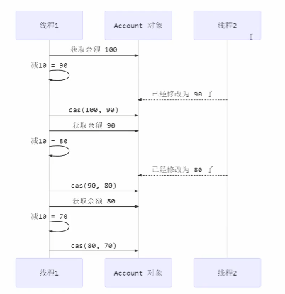

>注意 
>
>其实 CAS 的底层是 lock cmpxchg 指令（X86 架构），在单核 CPU 和多核 CPU 下都能够保证【比较-交 换】的原子性。
>
>在多核状态下，某个核执行到带 lock 的指令时，CPU 会让总线锁住，当这个核把此指令执行完毕，再 开启总线。这个过程中不会被线程的调度机制所打断，保证了多个线程对内存操作的准确性，是原子 的。

#### 慢动作分析

```java
@Slf4j
public class SlowMotion {
    public static void main(String[] args) {
        AtomicInteger balance = new AtomicInteger(10000);
        int mainPrev = balance.get();
        log.debug("try get {}", mainPrev);
        new Thread(() -> {
            sleep(1000);
            int prev = balance.get();
            balance.compareAndSet(prev, 9000);
            log.debug(balance.toString());
        }, "t1").start();
        sleep(2000);
        log.debug("try set 8000...");
        boolean isSuccess = balance.compareAndSet(mainPrev, 8000);
        log.debug("is success ? {}", isSuccess);
        if(!isSuccess){
            mainPrev = balance.get();
            log.debug("try set 8000...");
            isSuccess = balance.compareAndSet(mainPrev, 8000);
            log.debug("is success ? {}", isSuccess);
        }
    }
    private static void sleep(int millis) {
        try {
            Thread.sleep(millis);
        } catch (InterruptedException e) {
            e.printStackTrace();
        }
    }
}
```

输出结果

```
2019-10-13 11:28:37.134 [main] try get 10000 
2019-10-13 11:28:38.154 [t1] 9000 
2019-10-13 11:28:39.154 [main] try set 8000... 
2019-10-13 11:28:39.154 [main] is success ? false 
2019-10-13 11:28:39.154 [main] try set 8000... 
2019-10-13 11:28:39.154 [main] is success ? true 
```

#### volatile

获取共享变量时，为了保证该变量的可见性，需要使用 volatile 修饰。 

它可以用来修饰成员变量和静态成员变量，他可以避免线程从自己的工作缓存中查找变量的值，必须到主存中获取 它的值，线程操作 volatile 变量都是直接操作主存。即一个线程对 volatile 变量的修改，对另一个线程可见。

> 注意 
>
> volatile 仅仅保证了共享变量的可见性，让其它线程能够看到最新值，但不能解决指令交错问题（不能保证原 子性）

CAS 必须借助 volatile 才能读取到共享变量的最新值来实现【比较并交换】的效果

#### 为什么无锁效率高

- 无锁情况下，即使重试失败，线程始终在高速运行，没有停歇，而 synchronized 会让线程在没有获得锁的时 候，发生上下文切换，进入阻塞。
- 线程就好像高速跑道上的赛车，高速运行时，速度超快，一旦发生上下文切换，就好比赛车要减速、熄火， 等被唤醒又得重新打火、启动、加速... 恢复到高速运行，代价比较大 
- 但无锁情况下，因为线程要保持运行，需要额外 CPU 的支持，CPU 在这里就好比高速跑道，没有额外的跑 道，线程想高速运行也无从谈起，虽然不会进入阻塞，但由于没有分到时间片，仍然会进入可运行状态，还 是会导致上下文切换。

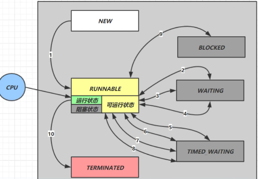

#### CAS 的特点

结合 CAS 和 volatile 可以实现无锁并发，适用于线程数少、多核 CPU 的场景下。 

- CAS 是基于乐观锁的思想：最乐观的估计，不怕别的线程来修改共享变量，就算改了也没关系，我吃亏点再 重试呗。 
- synchronized 是基于悲观锁的思想：最悲观的估计，得防着其它线程来修改共享变量，我上了锁你们都别想 改，我改完了解开锁，你们才有机会。 
- CAS 体现的是无锁并发、无阻塞并发，请仔细体会这两句话的意思 
  - 因为没有使用 synchronized，所以线程不会陷入阻塞，这是效率提升的因素之一 
  - 但如果竞争激烈，可以想到重试必然频繁发生，反而效率会受影响

### 3. 原子整数

J.U.C 并发包提供了： 

- AtomicBoolean 
- AtomicInteger 
- AtomicLong 

以 AtomicInteger 为例

```java
AtomicInteger i = new AtomicInteger(0);
// 获取并自增（i = 0, 结果 i = 1, 返回 0），类似于 i++
System.out.println(i.getAndIncrement());
// 自增并获取（i = 1, 结果 i = 2, 返回 2），类似于 ++i
System.out.println(i.incrementAndGet());
// 自减并获取（i = 2, 结果 i = 1, 返回 1），类似于 --i
System.out.println(i.decrementAndGet());
// 获取并自减（i = 1, 结果 i = 0, 返回 1），类似于 i--
System.out.println(i.getAndDecrement());
// 获取并加值（i = 0, 结果 i = 5, 返回 0）
System.out.println(i.getAndAdd(5));
// 加值并获取（i = 5, 结果 i = 0, 返回 0）
System.out.println(i.addAndGet(-5));
// 获取并更新（i = 0, p 为 i 的当前值, 结果 i = -2, 返回 0）
// 其中函数中的操作能保证原子，但函数需要无副作用
System.out.println(i.getAndUpdate(p -> p - 2));
// 更新并获取（i = -2, p 为 i 的当前值, 结果 i = 0, 返回 0）
// 其中函数中的操作能保证原子，但函数需要无副作用
System.out.println(i.updateAndGet(p -> p + 2));
// 获取并计算（i = 0, p 为 i 的当前值, x 为参数1, 结果 i = 10, 返回 0）
// 其中函数中的操作能保证原子，但函数需要无副作用
// getAndUpdate 如果在 lambda 中引用了外部的局部变量，要保证该局部变量是 final 的
// getAndAccumulate 可以通过 参数1 来引用外部的局部变量，但因为其不在 lambda 中因此不必是 final
System.out.println(i.getAndAccumulate(10, (p, x) -> p + x));
// 计算并获取（i = 10, p 为 i 的当前值, x 为参数1, 结果 i = 0, 返回 0）
// 其中函数中的操作能保证原子，但函数需要无副作用
System.out.println(i.accumulateAndGet(-10, (p, x) -> p + x));
```

### 4. 原子引用

为什么需要原子引用类型？ 

- AtomicReference 
- AtomicMarkableReference 
- AtomicStampedReference

有如下方法

```java
public interface DecimalAccount {
    // 获取余额
    BigDecimal getBalance();
    // 取款
    void withdraw(BigDecimal amount);
    /**
 * 方法内会启动 1000 个线程，每个线程做 -10 元 的操作
 * 如果初始余额为 10000 那么正确的结果应当是 0
 */
    static void demo(DecimalAccount account) {
        List<Thread> ts = new ArrayList<>();
        for (int i = 0; i < 1000; i++) {
            ts.add(new Thread(() -> {
                account.withdraw(BigDecimal.TEN);
            }));
        }
        ts.forEach(Thread::start);
        ts.forEach(t -> {
            try {
                t.join();
            } catch (InterruptedException e) {
                e.printStackTrace();
            }
        });
        System.out.println(account.getBalance());
    }
}
```

试着提供不同的 DecimalAccount 实现，实现安全的取款操作

#### 不安全实现

```java
class DecimalAccountUnsafe implements DecimalAccount {
    BigDecimal balance;
    public DecimalAccountUnsafe(BigDecimal balance) {
        this.balance = balance;
    }
    @Override
    public BigDecimal getBalance() {
        return balance;
    }
    @Override
    public void withdraw(BigDecimal amount) {
        BigDecimal balance = this.getBalance();
        this.balance = balance.subtract(amount);
    }
}
```

#### 安全实现-使用锁

```java
class DecimalAccountSafeLock implements DecimalAccount {
    private final Object lock = new Object();
    BigDecimal balance;
    public DecimalAccountSafeLock(BigDecimal balance) {
        this.balance = balance;
    }
    @Override
    public BigDecimal getBalance() {
        return balance;
    }
    @Override
    public void withdraw(BigDecimal amount) {
        synchronized (lock) {
            BigDecimal balance = this.getBalance();
            this.balance = balance.subtract(amount);
        }
    }
}
```

#### 安全实现-使用 CAS

```java
class DecimalAccountSafeCas implements DecimalAccount {
    AtomicReference<BigDecimal> ref;
    public DecimalAccountSafeCas(BigDecimal balance) {
        ref = new AtomicReference<>(balance);
    }
    @Override
    public BigDecimal getBalance() {
        return ref.get();
    }
    @Override
    public void withdraw(BigDecimal amount) {
        while (true) {
            BigDecimal prev = ref.get();
            BigDecimal next = prev.subtract(amount);
            if (ref.compareAndSet(prev, next)) {
                break;
            }
        }
    }
}
```

测试代码

```java
DecimalAccount.demo(new DecimalAccountUnsafe(new BigDecimal("10000")));
DecimalAccount.demo(new DecimalAccountSafeLock(new BigDecimal("10000")));
DecimalAccount.demo(new DecimalAccountSafeCas(new BigDecimal("10000")));
```

运行结果

```
4310 cost: 425 ms 
0 cost: 285 ms 
0 cost: 274 ms 
```

#### ABA 问题及解决

ABA 问题

```java
static AtomicReference<String> ref = new AtomicReference<>("A");
public static void main(String[] args) throws InterruptedException {
    log.debug("main start...");
    // 获取值 A
    // 这个共享变量被它线程修改过？
    String prev = ref.get();
    other();
    sleep(1);
    // 尝试改为 C
    log.debug("change A->C {}", ref.compareAndSet(prev, "C"));
}
private static void other() {
    new Thread(() -> {
        log.debug("change A->B {}", ref.compareAndSet(ref.get(), "B"));
    }, "t1").start();
    sleep(0.5);
    new Thread(() -> {
        log.debug("change B->A {}", ref.compareAndSet(ref.get(), "A"));
    }, "t2").start();
}
```

输出

```
11:29:52.325 c.Test36 [main] - main start... 
11:29:52.379 c.Test36 [t1] - change A->B true 
11:29:52.879 c.Test36 [t2] - change B->A true 
11:29:53.880 c.Test36 [main] - change A->C true 
```

主线程仅能判断出共享变量的值与最初值 A 是否相同，不能感知到这种从 A 改为 B 又 改回 A 的情况，如果主线程 希望： 

只要有其它线程【动过了】共享变量，那么自己的 cas 就算失败，这时，仅比较值是不够的，需要再加一个版本号

#### AtomicStampedReference

```java
static AtomicStampedReference<String> ref = new AtomicStampedReference<>("A", 0);
public static void main(String[] args) throws InterruptedException {
    log.debug("main start...");
    // 获取值 A
    String prev = ref.getReference();
    // 获取版本号
    int stamp = ref.getStamp();
    log.debug("版本 {}", stamp);
    // 如果中间有其它线程干扰，发生了 ABA 现象
    other();
    sleep(1);
    // 尝试改为 C
    log.debug("change A->C {}", ref.compareAndSet(prev, "C", stamp, stamp + 1));
}
private static void other() {
    new Thread(() -> {
        log.debug("change A->B {}", ref.compareAndSet(ref.getReference(), "B", 
                                                      ref.getStamp(), ref.getStamp() + 1));
        log.debug("更新版本为 {}", ref.getStamp());
    }, "t1").start();
    sleep(0.5);
    new Thread(() -> {
        log.debug("change B->A {}", ref.compareAndSet(ref.getReference(), "A", 
                                                      ref.getStamp(), ref.getStamp() + 1));
        log.debug("更新版本为 {}", ref.getStamp());
    }, "t2").start();
}
```

输出为

```
15:41:34.891 c.Test36 [main] - main start... 
15:41:34.894 c.Test36 [main] - 版本 0 
15:41:34.956 c.Test36 [t1] - change A->B true 
15:41:34.956 c.Test36 [t1] - 更新版本为 1 
15:41:35.457 c.Test36 [t2] - change B->A true 
15:41:35.457 c.Test36 [t2] - 更新版本为 2 
15:41:36.457 c.Test36 [main] - change A->C false 
```

AtomicStampedReference 可以给原子引用加上版本号，追踪原子引用整个的变化过程，如： **A -> B -> A -> C** ，通过AtomicStampedReference，我们可以知道，引用变量中途被更改了几次。 

但是有时候，并不关心引用变量更改了几次，只是单纯的关心是否更改过，所以就有了 AtomicMarkableReference

#### AtomicMarkableReference

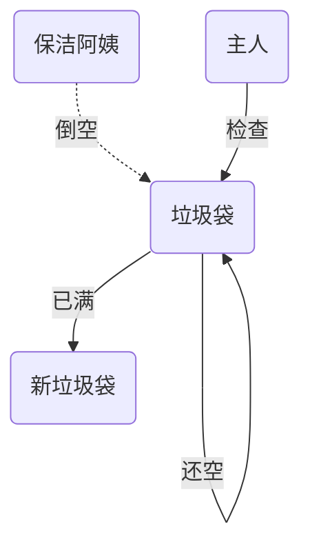

```java
class GarbageBag {
    String desc;
    public GarbageBag(String desc) {
        this.desc = desc;
    }
    public void setDesc(String desc) {
        this.desc = desc;
    }
    @Override
    public String toString() {
        return super.toString() + " " + desc;
    }
}

@Slf4j
public class TestABAAtomicMarkableReference {
    public static void main(String[] args) throws InterruptedException {
        GarbageBag bag = new GarbageBag("装满了垃圾");
        // 参数2 mark 可以看作一个标记，表示垃圾袋满了
        AtomicMarkableReference<GarbageBag> ref = new AtomicMarkableReference<>(bag, true);
        log.debug("主线程 start...");
        GarbageBag prev = ref.getReference();
        log.debug(prev.toString());
        new Thread(() -> {
            log.debug("打扫卫生的线程 start...");
            bag.setDesc("空垃圾袋");
            while (!ref.compareAndSet(bag, bag, true, false)) {}
            log.debug(bag.toString());
        }).start();
        Thread.sleep(1000);
        log.debug("主线程想换一只新垃圾袋？");
        boolean success = ref.compareAndSet(prev, new GarbageBag("空垃圾袋"), true, false);
        log.debug("换了么？" + success);
        log.debug(ref.getReference().toString());
    }
}
```

输出

```
2019-10-13 15:30:09.264 [main] 主线程 start... 
2019-10-13 15:30:09.270 [main] cn.itcast.GarbageBag@5f0fd5a0 装满了垃圾
2019-10-13 15:30:09.293 [Thread-1] 打扫卫生的线程 start... 
2019-10-13 15:30:09.294 [Thread-1] cn.itcast.GarbageBag@5f0fd5a0 空垃圾袋
2019-10-13 15:30:10.294 [main] 主线程想换一只新垃圾袋？
2019-10-13 15:30:10.294 [main] 换了么？false 
2019-10-13 15:30:10.294 [main] cn.itcast.GarbageBag@5f0fd5a0 空垃圾袋
```

可以注释掉打扫卫生线程代码，再观察输出

### 5. 原子数组

- AtomicIntegerArray 
- AtomicLongArray 
- AtomicReferenceArray

有如下方法

```java
/**
 参数1，提供数组、可以是线程不安全数组或线程安全数组
 参数2，获取数组长度的方法
 参数3，自增方法，回传 array, index
 参数4，打印数组的方法
*/
// supplier 提供者 无中生有 ()->结果
// function 函数 一个参数一个结果 (参数)->结果 , BiFunction (参数1,参数2)->结果
// consumer 消费者 一个参数没结果 (参数)->void, BiConsumer (参数1,参数2)->
private static <T> void demo(
    Supplier<T> arraySupplier,
    Function<T, Integer> lengthFun,
    BiConsumer<T, Integer> putConsumer,
    Consumer<T> printConsumer ) {
    List<Thread> ts = new ArrayList<>();
    T array = arraySupplier.get();
    int length = lengthFun.apply(array);
    for (int i = 0; i < length; i++) {
        // 每个线程对数组作 10000 次操作
        ts.add(new Thread(() -> {
            for (int j = 0; j < 10000; j++) {
                putConsumer.accept(array, j%length);
            }
        }));
    }
    ts.forEach(t -> t.start()); // 启动所有线程
    ts.forEach(t -> {
        try {
            t.join();
        } catch (InterruptedException e) {
            e.printStackTrace();
        }
    }); // 等所有线程结束
    printConsumer.accept(array);
}
```

#### 不安全的数组

```java
demo(
    ()->new int[10],
    (array)->array.length,
    (array, index) -> array[index]++,
    array-> System.out.println(Arrays.toString(array))
);
```

结果

```
[9870, 9862, 9774, 9697, 9683, 9678, 9679, 9668, 9680, 9698] 
```

#### 安全的数组

```java
demo(
    ()-> new AtomicIntegerArray(10),
    (array) -> array.length(),
    (array, index) -> array.getAndIncrement(index),
    array -> System.out.println(array)
);
```

结果

```
[10000, 10000, 10000, 10000, 10000, 10000, 10000, 10000, 10000, 10000] 
```

### 6. 字段更新器

- AtomicReferenceFieldUpdater // 域 字段 
- AtomicIntegerFieldUpdater 
- AtomicLongFieldUpdater

利用字段更新器，可以针对对象的某个域（Field）进行原子操作，只能配合 volatile 修饰的字段使用，否则会出现 异常

```
Exception in thread "main" java.lang.IllegalArgumentException: Must be volatile type
```

```java
public class Test5 {
    private volatile int field;
    public static void main(String[] args) {
        AtomicIntegerFieldUpdater fieldUpdater = AtomicIntegerFieldUpdater.newUpdater(Test5.class, "field");
        Test5 test5 = new Test5();
        fieldUpdater.compareAndSet(test5, 0, 10);
        // 修改成功 field = 10
        System.out.println(test5.field);
        // 修改成功 field = 20
        fieldUpdater.compareAndSet(test5, 10, 20);
        System.out.println(test5.field);
        // 修改失败 field = 20
        fieldUpdater.compareAndSet(test5, 10, 30);
        System.out.println(test5.field);
    }
}
```

输出

```
10 
20 
20 
```

### 7. 原子累加器

#### 累加器性能比较

```java
private static <T> void demo(Supplier<T> adderSupplier, Consumer<T> action) {
    T adder = adderSupplier.get();
    long start = System.nanoTime();
    List<Thread> ts = new ArrayList<>();
    // 4 个线程，每人累加 50 万
    for (int i = 0; i < 40; i++) {
        ts.add(new Thread(() -> {
            for (int j = 0; j < 500000; j++) {
                action.accept(adder);
            }
        }));
    }
    ts.forEach(t -> t.start());
    ts.forEach(t -> {
        try {
            t.join();
        } catch (InterruptedException e) {
            e.printStackTrace();
        }
    });
    long end = System.nanoTime();
    System.out.println(adder + " cost:" + (end - start)/1000_000);
}
```

比较 AtomicLong 与 LongAdder

```java
for (int i = 0; i < 5; i++) {
    demo(() -> new LongAdder(), adder -> adder.increment());
}
for (int i = 0; i < 5; i++) {
    demo(() -> new AtomicLong(), adder -> adder.getAndIncrement());
}
```

输出

```
1000000 cost:43 
1000000 cost:9 
1000000 cost:7 
1000000 cost:7 
1000000 cost:7 
1000000 cost:31 
1000000 cost:27 
1000000 cost:28 
1000000 cost:24 
1000000 cost:22 
```

性能提升的原因很简单，就是在有竞争时，设置多个累加单元，Therad-0 累加 Cell[0]，而 Thread-1 累加 Cell[1]... 最后将结果汇总。这样它们在累加时操作的不同的 Cell 变量，因此减少了 CAS 重试失败，从而提高性 能。

#### LongAdder源码

LongAdder 类有几个关键域

```java
// 累加单元数组, 懒惰初始化
transient volatile Cell[] cells;
// 基础值, 如果没有竞争, 则用 cas 累加这个域
transient volatile long base;
// 在 cells 创建或扩容时, 置为 1, 表示加锁
transient volatile int cellsBusy;
```

测试cas锁

```java
// 不要用于实践！！！
public class LockCas {
    private AtomicInteger state = new AtomicInteger(0);
    public void lock() {
        while (true) {
            if (state.compareAndSet(0, 1)) {
                break;
            }
        }
    }
    public void unlock() {
        log.debug("unlock...");
        state.set(0);
    }
}

LockCas lock = new LockCas();
new Thread(() -> {
    log.debug("begin...");
    lock.lock();
    try {
        log.debug("lock...");
        sleep(1);
    } finally {
        lock.unlock();
    }
}).start();
new Thread(() -> {
    log.debug("begin...");
    lock.lock();
    try {
        log.debug("lock...");
    } finally {
        lock.unlock();
    }
}).start();
```

输出

```
18:27:07.198 c.Test42 [Thread-0] - begin... 
18:27:07.202 c.Test42 [Thread-0] - lock... 
18:27:07.198 c.Test42 [Thread-1] - begin... 
18:27:08.204 c.Test42 [Thread-0] - unlock... 
18:27:08.204 c.Test42 [Thread-1] - lock... 
18:27:08.204 c.Test42 [Thread-1] - unlock... 
```

#### 伪共享

其中 Cell 即为累加单元

```java
// 防止缓存行伪共享
@sun.misc.Contended
    static final class Cell {
        volatile long value;
        Cell(long x) { value = x; }

        // 最重要的方法, 用来 cas 方式进行累加, prev 表示旧值, next 表示新值
        final boolean cas(long prev, long next) {
            return UNSAFE.compareAndSwapLong(this, valueOffset, prev, next);
        }
        // 省略不重要代码
    }
```

得从缓存说起 

缓存与内存的速度比较

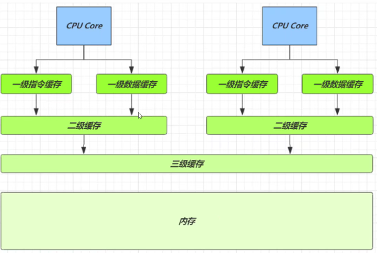

| 从 cpu 到 | 大约需要的时钟周期               |
| --------- | -------------------------------- |
| 寄存器    | 1 cycle (4GHz 的 CPU 约为0.25ns) |
| L1        | 3~4 cycle                        |
| L2        | 10~20 cycle                      |
| L3        | 40~45 cycle                      |
| 内存      | 120~240 cycle                    |

因为 CPU 与 内存的速度差异很大，需要靠预读数据至缓存来提升效率。 

而缓存以缓存行为单位，每个缓存行对应着一块内存，一般是 64 byte（8 个 long） 

缓存的加入会造成数据副本的产生，即同一份数据会缓存在不同核心的缓存行中 

CPU 要保证数据的一致性，如果某个 CPU 核心更改了数据，其它 CPU 核心对应的整个缓存行必须失效

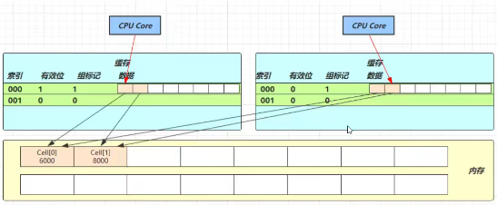

因为 Cell 是数组形式，在内存中是连续存储的，一个 Cell 为 24 字节（16 字节的对象头和 8 字节的 value），因 此缓存行可以存下 2 个的 Cell 对象。这样问题来了： 

- Core-0 要修改 Cell[0] 
- Core-1 要修改 Cell[1] 

无论谁修改成功，都会导致对方 Core 的缓存行失效，比如 Core-0 中 **Cell[0]=6000, Cell[1]=8000** 要累加 **Cell[0]=6001, Cell[1]=8000** ，这时会让 Core-1 的缓存行失效 

@sun.misc.Contended 用来解决这个问题，它的原理是在使用此注解的对象或字段的前后各增加 128 字节大小的 padding，从而让 CPU 将对象预读至缓存时占用不同的缓存行，这样，不会造成对方缓存行的失效

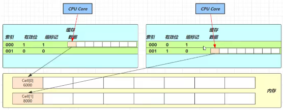

累加主要调用下面的方法

```java
public void add(long x) {
    // as 为累加单元数组
    // b 为基础值
    // x 为累加值
    Cell[] as; long b, v; int m; Cell a;
    // 进入 if 的两个条件
    // 1. as 有值, 表示已经发生过竞争, 进入 if
    // 2. cas 给 base 累加时失败了, 表示 base 发生了竞争, 进入 if
    if ((as = cells) != null || !casBase(b = base, b + x)) {
        // uncontended 表示 cell 没有竞争
        boolean uncontended = true;
        if (
            // as 还没有创建
            as == null || (m = as.length - 1) < 0 ||
            // 当前线程对应的 cell 还没有
            (a = as[getProbe() & m]) == null ||
            // cas 给当前线程的 cell 累加失败 uncontended=false ( a 为当前线程的 cell )
            !(uncontended = a.cas(v = a.value, v + x))
        ) {
            // 进入 cell 数组创建、cell 创建的流程
            longAccumulate(x, null, uncontended);
        }
    }
}
```

add 流程图

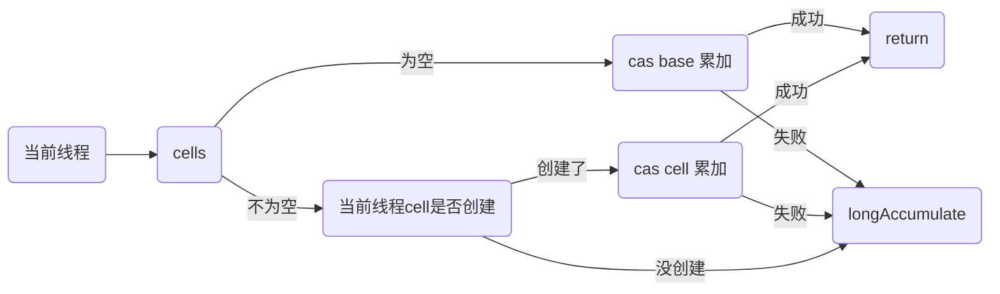

```java
final void longAccumulate(long x, LongBinaryOperator fn,
                          boolean wasUncontended) {
    int h;
    // 当前线程还没有对应的 cell, 需要随机生成一个 h 值用来将当前线程绑定到 cell
    if ((h = getProbe()) == 0) {
        // 初始化 probe
        ThreadLocalRandom.current();
        // h 对应新的 probe 值, 用来对应 cell
        h = getProbe();
        wasUncontended = true;
    }
    // collide 为 true 表示需要扩容
    boolean collide = false; 
    for (;;) {
        Cell[] as; Cell a; int n; long v;
        // 已经有了 cells
        if ((as = cells) != null && (n = as.length) > 0) {
            // 还没有 cell
            if ((a = as[(n - 1) & h]) == null) {
                // 为 cellsBusy 加锁, 创建 cell, cell 的初始累加值为 x
                // 成功则 break, 否则继续 continue 循环
            }
            // 有竞争, 改变线程对应的 cell 来重试 cas
            else if (!wasUncontended)
                wasUncontended = true;
            // cas 尝试累加, fn 配合 LongAccumulator 不为 null, 配合 LongAdder 为 null
            else if (a.cas(v = a.value, ((fn == null) ? v + x : fn.applyAsLong(v, x))))
                break;
            // 如果 cells 长度已经超过了最大长度, 或者已经扩容, 改变线程对应的 cell 来重试 cas
            else if (n >= NCPU || cells != as)
                collide = false;
            // 确保 collide 为 false 进入此分支, 就不会进入下面的 else if 进行扩容了
            else if (!collide)
                collide = true;
            // 加锁
            else if (cellsBusy == 0 && casCellsBusy()) {
                // 加锁成功, 扩容
                continue;
            }
            // 改变线程对应的 cell
            h = advanceProbe(h);
        }
        // 还没有 cells, 尝试给 cellsBusy 加锁
        else if (cellsBusy == 0 && cells == as && casCellsBusy()) {
            // 加锁成功, 初始化 cells, 最开始长度为 2, 并填充一个 cell
            // 成功则 break;
        }
        // 上两种情况失败, 尝试给 base 累加
        else if (casBase(v = base, ((fn == null) ? v + x : fn.applyAsLong(v, x))))
            break;
    }
}
```

longAccumulate 流程图

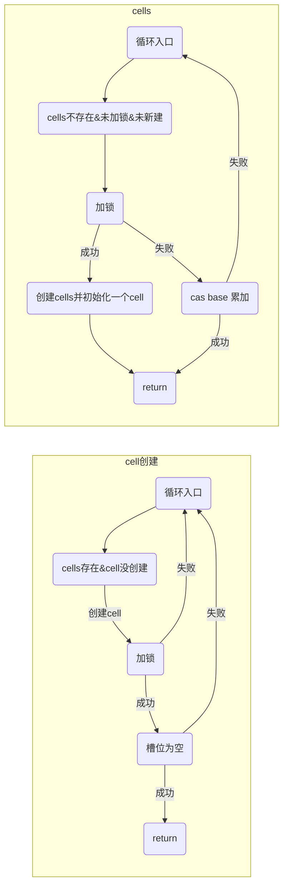

每个线程刚进入 longAccumulate 时，会尝试对应一个 cell 对象（找到一个坑位）

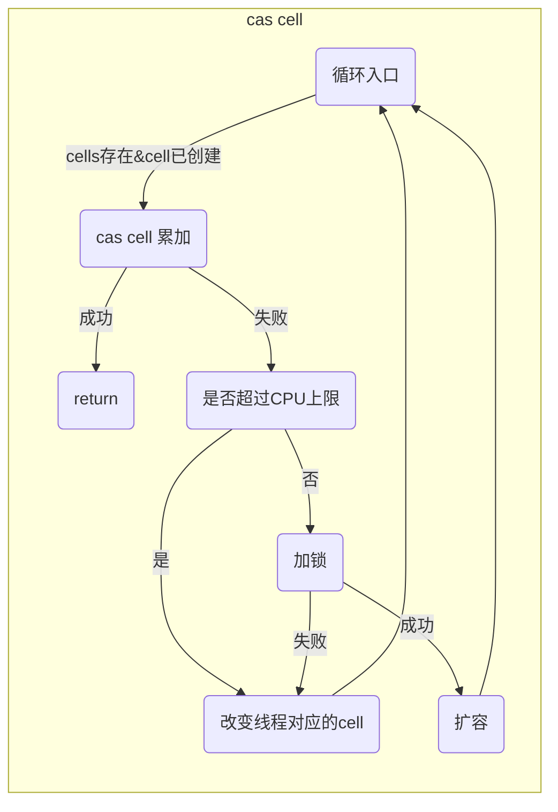

获取最终结果通过 sum 方法

```java
public long sum() {
    Cell[] as = cells; Cell a;
    long sum = base;
    if (as != null) {
        for (int i = 0; i < as.length; ++i) {
            if ((a = as[i]) != null)
                sum += a.value;
        }
    }
    return sum;
}
```

### 8. Unsafe

#### 概述

Unsafe 对象提供了非常底层的，操作内存、线程的方法，Unsafe 对象不能直接调用，只能通过反射获得

```java
public class UnsafeAccessor {
    static Unsafe unsafe;
    static {
        try { 
            Field theUnsafe = Unsafe.class.getDeclaredField("theUnsafe");
            theUnsafe.setAccessible(true);
            unsafe = (Unsafe) theUnsafe.get(null);
        } catch (NoSuchFieldException | IllegalAccessException e) {
            throw new Error(e);
        }
    }
    static Unsafe getUnsafe() {
        return unsafe;
    }
}
```

#### Unsafe CAS 操作

```JAVA
@Data
class Student {
    volatile int id;
    volatile String name;
}

Unsafe unsafe = UnsafeAccessor.getUnsafe();
Field id = Student.class.getDeclaredField("id");
Field name = Student.class.getDeclaredField("name");
// 获得成员变量的偏移量
long idOffset = UnsafeAccessor.unsafe.objectFieldOffset(id);
long nameOffset = UnsafeAccessor.unsafe.objectFieldOffset(name);
Student student = new Student();
// 使用 cas 方法替换成员变量的值
UnsafeAccessor.unsafe.compareAndSwapInt(student, idOffset, 0, 20); // 返回 true
UnsafeAccessor.unsafe.compareAndSwapObject(student, nameOffset, null, "张三"); // 返回 true
System.out.println(student);
```

输出

```
Student(id=20, name=张三) 
```

使用自定义的 AtomicData 实现之前线程安全的原子整数 Account 实现

```java
class AtomicData {
    private volatile int data;
    static final Unsafe unsafe;
    static final long DATA_OFFSET;
    static {
        unsafe = UnsafeAccessor.getUnsafe();
        try {
            // data 属性在 DataContainer 对象中的偏移量，用于 Unsafe 直接访问该属性
            DATA_OFFSET = unsafe.objectFieldOffset(AtomicData.class.getDeclaredField("data"));
        } catch (NoSuchFieldException e) {
            throw new Error(e);
        }
    }
    public AtomicData(int data) {
        this.data = data;
    }
    public void decrease(int amount) {
        int oldValue;
        while(true) {
            // 获取共享变量旧值，可以在这一行加入断点，修改 data 调试来加深理解
            oldValue = data;
            // cas 尝试修改 data 为 旧值 + amount，如果期间旧值被别的线程改了，返回 false
            if (unsafe.compareAndSwapInt(this, DATA_OFFSET, oldValue, oldValue - amount)) {
                return;
            }
        }
    }
    public int getData() {
        return data;
    }
}
```

Account 实现

```java
Account.demo(new Account() {
    AtomicData atomicData = new AtomicData(10000);
    @Override
    public Integer getBalance() {
        return atomicData.getData();
    }
    @Override
    public void withdraw(Integer amount) {
        atomicData.decrease(amount);
    }
});
```

