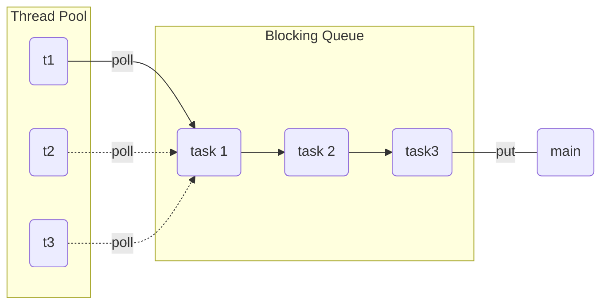
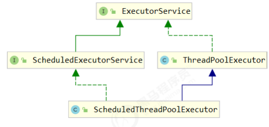
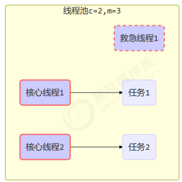
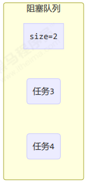
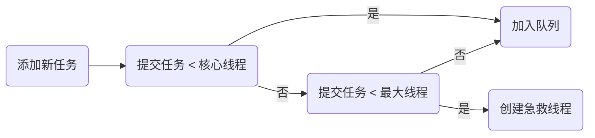
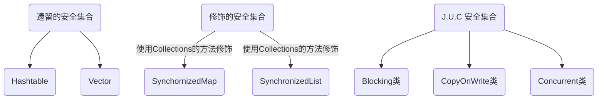
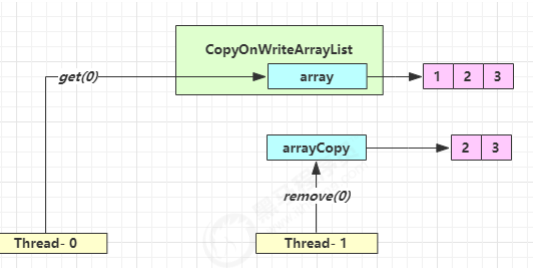

## 六、共享模型之不可变

### 1. 日期转换的问题

#### 问题

下面的代码在运行时，由于 SimpleDateFormat 不是线程安全的

```java
SimpleDateFormat sdf = new SimpleDateFormat("yyyy-MM-dd");
for (int i = 0; i < 10; i++) {
    new Thread(() -> {
        try {
            log.debug("{}", sdf.parse("1951-04-21"));
        } catch (Exception e) {
            log.error("{}", e);
        }
    }).start();
}
```

有很大几率出现 java.lang.NumberFormatException 或者出现不正确的日期解析结果，例如：

```
19:10:40.859 [Thread-2] c.TestDateParse - {} 
java.lang.NumberFormatException: For input string: "" 
 at java.lang.NumberFormatException.forInputString(NumberFormatException.java:65) 
 at java.lang.Long.parseLong(Long.java:601) 
 at java.lang.Long.parseLong(Long.java:631) 
 at java.text.DigitList.getLong(DigitList.java:195) 
 at java.text.DecimalFormat.parse(DecimalFormat.java:2084) 
 at java.text.SimpleDateFormat.subParse(SimpleDateFormat.java:2162) 
 at java.text.SimpleDateFormat.parse(SimpleDateFormat.java:1514) 
 at java.text.DateFormat.parse(DateFormat.java:364) 
 at cn.itcast.n7.TestDateParse.lambda$test1$0(TestDateParse.java:18) 
 at java.lang.Thread.run(Thread.java:748) 
19:10:40.859 [Thread-1] c.TestDateParse - {} 
java.lang.NumberFormatException: empty String 
 at sun.misc.FloatingDecimal.readJavaFormatString(FloatingDecimal.java:1842) 
 at sun.misc.FloatingDecimal.parseDouble(FloatingDecimal.java:110) 
 at java.lang.Double.parseDouble(Double.java:538) 
 at java.text.DigitList.getDouble(DigitList.java:169) 
 at java.text.DecimalFormat.parse(DecimalFormat.java:2089) 
 at java.text.SimpleDateFormat.subParse(SimpleDateFormat.java:2162) 
 at java.text.SimpleDateFormat.parse(SimpleDateFormat.java:1514) 
 at java.text.DateFormat.parse(DateFormat.java:364) 
 at cn.itcast.n7.TestDateParse.lambda$test1$0(TestDateParse.java:18) 
 at java.lang.Thread.run(Thread.java:748) 
19:10:40.857 [Thread-8] c.TestDateParse - Sat Apr 21 00:00:00 CST 1951 
19:10:40.857 [Thread-9] c.TestDateParse - Sat Apr 21 00:00:00 CST 1951 
19:10:40.857 [Thread-6] c.TestDateParse - Sat Apr 21 00:00:00 CST 1951 
19:10:40.857 [Thread-4] c.TestDateParse - Sat Apr 21 00:00:00 CST 1951 
19:10:40.857 [Thread-5] c.TestDateParse - Mon Apr 21 00:00:00 CST 178960645 
19:10:40.857 [Thread-0] c.TestDateParse - Sat Apr 21 00:00:00 CST 1951 
19:10:40.857 [Thread-7] c.TestDateParse - Sat Apr 21 00:00:00 CST 1951 
19:10:40.857 [Thread-3] c.TestDateParse - Sat Apr 21 00:00:00 CST 1951 
```

#### 同步锁

这样虽能解决问题，但带来的是性能上的损失，并不算很好：

```java
SimpleDateFormat sdf = new SimpleDateFormat("yyyy-MM-dd");
for (int i = 0; i < 50; i++) {
    new Thread(() -> {
        synchronized (sdf) {
            try {
                log.debug("{}", sdf.parse("1951-04-21"));
            } catch (Exception e) {
                log.error("{}", e);
            }
        }
    }).start();
}
```

#### 不可变

如果一个对象在不能够修改其内部状态（属性），那么它就是线程安全的，因为不存在并发修改。这样的对象在 Java 中有很多，例如在 Java 8 后，提供了一个新的日期格式化类：

```java
DateTimeFormatter dtf = DateTimeFormatter.ofPattern("yyyy-MM-dd");
for (int i = 0; i < 10; i++) {
    new Thread(() -> {
        LocalDate date = dtf.parse("2018-10-01", LocalDate::from);
        log.debug("{}", date);
    }).start();
}
```

可以看 DateTimeFormatter 的文档：

```java
@implSpec
This class is immutable and thread-safe.
```

不可变对象，实际是另一种避免竞争的方式。

### 2. 不可变设计

String 类也是不可变的，以它为例，说明一下不可变设计的要素

```java
public final class String
    implements java.io.Serializable, Comparable<String>, CharSequence {
    /** The value is used for character storage. */
    private final char value[];
    /** Cache the hash code for the string */
    private int hash; // Default to 0

    // ...

}
```

#### final 的使用

发现该类、类中所有属性都是 final 的 

- 属性用 final 修饰保证了该属性是只读的，不能修改 
- 类用 final 修饰保证了该类中的方法不能被覆盖，防止子类无意间破坏不可变性

#### 保护性拷贝

使用字符串时，也有一些跟修改相关的方法，比如 substring 等，那么下面就看一看这些方法是 如何实现的，就以 substring 为例：

```java
public String substring(int beginIndex) {
    if (beginIndex < 0) {
        throw new StringIndexOutOfBoundsException(beginIndex);
    }
    int subLen = value.length - beginIndex;
    if (subLen < 0) {
        throw new StringIndexOutOfBoundsException(subLen);
    }
    return (beginIndex == 0) ? this : new String(value, beginIndex, subLen);
}
```

发现其内部是调用 String 的构造方法创建了一个新字符串，再进入这个构造看看，是否对 final char[] value 做出 了修改：

```java
public String(char value[], int offset, int count) {
    if (offset < 0) {
        throw new StringIndexOutOfBoundsException(offset);
    }
    if (count <= 0) {
        if (count < 0) {
            throw new StringIndexOutOfBoundsException(count);
        }
        if (offset <= value.length) {
            this.value = "".value;
            return;
        }
    }
    if (offset > value.length - count) {
        throw new StringIndexOutOfBoundsException(offset + count);
    }
    this.value = Arrays.copyOfRange(value, offset, offset+count);
}
```

结果发现也没有，构造新字符串对象时，会生成新的 char[] value，对内容进行复制 。这种通过创建副本对象来避 免共享的手段称之为【保护性拷贝（defensive copy）】

### 3. 无状态

在 web 中，设计 Servlet 时为了保证其线程安全，都会建议，不要为 Servlet 设置成员变量，这 种没有任何成员变量的类是线程安全的

> 在 web 阶段学习时，设计 Servlet 时为了保证其线程安全，都会有这样的建议，不要为 Servlet 设置成员变量，这 种没有任何成员变量的类是线程安全的

## 七、共享模型之工具

### 1. 线程池

####  1.1 自定义线程池



步骤1：自定义拒绝策略接口

```java
@FunctionalInterface // 拒绝策略
interface RejectPolicy<T> {
    void reject(BlockingQueue<T> queue, T task);
}
```

步骤2：自定义任务队列

```java
class BlockingQueue<T> {
    // 1. 任务队列
    private Deque<T> queue = new ArrayDeque<>();
    // 2. 锁
    private ReentrantLock lock = new ReentrantLock();
    // 3. 生产者条件变量
    private Condition fullWaitSet = lock.newCondition();
    // 4. 消费者条件变量
    private Condition emptyWaitSet = lock.newCondition();
    // 5. 容量
    private int capcity;
    public BlockingQueue(int capcity) {
        this.capcity = capcity;
    }
    // 带超时阻塞获取
    public T poll(long timeout, TimeUnit unit) {
        lock.lock();
        try {
            // 将 timeout 统一转换为 纳秒
            long nanos = unit.toNanos(timeout);
            while (queue.isEmpty()) {
                try {
                    // 返回值是剩余时间
                    if (nanos <= 0) {
                        return null;
                    }
                    nanos = emptyWaitSet.awaitNanos(nanos);
                } catch (InterruptedException e) {
                    e.printStackTrace();
                }
            }
            T t = queue.removeFirst();
            fullWaitSet.signal();
            return t;
        } finally {
            lock.unlock();
        }
    }
    // 阻塞获取
    public T take() {
        lock.lock();
        try {
            while (queue.isEmpty()) {
                try {
                    emptyWaitSet.await();
                } catch (InterruptedException e) {
                    e.printStackTrace();
                }
            }
            T t = queue.removeFirst();
            fullWaitSet.signal();
            return t;
        } finally {
            lock.unlock();
        }
    }
    // 阻塞添加
    public void put(T task) {
        lock.lock();
        try {
            while (queue.size() == capcity) {
                try {
                    log.debug("等待加入任务队列 {} ...", task);
                    fullWaitSet.await();
                } catch (InterruptedException e) {
                    e.printStackTrace();
                }
            }
            log.debug("加入任务队列 {}", task);
            queue.addLast(task);
            emptyWaitSet.signal();
        } finally {
            lock.unlock();
        }
    }
    // 带超时时间阻塞添加
    public boolean offer(T task, long timeout, TimeUnit timeUnit) {
        lock.lock();
        try {
            long nanos = timeUnit.toNanos(timeout);
            while (queue.size() == capcity) {
                try {
                    if(nanos <= 0) {
                        return false;
                    }
                    log.debug("等待加入任务队列 {} ...", task);
                    nanos = fullWaitSet.awaitNanos(nanos);
                } catch (InterruptedException e) {
                    e.printStackTrace();
                }
            }
            log.debug("加入任务队列 {}", task);
            queue.addLast(task);
            emptyWaitSet.signal();
            return true;
        } finally {
            lock.unlock();
        }
    }
    public int size() {
        lock.lock();
        try {
            return queue.size();
        } finally {
            lock.unlock();
        }
    }
    public void tryPut(RejectPolicy<T> rejectPolicy, T task) {
        lock.lock();
        try {
            // 判断队列是否满
            if(queue.size() == capcity) {
                rejectPolicy.reject(this, task);
            } else { // 有空闲
                log.debug("加入任务队列 {}", task);
                queue.addLast(task);
                emptyWaitSet.signal();
            }
        } finally {
            lock.unlock();
        }
    }
}
```

步骤3：自定义线程池

```java
class ThreadPool {
    // 任务队列
    private BlockingQueue<Runnable> taskQueue;
    // 线程集合
    private HashSet<Worker> workers = new HashSet<>();
    // 核心线程数
    private int coreSize;
    // 获取任务时的超时时间
    private long timeout;
    private TimeUnit timeUnit;
    private RejectPolicy<Runnable> rejectPolicy;
    // 执行任务
    public void execute(Runnable task) {
        // 当任务数没有超过 coreSize 时，直接交给 worker 对象执行
        // 如果任务数超过 coreSize 时，加入任务队列暂存
        synchronized (workers) {
            if(workers.size() < coreSize) {
                Worker worker = new Worker(task);
                log.debug("新增 worker{}, {}", worker, task);
                workers.add(worker);
                worker.start();
            } else {
                // taskQueue.put(task);
                // 1) 死等
                // 2) 带超时等待
                // 3) 让调用者放弃任务执行
                // 4) 让调用者抛出异常
                // 5) 让调用者自己执行任务
                taskQueue.tryPut(rejectPolicy, task);
            }
        }
    }
    public ThreadPool(int coreSize, long timeout, TimeUnit timeUnit, int queueCapcity, 
                      RejectPolicy<Runnable> rejectPolicy) {
        this.coreSize = coreSize;
        this.timeout = timeout;
        this.timeUnit = timeUnit;
        this.taskQueue = new BlockingQueue<>(queueCapcity);
        this.rejectPolicy = rejectPolicy;
    }
    class Worker extends Thread{
        private Runnable task;
        public Worker(Runnable task) {
            this.task = task;
        }
        @Override
        public void run() {
            // 执行任务
            // 1) 当 task 不为空，执行任务
            // 2) 当 task 执行完毕，再接着从任务队列获取任务并执行
            // while(task != null || (task = taskQueue.take()) != null) {
            while(task != null || (task = taskQueue.poll(timeout, timeUnit)) != null) {
                try {
                    log.debug("正在执行...{}", task);
                    task.run();
                } catch (Exception e) {
                    e.printStackTrace();
                } finally {
                    task = null;
                }
            }
            synchronized (workers) {
                log.debug("worker 被移除{}", this);
                workers.remove(this);
            }
        }
    }
}
```

步骤4：测试

```java
public static void main(String[] args) {
    ThreadPool threadPool = new ThreadPool(1,
                                           1000, TimeUnit.MILLISECONDS, 1, (queue, task)->{
                                               // 1. 死等
                                               // queue.put(task);
                                               // 2) 带超时等待
                                               // queue.offer(task, 1500, TimeUnit.MILLISECONDS);
                                               // 3) 让调用者放弃任务执行
                                               // log.debug("放弃{}", task);
                                               // 4) 让调用者抛出异常
                                               // throw new RuntimeException("任务执行失败 " + task);
                                               // 5) 让调用者自己执行任务
                                               task.run();
                                           });
    for (int i = 0; i < 4; i++) {
        int j = i;
        threadPool.execute(() -> {
            try {
                Thread.sleep(1000L);
            } catch (InterruptedException e) {
                e.printStackTrace();
            }
            log.debug("{}", j);
        });
    }
}
```

#### 1.2 ThreadPoolExecutor



1) 线程池状态

   ThreadPoolExecutor 使用 int 的高 3 位来表示线程池状态，低 29 位表示线程数量

   | 状态名     | 高 3  位 | 接收新任 务 | 处理阻塞队列任 务 | 说明                                       |
   | ---------- | -------- | ----------- | ----------------- | ------------------------------------------ |
   | RUNNING    | 111      | Y           | Y                 |                                            |
   | SHUTDOWN   | 000      | N           | Y                 | 不会接收新任务，但会处理阻塞队列剩余 任务  |
   | STOP       | 001      | N           | N                 | 会中断正在执行的任务，并抛弃阻塞队列 任务  |
   | TIDYING    | 010      | \-          | \-                | 任务全执行完毕，活动线程为 0 即将进入 终结 |
   | TERMINATED | 011      | \-          | \-                | 终结状态                                   |

   从数字上比较，TERMINATED > TIDYING > STOP > SHUTDOWN > RUNNING 

   这些信息存储在一个原子变量 ctl 中，目的是将线程池状态与线程个数合二为一，这样就可以用一次 cas 原子操作 进行赋值

   ```java
   // c 为旧值， ctlOf 返回结果为新值
   ctl.compareAndSet(c, ctlOf(targetState, workerCountOf(c))));
   // rs 为高 3 位代表线程池状态， wc 为低 29 位代表线程个数，ctl 是合并它们
   private static int ctlOf(int rs, int wc) { return rs | wc; }
   ```

   

2) 构造方法

   ```java
   public ThreadPoolExecutor(int corePoolSize,
                             int maximumPoolSize,
                             long keepAliveTime,
                             TimeUnit unit,
                             BlockingQueue<Runnable> workQueue,
                             ThreadFactory threadFactory,
                             RejectedExecutionHandler handler)
   ```

   - corePoolSize 核心线程数目 (最多保留的线程数) 
   - maximumPoolSize 最大线程数目 
   - keepAliveTime 生存时间 - 针对救急线程 
   - unit 时间单位 - 针对救急线程 
   - workQueue 阻塞队列 
   - threadFactory 线程工厂 - 可以为线程创建时起个好名字 
   - handler 拒绝策略

   工作方式：

   

   

   - 线程池中刚开始没有线程，当一个任务提交给线程池后，线程池会创建一个新线程来执行任务。 

   - 当线程数达到 corePoolSize 并没有线程空闲，这时再加入任务，新加的任务会被加入workQueue 队列排 队，直到有空闲的线程。 

   - 如果队列选择了有界队列，那么任务超过了队列大小时，会创建 maximumPoolSize - corePoolSize 数目的线 程来救急。 

   - 如果线程到达 maximumPoolSize 仍然有新任务这时会执行拒绝策略。拒绝策略 jdk 提供了 4 种实现，其它著名框架也提供了实现 

     - AbortPolicy 让调用者抛出 RejectedExecutionException 异常，这是默认策略 
     - CallerRunsPolicy 让调用者运行任务 
     - DiscardPolicy 放弃本次任务 
     - DiscardOldestPolicy 放弃队列中最早的任务，本任务取而代之 
     - Dubbo 的实现，在抛出 RejectedExecutionException 异常之前会记录日志，并 dump 线程栈信息，方 便定位问题 
     - Netty 的实现，是创建一个新线程来执行任务 
     - ActiveMQ 的实现，带超时等待（60s）尝试放入队列，类似我们之前自定义的拒绝策略 
     - PinPoint 的实现，它使用了一个拒绝策略链，会逐一尝试策略链中每种拒绝策略 

   - 当高峰过去后，超过corePoolSize 的救急线程如果一段时间没有任务做，需要结束节省资源，这个时间由 keepAliveTime 和 unit 来控制。

     

     根据这个构造方法，JDK Executors 类中提供了众多工厂方法来创建各种用途的线程池

3) newFixedThreadPool

   ```java
   public static ExecutorService newFixedThreadPool(int nThreads) {
       return new ThreadPoolExecutor(nThreads, nThreads,
                                     0L, TimeUnit.MILLISECONDS,
                                     new LinkedBlockingQueue<Runnable>());
   }
   ```

   特点 

   - 核心线程数 == 最大线程数（没有救急线程被创建），因此也无需超时时间 
   - 阻塞队列是无界的，可以放任意数量的任务

   > 适用于任务量已知，相对耗时的任务

4) newCachedThreadPool

   ```java
   public static ExecutorService newCachedThreadPool() {
       return new ThreadPoolExecutor(0, Integer.MAX_VALUE,
                                     60L, TimeUnit.SECONDS,
                                     new SynchronousQueue<Runnable>());
   }
   ```

   特点 

   - 核心线程数是 0， 最大线程数是 Integer.MAX_VALUE，救急线程的空闲生存时间是 60s，意味着 
     - 全部都是救急线程（60s 后可以回收）
     - 救急线程可以无限创建 
   - 队列采用了 SynchronousQueue 实现特点是，它没有容量，没有线程来取是放不进去的（一手交钱、一手交 货）

   ```java
   SynchronousQueue<Integer> integers = new SynchronousQueue<>();
   new Thread(() -> {
       try {
           log.debug("putting {} ", 1);
           integers.put(1);
           log.debug("{} putted...", 1);
           log.debug("putting...{} ", 2);
           integers.put(2);
           log.debug("{} putted...", 2);
       } catch (InterruptedException e) {
           e.printStackTrace();
       }
   },"t1").start();
   sleep(1);
   new Thread(() -> {
       try {
           log.debug("taking {}", 1);
           integers.take();
       } catch (InterruptedException e) {
           e.printStackTrace();
       }
   },"t2").start();
   sleep(1);
   new Thread(() -> {
       try {
           log.debug("taking {}", 2);
           integers.take();
       } catch (InterruptedException e) {
           e.printStackTrace();
       }
   },"t3").start();
   ```

   输出

   ```
   11:48:15.500 c.TestSynchronousQueue [t1] - putting 1 
   11:48:16.500 c.TestSynchronousQueue [t2] - taking 1 
   11:48:16.500 c.TestSynchronousQueue [t1] - 1 putted... 
   11:48:16.500 c.TestSynchronousQueue [t1] - putting...2 
   11:48:17.502 c.TestSynchronousQueue [t3] - taking 2 
   11:48:17.503 c.TestSynchronousQueue [t1] - 2 putted... 
   ```

   > 整个线程池表现为线程数会根据任务量不断增长，没有上限，当任务执行完毕，空闲 1分钟后释放线 程。 适合任务数比较密集，但每个任务执行时间较短的情况

5) newSingleThreadExecutor

   ```java
   public static ExecutorService newSingleThreadExecutor() {
       return new FinalizableDelegatedExecutorService
           (new ThreadPoolExecutor(1, 1,
                                   0L, TimeUnit.MILLISECONDS,
                                   new LinkedBlockingQueue<Runnable>()));
   }
   ```

   使用场景： 

   希望多个任务排队执行。线程数固定为 1，任务数多于 1 时，会放入无界队列排队。任务执行完毕，这唯一的线程 也不会被释放。 

   区别： 

   - 自己创建一个单线程串行执行任务，如果任务执行失败而终止那么没有任何补救措施，而线程池还会新建一 个线程，保证池的正常工作 
   - Executors.newSingleThreadExecutor() 线程个数始终为1，不能修改 
     - FinalizableDelegatedExecutorService 应用的是装饰器模式，只对外暴露了 ExecutorService 接口，因 此不能调用 ThreadPoolExecutor 中特有的方法 
   - Executors.newFixedThreadPool(1) 初始时为1，以后还可以修改 
     - 对外暴露的是 ThreadPoolExecutor 对象，可以强转后调用 setCorePoolSize 等方法进行修改

6) 提交任务

   ```java
   // 执行任务
   void execute(Runnable command);
   // 提交任务 task，用返回值 Future 获得任务执行结果
   <T> Future<T> submit(Callable<T> task);
   // 提交 tasks 中所有任务
   <T> List<Future<T>> invokeAll(Collection<? extends Callable<T>> tasks)
       throws InterruptedException;
   // 提交 tasks 中所有任务，带超时时间
   <T> List<Future<T>> invokeAll(Collection<? extends Callable<T>> tasks,
                                 long timeout, TimeUnit unit)
       throws InterruptedException;
   // 提交 tasks 中所有任务，哪个任务先成功执行完毕，返回此任务执行结果，其它任务取消
   <T> T invokeAny(Collection<? extends Callable<T>> tasks)
       throws InterruptedException, ExecutionException;
   // 执行任务
   void execute(Runnable command);
   // 提交任务 task，用返回值 Future 获得任务执行结果
   <T> Future<T> submit(Callable<T> task);
   // 提交 tasks 中所有任务
   <T> List<Future<T>> invokeAll(Collection<? extends Callable<T>> tasks)
       throws InterruptedException;
   // 提交 tasks 中所有任务，带超时时间
   <T> List<Future<T>> invokeAll(Collection<? extends Callable<T>> tasks,
                                 long timeout, TimeUnit unit)
       throws InterruptedException;
   // 提交 tasks 中所有任务，哪个任务先成功执行完毕，返回此任务执行结果，其它任务取消
   <T> T invokeAny(Collection<? extends Callable<T>> tasks)
       throws InterruptedException, ExecutionException;
   ```

   

7) 关闭线程池

   **shutdown**

   ```java
   /*
   线程池状态变为 SHUTDOWN
   - 不会接收新任务
   - 但已提交任务会执行完
   - 此方法不会阻塞调用线程的执行
   */
   void shutdown();
   
   public void shutdown() {
       final ReentrantLock mainLock = this.mainLock;
       mainLock.lock();
       try {
           checkShutdownAccess();
           // 修改线程池状态
           advanceRunState(SHUTDOWN);
           // 仅会打断空闲线程
           interruptIdleWorkers();
           onShutdown(); // 扩展点 ScheduledThreadPoolExecutor
       } finally {
           mainLock.unlock();
       }
       // 尝试终结(没有运行的线程可以立刻终结，如果还有运行的线程也不会等)
       tryTerminate();
   }
   ```

   **shutdownNow**

   ```java
   /*
   线程池状态变为 STOP
   - 不会接收新任务
   - 会将队列中的任务返回
   - 并用 interrupt 的方式中断正在执行的任务
   */
   List<Runnable> shutdownNow();
   
   public List<Runnable> shutdownNow() {
       List<Runnable> tasks;
       final ReentrantLock mainLock = this.mainLock;
       mainLock.lock();
       try {
           checkShutdownAccess();
           // 修改线程池状态
           advanceRunState(STOP);
           // 打断所有线程
           interruptWorkers();
           // 获取队列中剩余任务
           tasks = drainQueue();
       } finally {
           mainLock.unlock();
       }
       // 尝试终结
       tryTerminate();
       return tasks;
   }
   ```

   **其它方法**

   ```java
   // 不在 RUNNING 状态的线程池，此方法就返回 true
   boolean isShutdown();
   // 线程池状态是否是 TERMINATED
   boolean isTerminated();
   // 调用 shutdown 后，由于调用线程并不会等待所有任务运行结束，因此如果它想在线程池 TERMINATED 后做些事情，可以利用此方法等待
   boolean awaitTermination(long timeout, TimeUnit unit) throws InterruptedException;
   ```

8) 任务调度线程池

   在『任务调度线程池』功能加入之前，可以使用 java.util.Timer 来实现定时功能，Timer 的优点在于简单易用，但 由于所有任务都是由同一个线程来调度，因此所有任务都是串行执行的，同一时间只能有一个任务在执行，前一个 任务的延迟或异常都将会影响到之后的任务。

   ```java
   public static void main(String[] args) {
       Timer timer = new Timer();
       TimerTask task1 = new TimerTask() {
           @Override
           public void run() {
               log.debug("task 1");
               sleep(2);
           }
       };
       TimerTask task2 = new TimerTask() {
           @Override
           public void run() {
               log.debug("task 2");
           }
       };
       // 使用 timer 添加两个任务，希望它们都在 1s 后执行
       // 但由于 timer 内只有一个线程来顺序执行队列中的任务，因此『任务1』的延时，影响了『任务2』的执行
       timer.schedule(task1, 1000);
       timer.schedule(task2, 1000);
   }
   ```

   输出

   ```
   20:46:09.444 c.TestTimer [main] - start... 
   20:46:10.447 c.TestTimer [Timer-0] - task 1 
   20:46:12.448 c.TestTimer [Timer-0] - task 2 
   ```

   使用 ScheduledExecutorService 改写：

   ```java
   ScheduledExecutorService executor = Executors.newScheduledThreadPool(2);
   // 添加两个任务，希望它们都在 1s 后执行
   executor.schedule(() -> {
       System.out.println("任务1，执行时间：" + new Date());
       try { Thread.sleep(2000); } catch (InterruptedException e) { }
   }, 1000, TimeUnit.MILLISECONDS);
   executor.schedule(() -> {
       System.out.println("任务2，执行时间：" + new Date());
   }, 1000, TimeUnit.MILLISECONDS);
   ```

   输出

   ```
   任务1，执行时间：Thu Jan 03 12:45:17 CST 2019 
   任务2，执行时间：Thu Jan 03 12:45:17 CST 2019 
   ```

   scheduleAtFixedRate 例子：

   ```java
   ScheduledExecutorService pool = Executors.newScheduledThreadPool(1);
   log.debug("start...");
   pool.scheduleAtFixedRate(() -> {
       log.debug("running...");
   }, 1, 1, TimeUnit.SECONDS);
   ```

   输出

   ```
   21:45:43.167 c.TestTimer [main] - start... 
   21:45:44.215 c.TestTimer [pool-1-thread-1] - running... 
   21:45:45.215 c.TestTimer [pool-1-thread-1] - running... 
   21:45:46.215 c.TestTimer [pool-1-thread-1] - running... 
   21:45:47.215 c.TestTimer [pool-1-thread-1] - running... 
   ```

   scheduleAtFixedRate 例子（任务执行时间超过了间隔时间）：

   ```java
   ScheduledExecutorService pool = Executors.newScheduledThreadPool(1);
   log.debug("start...");
   pool.scheduleAtFixedRate(() -> {
       log.debug("running...");
       sleep(2);
   }, 1, 1, TimeUnit.SECONDS);
   ```

   输出分析：一开始，延时 1s，接下来，由于任务执行时间 > 间隔时间，间隔被『撑』到了 2s

   ```
   21:44:30.311 c.TestTimer [main] - start... 
   21:44:31.360 c.TestTimer [pool-1-thread-1] - running... 
   21:44:33.361 c.TestTimer [pool-1-thread-1] - running... 
   21:44:35.362 c.TestTimer [pool-1-thread-1] - running... 
   21:44:37.362 c.TestTimer [pool-1-thread-1] - running... 
   ```

   scheduleWithFixedDelay 例子：

   ```java
   ScheduledExecutorService pool = Executors.newScheduledThreadPool(1);
   log.debug("start...");
   pool.scheduleWithFixedDelay(()-> {
       log.debug("running...");
       sleep(2);
   }, 1, 1, TimeUnit.SECONDS);
   ```

   输出分析：一开始，延时 1s，scheduleWithFixedDelay 的间隔是 上一个任务结束 <-> 延时 <-> 下一个任务开始 所 以间隔都是 3s

   ```
   21:40:55.078 c.TestTimer [main] - start... 
   21:40:56.140 c.TestTimer [pool-1-thread-1] - running... 
   21:40:59.143 c.TestTimer [pool-1-thread-1] - running... 
   21:41:02.145 c.TestTimer [pool-1-thread-1] - running... 
   21:41:05.147 c.TestTimer [pool-1-thread-1] - running... 
   ```

   > 整个线程池表现为：线程数固定，任务数多于线程数时，会放入无界队列排队。任务执行完毕，这些线 程也不会被释放。用来执行延迟或反复执行的任务

9) 正确处理执行任务异常

   方法1：主动捉异常

   ```java
   ExecutorService pool = Executors.newFixedThreadPool(1);
   pool.submit(() -> {
       try {
           log.debug("task1");
           int i = 1 / 0;
       } catch (Exception e) {
           log.error("error:", e);
       }
   });
   ```

   输出

   ```
   21:59:04.558 c.TestTimer [pool-1-thread-1] - task1 
   21:59:04.562 c.TestTimer [pool-1-thread-1] - error: 
   java.lang.ArithmeticException: / by zero 
    at cn.itcast.n8.TestTimer.lambda$main$0(TestTimer.java:28) 
    at java.util.concurrent.Executors$RunnableAdapter.call(Executors.java:511) 
    at java.util.concurrent.FutureTask.run(FutureTask.java:266) 
    at java.util.concurrent.ThreadPoolExecutor.runWorker(ThreadPoolExecutor.java:1149) 
    at java.util.concurrent.ThreadPoolExecutor$Worker.run(ThreadPoolExecutor.java:624) 
    at java.lang.Thread.run(Thread.java:748) 
   
   ```

   方法2：使用 Future

   ```java
   ExecutorService pool = Executors.newFixedThreadPool(1);
   Future<Boolean> f = pool.submit(() -> {
    log.debug("task1");
    int i = 1 / 0;
    return true;
   });
   log.debug("result:{}", f.get());
   ```

   输出

   ```
   21:54:58.208 c.TestTimer [pool-1-thread-1] - task1 
   Exception in thread "main" java.util.concurrent.ExecutionException: 
   java.lang.ArithmeticException: / by zero 
    at java.util.concurrent.FutureTask.report(FutureTask.java:122) 
    at java.util.concurrent.FutureTask.get(FutureTask.java:192) 
    at cn.itcast.n8.TestTimer.main(TestTimer.java:31) 
   Caused by: java.lang.ArithmeticException: / by zero 
    at cn.itcast.n8.TestTimer.lambda$main$0(TestTimer.java:28) 
    at java.util.concurrent.FutureTask.run(FutureTask.java:266) 
    at java.util.concurrent.ThreadPoolExecutor.runWorker(ThreadPoolExecutor.java:1149) 
    at java.util.concurrent.ThreadPoolExecutor$Worker.run(ThreadPoolExecutor.java:624) 
    at java.lang.Thread.run(Thread.java:748) 
   ```

   

10) Tomcat 线程池

Tomcat 在哪里用到了线程池

- LimitLatch 用来限流，可以控制最大连接个数，类似 J.U.C 中的 Semaphore 后面再讲 
- Acceptor 只负责【接收新的 socket 连接】 
- Poller 只负责监听 socket channel 是否有【可读的 I/O 事件】 
- 一旦可读，封装一个任务对象（socketProcessor），提交给 
- Executor 线程池处理 Executor 线程池中的工作线程最终负责【处理请求】

Tomcat 线程池扩展了 ThreadPoolExecutor，行为稍有不同 

- 如果总线程数达到 maximumPoolSize 
  - 这时不会立刻抛 RejectedExecutionException 异常 
  - 而是再次尝试将任务放入队列，如果还失败，才抛出 RejectedExecutionException 异常

源码 tomcat-7.0.42

```java
public void execute(Runnable command, long timeout, TimeUnit unit) {
    submittedCount.incrementAndGet();
    try {
        super.execute(command);
    } catch (RejectedExecutionException rx) {
        if (super.getQueue() instanceof TaskQueue) {
            final TaskQueue queue = (TaskQueue)super.getQueue();
            try {
                if (!queue.force(command, timeout, unit)) {
                    submittedCount.decrementAndGet();
                    throw new RejectedExecutionException("Queue capacity is full.");
                }
            } catch (InterruptedException x) {
                submittedCount.decrementAndGet();
                Thread.interrupted();
                throw new RejectedExecutionException(x);
            }
        } else {
            submittedCount.decrementAndGet();
            throw rx;
        }
    }
}
```

TaskQueue.java

```java
public boolean force(Runnable o, long timeout, TimeUnit unit) throws InterruptedException {
    if ( parent.isShutdown() ) 
        throw new RejectedExecutionException(
        "Executor not running, can't force a command into the queue"
    );
    return super.offer(o,timeout,unit); //forces the item onto the queue, to be used if the task 
    is rejected
}
```

Connector 配置

| 配置项              | 默认值 | 说明                                   |
| ------------------- | ------ | -------------------------------------- |
| acceptorThreadCount | 1      | acceptor 线程数量                      |
| pollerThreadCount   | 1      | poller 线程数量                        |
| minSpareThreads     | 10     | 核心线程数，即 corePoolSize            |
| maxThreads          | 200    | 最大线程数，即 maximumPoolSize         |
| executor            | -      | Executor 名称，用来引用下面的 Executor |

Executor 线程配置

| 配置项                  | 默认值            | 说明                                      |
| ----------------------- | ----------------- | ----------------------------------------- |
| threadPriority          | 5                 | 线程优先级                                |
| daemon                  | true              | 是否守护线程                              |
| minSpareThreads         | 25                | 核心线程数，即 corePoolSize               |
| maxThreads              | 200               | 最大线程数，即 maximumPoolSize            |
| maxIdleTime             | 60000             | 线程生存时间，单位是毫秒，默认值即 1 分钟 |
| maxQueueSize            | Integer.MAX_VALUE | 队列长度                                  |
| prestartminSpareThreads | false             | 核心线程是否在服务器启动时启动            |



#### 1.3 Fork/Join

1. 概念

   Fork/Join 是 JDK 1.7 加入的新的线程池实现，它体现的是一种分治思想，适用于能够进行任务拆分的 cpu 密集型 运算 

   所谓的任务拆分，是将一个大任务拆分为算法上相同的小任务，直至不能拆分可以直接求解。跟递归相关的一些计 算，如归并排序、斐波那契数列、都可以用分治思想进行求解 

   Fork/Join 在分治的基础上加入了多线程，可以把每个任务的分解和合并交给不同的线程来完成，进一步提升了运 算效率 

   Fork/Join 默认会创建与 cpu 核心数大小相同的线程池

2. 使用

   提交给 Fork/Join 线程池的任务需要继承 RecursiveTask（有返回值）或 RecursiveAction（没有返回值），例如下 面定义了一个对 1~n 之间的整数求和的任务

   ```java
   class AddTask1 extends RecursiveTask<Integer> {
       int n;
       public AddTask1(int n) {
           this.n = n;
       }
       @Override
       public String toString() {
           return "{" + n + '}';
       }
       @Override
       protected Integer compute() {
           // 如果 n 已经为 1，可以求得结果了
           if (n == 1) {
               log.debug("join() {}", n);
               return n;
           }
   
           // 将任务进行拆分(fork)
           AddTask1 t1 = new AddTask1(n - 1);
           t1.fork();
           log.debug("fork() {} + {}", n, t1);
   
           // 合并(join)结果
           int result = n + t1.join();
           log.debug("join() {} + {} = {}", n, t1, result);
           return result;
       }
   }
   ```

   然后提交给 ForkJoinPool 来执行

   ```java
   public static void main(String[] args) {
       ForkJoinPool pool = new ForkJoinPool(4);
       System.out.println(pool.invoke(new AddTask1(5)));
   }
   ```

   结果

   ```
   [ForkJoinPool-1-worker-0] - fork() 2 + {1} 
   [ForkJoinPool-1-worker-1] - fork() 5 + {4} 
   [ForkJoinPool-1-worker-0] - join() 1 
   [ForkJoinPool-1-worker-0] - join() 2 + {1} = 3 
   [ForkJoinPool-1-worker-2] - fork() 4 + {3} 
   [ForkJoinPool-1-worker-3] - fork() 3 + {2} 
   [ForkJoinPool-1-worker-3] - join() 3 + {2} = 6 
   [ForkJoinPool-1-worker-2] - join() 4 + {3} = 10 
   [ForkJoinPool-1-worker-1] - join() 5 + {4} = 15 
   15 
   ```

   改进

   ```java
   class AddTask3 extends RecursiveTask<Integer> {
   
       int begin;
       int end;
       public AddTask3(int begin, int end) {
           this.begin = begin;
           this.end = end;
       }
       @Override
       public String toString() {
           return "{" + begin + "," + end + '}';
       }
       @Override
       protected Integer compute() {
           // 5, 5
           if (begin == end) {
               log.debug("join() {}", begin);
               return begin;
           }
           // 4, 5
           if (end - begin == 1) {
               log.debug("join() {} + {} = {}", begin, end, end + begin);
               return end + begin;
           }
   
           // 1 5
           int mid = (end + begin) / 2; // 3
           AddTask3 t1 = new AddTask3(begin, mid); // 1,3
           t1.fork();
           AddTask3 t2 = new AddTask3(mid + 1, end); // 4,5
           t2.fork();
           log.debug("fork() {} + {} = ?", t1, t2);
           int result = t1.join() + t2.join();
           log.debug("join() {} + {} = {}", t1, t2, result);
           return result;
       }
   }
   ```

   然后提交给 ForkJoinPool 来执行

   ```java
   public static void main(String[] args) {
       ForkJoinPool pool = new ForkJoinPool(4);
       System.out.println(pool.invoke(new AddTask3(1, 10)));
   }
   ```

   结果

   ```
   [ForkJoinPool-1-worker-0] - join() 1 + 2 = 3 
   [ForkJoinPool-1-worker-3] - join() 4 + 5 = 9 
   [ForkJoinPool-1-worker-0] - join() 3 
   [ForkJoinPool-1-worker-1] - fork() {1,3} + {4,5} = ? 
   [ForkJoinPool-1-worker-2] - fork() {1,2} + {3,3} = ? 
   [ForkJoinPool-1-worker-2] - join() {1,2} + {3,3} = 6 
   [ForkJoinPool-1-worker-1] - join() {1,3} + {4,5} = 15 
   15 
   ```

### 2. J.U.C

#### 2.1 读写锁

1. ReentrantReadWriteLock

   当读操作远远高于写操作时，这时候使用 **读写锁** 让 **读-读** 可以并发，提高性能。 类似于数据库中的 **select ... from ... lock in share mode** 

   提供一个 数据容器类 内部分别使用读锁保护数据的 **read()** 方法，写锁保护数据的 **write()** 方法

   ```java
   class DataContainer {
       private Object data;
       private ReentrantReadWriteLock rw = new ReentrantReadWriteLock();
       private ReentrantReadWriteLock.ReadLock r = rw.readLock();
       private ReentrantReadWriteLock.WriteLock w = rw.writeLock();
       public Object read() {
           log.debug("获取读锁...");
           r.lock();
           try {
               log.debug("读取");
               sleep(1);
               return data;
           } finally {
               log.debug("释放读锁...");
               r.unlock();
           }
       }
       public void write() {
           log.debug("获取写锁...");
           w.lock();
           try {
               log.debug("写入");
               sleep(1);
           } finally {
               log.debug("释放写锁...");
               w.unlock();
           }
       }
   }
   ```

   测试 **读锁-读锁** 可以并发

   ```java
   DataContainer dataContainer = new DataContainer();
   new Thread(() -> {
       dataContainer.read();
   }, "t1").start();
   new Thread(() -> {
       dataContainer.read();
   }, "t2").start();
   ```

   输出结果，从这里可以看到 Thread-0 锁定期间，Thread-1 的读操作不受影响

   ```
   14:05:14.341 c.DataContainer [t2] - 获取读锁... 
   14:05:14.341 c.DataContainer [t1] - 获取读锁... 
   14:05:14.345 c.DataContainer [t1] - 读取
   14:05:14.345 c.DataContainer [t2] - 读取
   14:05:15.365 c.DataContainer [t2] - 释放读锁... 
   14:05:15.386 c.DataContainer [t1] - 释放读锁... 
   ```

   测试 **读锁-写锁** 相互阻塞

   ```java
   DataContainer dataContainer = new DataContainer();
   new Thread(() -> {
       dataContainer.read();
   }, "t1").start();
   Thread.sleep(100);
   new Thread(() -> {
       dataContainer.write();
   }, "t2").start();
   ```

   输出结果

   ```
   14:04:21.838 c.DataContainer [t1] - 获取读锁... 
   14:04:21.838 c.DataContainer [t2] - 获取写锁... 
   14:04:21.841 c.DataContainer [t2] - 写入
   14:04:22.843 c.DataContainer [t2] - 释放写锁... 
   14:04:22.843 c.DataContainer [t1] - 读取
   14:04:23.843 c.DataContainer [t1] - 释放读锁... 
   ```

   **写锁-写锁** 也是相互阻塞的

   

   注意事项 

   - 读锁不支持条件变量 

   - 重入时升级不支持：即持有读锁的情况下去获取写锁，会导致获取写锁永久等待

     ```java
     r.lock();
     try {
         // ...
         w.lock();
         try {
             // ...
         } finally{
             w.unlock();
         }
     } finally{
         r.unlock();
     }
     ```

   - 重入时降级支持：即持有写锁的情况下去获取读锁

     ```java
     class CachedData {
         Object data;
         // 是否有效，如果失效，需要重新计算 data
         volatile boolean cacheValid;
         final ReentrantReadWriteLock rwl = new ReentrantReadWriteLock();
         void processCachedData() {
             rwl.readLock().lock();
             if (!cacheValid) {
                 // 获取写锁前必须释放读锁
                 rwl.readLock().unlock();
                 rwl.writeLock().lock();
                 try {
                     // 判断是否有其它线程已经获取了写锁、更新了缓存, 避免重复更新
                     if (!cacheValid) {
                         data = ...
                             cacheValid = true;
                     }
                     // 降级为读锁, 释放写锁, 这样能够让其它线程读取缓存
                     rwl.readLock().lock();
                 } finally {
                     rwl.writeLock().unlock();
                 }
             }
             // 自己用完数据, 释放读锁 
             try {
                 use(data);
             } finally {
                 rwl.readLock().unlock();
             }
         }
     }
     ```

2. StampedLock

   该类自 JDK 8 加入，是为了进一步优化读性能，它的特点是在使用读锁、写锁时都必须配合【戳】使用

   加解读锁

   ```java
   long stamp = lock.readLock();
   lock.unlockRead(stamp);
   ```

   加解写锁

   ```java
   long stamp = lock.writeLock();
   lock.unlockWrite(stamp);
   ```

   乐观读，StampedLock 支持 tryOptimisticRead() 方法（乐观读），读取完毕后需要做一次 戳校验 如果校验通 过，表示这期间确实没有写操作，数据可以安全使用，如果校验没通过，需要重新获取读锁，保证数据安全。

   ```java
   long stamp = lock.tryOptimisticRead();
   // 验戳
   if(!lock.validate(stamp)){
    // 锁升级
   }
   ```

   提供一个 数据容器类 内部分别使用读锁保护数据的 read() 方法，写锁保护数据的 write() 方法

   ```java
   class DataContainerStamped {
       private int data;
       private final StampedLock lock = new StampedLock();
       public DataContainerStamped(int data) {
           this.data = data;
       }
       public int read(int readTime) {
           long stamp = lock.tryOptimisticRead();
           log.debug("optimistic read locking...{}", stamp);
           sleep(readTime);
           if (lock.validate(stamp)) {
               log.debug("read finish...{}, data:{}", stamp, data);
               return data;
           }
           // 锁升级 - 读锁
           log.debug("updating to read lock... {}", stamp);
           try {
               stamp = lock.readLock();
               log.debug("read lock {}", stamp);
               sleep(readTime);
               log.debug("read finish...{}, data:{}", stamp, data);
               return data;
           } finally {
               log.debug("read unlock {}", stamp);
               lock.unlockRead(stamp);
           }
       }
       public void write(int newData) {
           long stamp = lock.writeLock();
           log.debug("write lock {}", stamp);
           try {
               sleep(2);
               this.data = newData;
           } finally {
               log.debug("write unlock {}", stamp);
               lock.unlockWrite(stamp);
           }
       }
   }
   ```

   测试 读-读 可以优化

   ```java
   public static void main(String[] args) {
       DataContainerStamped dataContainer = new DataContainerStamped(1);
       new Thread(() -> {
           dataContainer.read(1);
       }, "t1").start();
       sleep(0.5);
       new Thread(() -> {
           dataContainer.read(0);
       }, "t2").start();
   }
   ```

   输出结果，可以看到实际没有加读锁

   ```
   15:58:50.217 c.DataContainerStamped [t1] - optimistic read locking...256 
   15:58:50.717 c.DataContainerStamped [t2] - optimistic read locking...256 
   15:58:50.717 c.DataContainerStamped [t2] - read finish...256, data:1 
   15:58:51.220 c.DataContainerStamped [t1] - read finish...256, data:1
   ```

   测试 读-写 时优化读补加读锁

   ```java
   public static void main(String[] args) {
       DataContainerStamped dataContainer = new DataContainerStamped(1);
       new Thread(() -> {
           dataContainer.read(1);
       }, "t1").start();
       sleep(0.5);
       new Thread(() -> {
           dataContainer.write(100);
       }, "t2").start();
   }
   ```

   输出结果

   ```
   15:57:00.219 c.DataContainerStamped [t1] - optimistic read locking...256 
   15:57:00.717 c.DataContainerStamped [t2] - write lock 384 
   15:57:01.225 c.DataContainerStamped [t1] - updating to read lock... 256 
   15:57:02.719 c.DataContainerStamped [t2] - write unlock 384 
   15:57:02.719 c.DataContainerStamped [t1] - read lock 513 
   15:57:03.719 c.DataContainerStamped [t1] - read finish...513, data:1000 
   15:57:03.719 c.DataContainerStamped [t1] - read unlock 513 
   ```

   > 注意 
   >
   > - StampedLock 不支持条件变量 
   > - StampedLock 不支持可重入

#### 2.2 Semaphore

**基本使用**

[ˈsɛməˌfɔr] 信号量，用来限制能同时访问共享资源的线程上限。

```java
public static void main(String[] args) {
    // 1. 创建 semaphore 对象
    Semaphore semaphore = new Semaphore(3);
    // 2. 10个线程同时运行
    for (int i = 0; i < 10; i++) {
        new Thread(() -> {
            // 3. 获取许可
            try {
                semaphore.acquire();
            } catch (InterruptedException e) {
                e.printStackTrace();
            }
            try {
                log.debug("running...");
                sleep(1);
                log.debug("end...");
            } finally {
                // 4. 释放许可
                semaphore.release();
            }
        }).start();
    }
}
```

输出

```
07:35:15.485 c.TestSemaphore [Thread-2] - running... 
07:35:15.485 c.TestSemaphore [Thread-1] - running... 
07:35:15.485 c.TestSemaphore [Thread-0] - running... 
07:35:16.490 c.TestSemaphore [Thread-2] - end... 
07:35:16.490 c.TestSemaphore [Thread-0] - end... 
07:35:16.490 c.TestSemaphore [Thread-1] - end... 
07:35:16.490 c.TestSemaphore [Thread-3] - running... 
07:35:16.490 c.TestSemaphore [Thread-5] - running... 
07:35:16.490 c.TestSemaphore [Thread-4] - running... 
07:35:17.490 c.TestSemaphore [Thread-5] - end... 
07:35:17.490 c.TestSemaphore [Thread-4] - end... 
07:35:17.490 c.TestSemaphore [Thread-3] - end... 
07:35:17.490 c.TestSemaphore [Thread-6] - running... 
07:35:17.490 c.TestSemaphore [Thread-7] - running... 
07:35:17.490 c.TestSemaphore [Thread-9] - running... 
07:35:18.491 c.TestSemaphore [Thread-6] - end... 
07:35:18.491 c.TestSemaphore [Thread-7] - end... 
07:35:18.491 c.TestSemaphore [Thread-9] - end... 
07:35:18.491 c.TestSemaphore [Thread-8] - running... 
07:35:19.492 c.TestSemaphore [Thread-8] - end... 
```

#### 2.3 CountdownLatch

用来进行线程同步协作，等待所有线程完成倒计时。 

其中构造参数用来初始化等待计数值，await() 用来等待计数归零，countDown() 用来让计数减一

```java
public static void main(String[] args) throws InterruptedException {
    CountDownLatch latch = new CountDownLatch(3);
    new Thread(() -> {
        log.debug("begin...");
        sleep(1);
        latch.countDown();
        log.debug("end...{}", latch.getCount());
    }).start();
    new Thread(() -> {
        log.debug("begin...");
        sleep(2);
        latch.countDown();
        log.debug("end...{}", latch.getCount());
    }).start();
    new Thread(() -> {
        log.debug("begin...");
        sleep(1.5);
        latch.countDown();
        log.debug("end...{}", latch.getCount());
    }).start();
    log.debug("waiting...");
    latch.await();
    log.debug("wait end...");
}
```

输出

```
18:44:00.778 c.TestCountDownLatch [main] - waiting... 
18:44:00.778 c.TestCountDownLatch [Thread-2] - begin... 
18:44:00.778 c.TestCountDownLatch [Thread-0] - begin... 
18:44:00.778 c.TestCountDownLatch [Thread-1] - begin... 
18:44:01.782 c.TestCountDownLatch [Thread-0] - end...2 
18:44:02.283 c.TestCountDownLatch [Thread-2] - end...1 
18:44:02.782 c.TestCountDownLatch [Thread-1] - end...0 
18:44:02.782 c.TestCountDownLatch [main] - wait end... 
```

可以配合线程池使用，改进如下

```java
public static void main(String[] args) throws InterruptedException {
    CountDownLatch latch = new CountDownLatch(3);
    ExecutorService service = Executors.newFixedThreadPool(4);
    service.submit(() -> {
        log.debug("begin...");
        sleep(1);
        latch.countDown();
        log.debug("end...{}", latch.getCount());
    });
    service.submit(() -> {
        log.debug("begin...");
        sleep(1.5);
        latch.countDown();
        log.debug("end...{}", latch.getCount());
    });
    service.submit(() -> {
        log.debug("begin...");
        sleep(2);
        latch.countDown();
        log.debug("end...{}", latch.getCount());
    });
    service.submit(()->{
        try {
            log.debug("waiting...");
            latch.await();
            log.debug("wait end...");
        } catch (InterruptedException e) {
            e.printStackTrace();
        }
    });
}
```

输出

```
18:52:25.831 c.TestCountDownLatch [pool-1-thread-3] - begin... 
18:52:25.831 c.TestCountDownLatch [pool-1-thread-1] - begin... 
18:52:25.831 c.TestCountDownLatch [pool-1-thread-2] - begin... 
18:52:25.831 c.TestCountDownLatch [pool-1-thread-4] - waiting... 
18:52:26.835 c.TestCountDownLatch [pool-1-thread-1] - end...2 
18:52:27.335 c.TestCountDownLatch [pool-1-thread-2] - end...1 
18:52:27.835 c.TestCountDownLatch [pool-1-thread-3] - end...0 
18:52:27.835 c.TestCountDownLatch [pool-1-thread-4] - wait end... 
```

**应用之同步等待多线程准备完毕**

```java
AtomicInteger num = new AtomicInteger(0);
ExecutorService service = Executors.newFixedThreadPool(10, (r) -> {
    return new Thread(r, "t" + num.getAndIncrement());
});
CountDownLatch latch = new CountDownLatch(10);
String[] all = new String[10];
Random r = new Random();
for (int j = 0; j < 10; j++) {
    int x = j;
    service.submit(() -> {
        for (int i = 0; i <= 100; i++) {
            try {
                Thread.sleep(r.nextInt(100));
            } catch (InterruptedException e) {
            }
            all[x] = Thread.currentThread().getName() + "(" + (i + "%") + ")";
            System.out.print("\r" + Arrays.toString(all));
        }
        latch.countDown();
    });
}
latch.await();
System.out.println("\n游戏开始...");
service.shutdown();
```

中间输出

```
[t0(52%), t1(47%), t2(51%), t3(40%), t4(49%), t5(44%), t6(49%), t7(52%), t8(46%), t9(46%)] 
```

最后输出

```
[t0(100%), t1(100%), t2(100%), t3(100%), t4(100%), t5(100%), t6(100%), t7(100%), t8(100%), 
t9(100%)] 
游戏开始... 
```

应用之同步等待多个远程调用结束

```java
@RestController
public class TestCountDownlatchController {
    @GetMapping("/order/{id}")
    public Map<String, Object> order(@PathVariable int id) {
        HashMap<String, Object> map = new HashMap<>();
        map.put("id", id);
        map.put("total", "2300.00");
        sleep(2000);
        return map;
    }
    @GetMapping("/product/{id}")
    public Map<String, Object> product(@PathVariable int id) {
        HashMap<String, Object> map = new HashMap<>();
        if (id == 1) {
            map.put("name", "小爱音箱");
            map.put("price", 300);
        } else if (id == 2) {
            map.put("name", "小米手机");
            map.put("price", 2000);
        }
        map.put("id", id);
        sleep(1000);
        return map;
    }
    @GetMapping("/logistics/{id}")
    public Map<String, Object> logistics(@PathVariable int id) {
        HashMap<String, Object> map = new HashMap<>();
        map.put("id", id);
        map.put("name", "中通快递");
        sleep(2500);
        return map;
    }
    private void sleep(int millis) {
        try {
            Thread.sleep(millis);
        } catch (InterruptedException e) {
            e.printStackTrace();
        }
    }
}
```

rest 远程调用

```java
RestTemplate restTemplate = new RestTemplate();
log.debug("begin");
ExecutorService service = Executors.newCachedThreadPool();
CountDownLatch latch = new CountDownLatch(4);
Future<Map<String,Object>> f1 = service.submit(() -> {
    Map<String, Object> r =
        restTemplate.getForObject("http://localhost:8080/order/{1}", Map.class, 1);
    return r;
});
Future<Map<String, Object>> f2 = service.submit(() -> {
    Map<String, Object> r =
        restTemplate.getForObject("http://localhost:8080/product/{1}", Map.class, 1);
    return r;
});
Future<Map<String, Object>> f3 = service.submit(() -> {
    Map<String, Object> r =
        restTemplate.getForObject("http://localhost:8080/product/{1}", Map.class, 2);
    return r;
});
Future<Map<String, Object>> f4 = service.submit(() -> {
    Map<String, Object> r =
        restTemplate.getForObject("http://localhost:8080/logistics/{1}", Map.class, 1);
    return r;
});
System.out.println(f1.get());
System.out.println(f2.get());
System.out.println(f3.get());
System.out.println(f4.get());
log.debug("执行完毕");
service.shutdown();
```

执行结果

```
19:51:39.711 c.TestCountDownLatch [main] - begin 
{total=2300.00, id=1} 
{price=300, name=小爱音箱, id=1} 
{price=2000, name=小米手机, id=2} 
{name=中通快递, id=1} 
19:51:42.407 c.TestCountDownLatch [main] - 执行完毕
```

#### 2.4 CyclicBarrier

[ˈsaɪklɪk ˈbæriɚ] 循环栅栏，用来进行线程协作，等待线程满足某个计数。构造时设置『计数个数』，每个线程执 行到某个需要“同步”的时刻调用 await() 方法进行等待，当等待的线程数满足『计数个数』时，继续执行

```java
CyclicBarrier cb = new CyclicBarrier(2); // 个数为2时才会继续执行
new Thread(()->{
    System.out.println("线程1开始.."+new Date());
    try {
        cb.await(); // 当个数不足时，等待
    } catch (InterruptedException | BrokenBarrierException e) {
        e.printStackTrace();
    }
    System.out.println("线程1继续向下运行..."+new Date());
}).start();
new Thread(()->{
    System.out.println("线程2开始.."+new Date());
    try { Thread.sleep(2000); } catch (InterruptedException e) { }
    try {
        cb.await(); // 2 秒后，线程个数够2，继续运行
    } catch (InterruptedException | BrokenBarrierException e) {
        e.printStackTrace();
    }
    System.out.println("线程2继续向下运行..."+new Date());
}).start();
```

> 注意 CyclicBarrier 与 CountDownLatch 的主要区别在于 CyclicBarrier 是可以重用的 CyclicBarrier 可以被比 喻为『人满发车』

#### 2.5 线程安全集合类概述



线程安全集合类可以分为三大类： 

- 遗留的线程安全集合如 Hashtable ， Vector 
- 使用 Collections 装饰的线程安全集合，如： 
  - Collections.synchronizedCollection 
  - Collections.synchronizedList 
  - Collections.synchronizedMap 
  - Collections.synchronizedSet 
  - Collections.synchronizedNavigableMap 
  - Collections.synchronizedNavigableSet  
  - Collections.synchronizedSortedMap 
  - Collections.synchronizedSortedSet 
- java.util.concurrent.* 

重点介绍 java.util.concurrent.* 下的线程安全集合类，可以发现它们有规律，里面包含三类关键词： Blocking、CopyOnWrite、Concurrent 

- Blocking 大部分实现基于锁，并提供用来阻塞的方法 
- CopyOnWrite 之类容器修改开销相对较重 
- Concurrent 类型的容器 
  - 内部很多操作使用 cas 优化，一般可以提供较高吞吐量 
  - 弱一致性 
    - 遍历时弱一致性，例如，当利用迭代器遍历时，如果容器发生修改，迭代器仍然可以继续进行遍 历，这时内容是旧的 
    - 求大小弱一致性，size 操作未必是 100% 准确 
    - 读取弱一致性

> 遍历时如果发生了修改，对于非安全容器来讲，使用 fail-fast 机制也就是让遍历立刻失败，抛出 ConcurrentModificationException，不再继续遍历

#### 2.6 ConcurrentHashMap

**单词计数**

生成测试数据

```java
static final String ALPHA = "abcedfghijklmnopqrstuvwxyz";
public static void main(String[] args) {
    int length = ALPHA.length();
    int count = 200;
    List<String> list = new ArrayList<>(length * count);
    for (int i = 0; i < length; i++) {
        char ch = ALPHA.charAt(i);
        for (int j = 0; j < count; j++) {
            list.add(String.valueOf(ch));
        }
    }
    Collections.shuffle(list);
    for (int i = 0; i < 26; i++) {
        try (PrintWriter out = new PrintWriter(
            new OutputStreamWriter(
                new FileOutputStream("tmp/" + (i+1) + ".txt")))) {
            String collect = list.subList(i * count, (i + 1) * count).stream()
                .collect(Collectors.joining("\n"));
            out.print(collect);
        } catch (IOException e) {
        }
    }
}
```

模版代码，模版代码中封装了多线程读取文件的代码

```java
private static <V> void demo(Supplier<Map<String,V>> supplier, 
                             BiConsumer<Map<String,V>,List<String>> consumer) {
    Map<String, V> counterMap = supplier.get();
    List<Thread> ts = new ArrayList<>();
    for (int i = 1; i <= 26; i++) {
        int idx = i;
        Thread thread = new Thread(() -> {
            List<String> words = readFromFile(idx);
            consumer.accept(counterMap, words);
        });
        ts.add(thread);
    }
    ts.forEach(t->t.start());
    ts.forEach(t-> {
        try {
            t.join();
        } catch (InterruptedException e) {
            e.printStackTrace();
        }
    });
    System.out.println(counterMap);
}
public static List<String> readFromFile(int i) {
    ArrayList<String> words = new ArrayList<>();
    try (BufferedReader in = new BufferedReader(new InputStreamReader(new FileInputStream("tmp/" + i +".txt")))) {
        while(true) {
            String word = in.readLine();
            if(word == null) {
                break;
            }
            words.add(word);
        }
        return words;
    } catch (IOException e) {
        throw new RuntimeException(e);
    }
}
```

实现两个参数 

- 一是提供一个 map 集合，用来存放每个单词的计数结果，key 为单词，value 为计数 
- 二是提供一组操作，保证计数的安全性，会传递 map 集合以及 单词 List 

正确结果输出应该是每个单词出现 200 次

```
{a=200, b=200, c=200, d=200, e=200, f=200, g=200, h=200, i=200, j=200, k=200, l=200, m=200, 
n=200, o=200, p=200, q=200, r=200, s=200, t=200, u=200, v=200, w=200, x=200, y=200, z=200}
```

下面的实现为：

```java
demo(
    // 创建 map 集合
    // 创建 ConcurrentHashMap 对不对？
    () -> new HashMap<String, Integer>(),
    // 进行计数
    (map, words) -> {
        for (String word : words) {
            Integer counter = map.get(word);
            int newValue = counter == null ? 1 : counter + 1;
            map.put(word, newValue);
        }
    }
);
```

改进1

```java
demo(
    () -> new ConcurrentHashMap<String, LongAdder>(),
    (map, words) -> {
        for (String word : words) {
            // 注意不能使用 putIfAbsent，此方法返回的是上一次的 value，首次调用返回 null
            map.computeIfAbsent(word, (key) -> new LongAdder()).increment();
        }
    }
);
```

改进2

```java
demo(
    () -> new ConcurrentHashMap<String, Integer>(),
    (map, words) -> {
        for (String word : words) {
            // 函数式编程，无需原子变量
            map.merge(word, 1, Integer::sum);
        }
    }
);
```

#### 2.7 BlockingQueue

#### 2.8 ConcurrentLinkedQueue

ConcurrentLinkedQueue 的设计与 LinkedBlockingQueue 非常像，也是 

- 两把【锁】，同一时刻，可以允许两个线程同时（一个生产者与一个消费者）执行 
- dummy 节点的引入让两把【锁】将来锁住的是不同对象，避免竞争 
- 只是这【锁】使用了 cas 来实现 

事实上，ConcurrentLinkedQueue 应用还是非常广泛的 

例如之前讲的 Tomcat 的 Connector 结构时，Acceptor 作为生产者向 Poller 消费者传递事件信息时，正是采用了 ConcurrentLinkedQueue 将 SocketChannel 给 Poller 使用

#### 2.9 CopyOnWriteArrayList

CopyOnWriteArraySet 是它的马甲 底层实现采用了 写入时拷贝 的思想，增删改操作会将底层数组拷贝一份，更 改操作在新数组上执行，这时不影响其它线程的并发读，读写分离。 以新增为例：

```java
public boolean add(E e) {
    synchronized (lock) {
        // 获取旧的数组
        Object[] es = getArray();
        int len = es.length;
        // 拷贝新的数组（这里是比较耗时的操作，但不影响其它读线程）
        es = Arrays.copyOf(es, len + 1);
        // 添加新元素
        es[len] = e;
        // 替换旧的数组
        setArray(es);
        return true;
    }
}
```

> 这里的源码版本是 Java 11，在 Java 1.8 中使用的是可重入锁而不是 synchronized

其它读操作并未加锁，例如：

```java
public void forEach(Consumer<? super E> action) {
    Objects.requireNonNull(action);
    for (Object x : getArray()) {
        @SuppressWarnings("unchecked") E e = (E) x;
        action.accept(e);
    }
}
```

适合『读多写少』的应用场景

**get 弱一致性**



| 时间点 | 操作                         |
| ------ | ---------------------------- |
| 1      | Thread-0 getArray()          |
| 2      | Thread-1 getArray()          |
| 3      | Thread-1 setArray(arrayCopy) |
| 4      | Thread-0 array[index]        |

> 不容易测试，但问题确实存在

**迭代器弱一致性**

```java
CopyOnWriteArrayList<Integer> list = new CopyOnWriteArrayList<>();
list.add(1);
list.add(2);
list.add(3);
Iterator<Integer> iter = list.iterator();
new Thread(() -> {
    list.remove(0);
    System.out.println(list);
}).start();
sleep1s();
while (iter.hasNext()) {
    System.out.println(iter.next());
}
```

> 不要觉得弱一致性就不好 
>
> - 数据库的 MVCC 都是弱一致性的表现 
> - 并发高和一致性是矛盾的，需要权衡